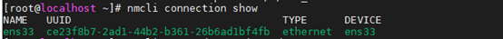
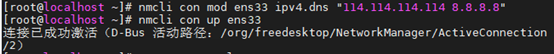

# Centos7配置阿里云的yum源

1.备份下原来的yum源

```Bash
cd /etc/yum.repos.d/

mv CentOS-Base.repo CentOS-Base.repo_bak
```

2 网易yum源：

```Bash
wget -O /etc/yum.repos.d/CentOS-Base.repo http://mirrors.163.com/.help/CentOS7-Base-163.repo

yum clean all

yum makecache
```

3阿里云yum源

```Bash
wget -O /etc/yum.repos.d/CentOS-Base.repo http://mirrors.aliyun.com/repo/Centos-7.repo

yum clean all

yum makecache
```

4 epel源

```Bash
yum -y install epel-release

yum clean all

yum makecache
```

**CentOS 7报Failed connect to \**[\*\*mirrors.cloud.aliyuncs.com:80\*\*](http://mirrors.cloud.aliyuncs.com:80)\**; Connection refused【拒绝连接】**

[原] Failed connect to [mirrors.cloud.aliyuncs.com:80](http://mirrors.cloud.aliyuncs.com:80); Connection refused【拒绝连接】

解决方案：配置DNS服务器 1).显示当前网络连接 nmcli connection show



2).修改当前网络连接对应的DNS服务器，这里的网络连接可以用名称或者UUID来标识 nmcli con mod ens33 ipv4.dns “114.114.114.114 8.8.8.8”

3).将dns配置生效 nmcli con up ens33

