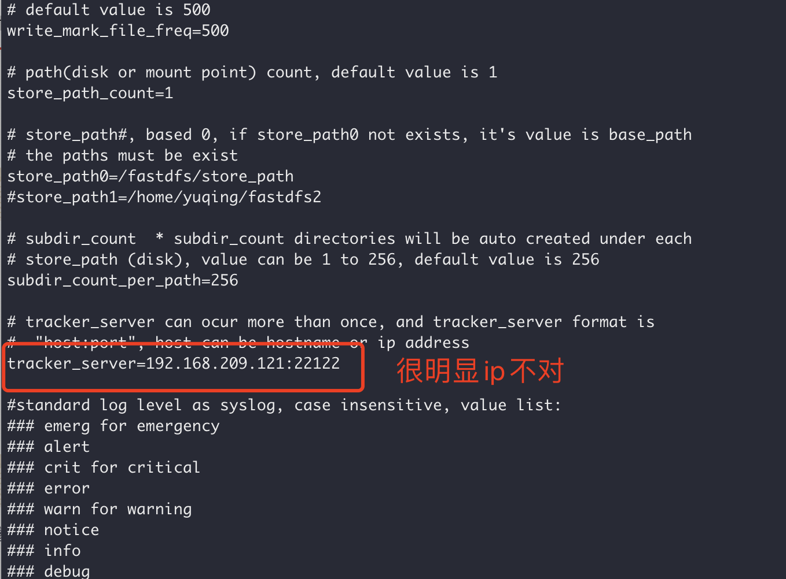
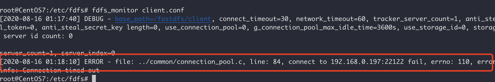
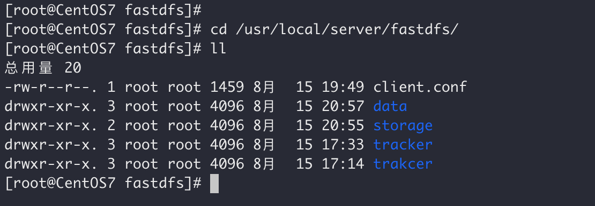
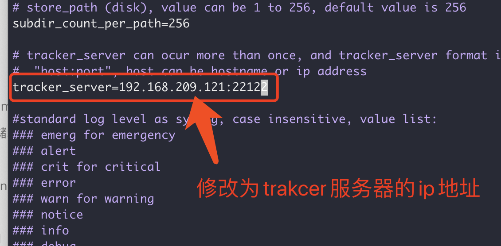
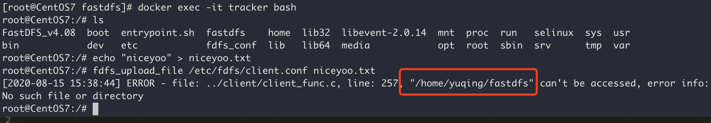
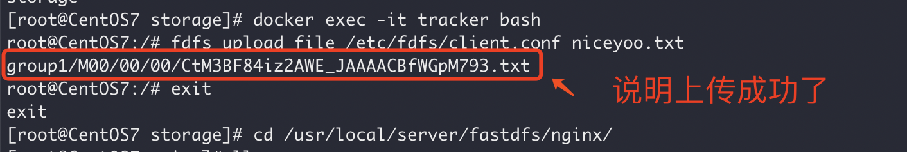
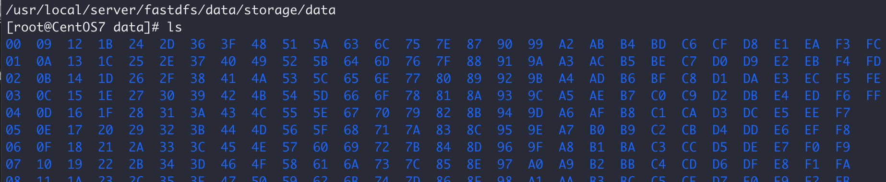
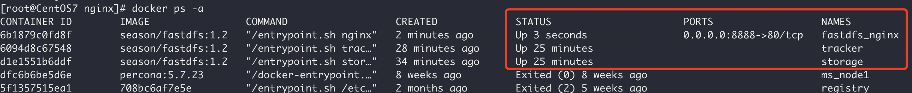
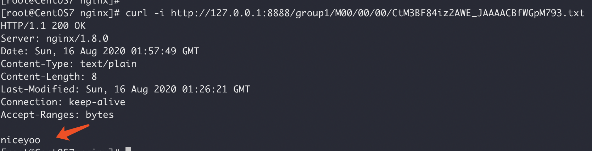
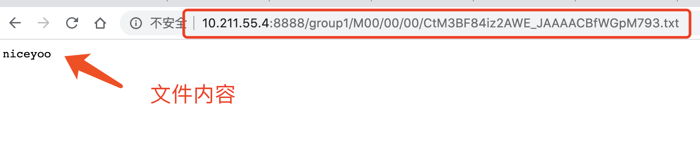

# Docker安装FastDFS

## 安装镜像

```Bash
docker pull season/fastdfs:1.2
```

## 创建容器并挂载目录

在创建容器之前我们先简单说一下 FastDFS，FastDFS 系统有三个角色：

1. `跟踪服务器`(Tracker Server)：跟踪服务器，主要做调度工作，起到均衡的作用；负责管理所有的 storage server和 group，每个 storage 在启动后会连接 Tracker，告知自己所属 group 等信息，并保持周期性心跳。
2. `存储服务器`(Storage Server)：存储服务器，主要提供容量和备份服务；以 group 为单位，每个 group 内可以有多台 storage server，数据互为备份。
3. `客户端`(Client)：上传下载数据的服务器，也就是我们自己的项目所部署在的服务器。

说到这就是想告诉小伙伴，接下来我们可能创建 **跟踪服务器容器**、**存储服务器容器**、**客户端容器** 这三个容器

### 创建出所需要的目录

```Bash
mkdir -p /usr/local/server/fastdfs/tracker/data
mkdir -p /usr/local/server/fastdfs/storage/data
mkdir -p /usr/local/server/fastdfs/storage/path
```

### 创建tracker容器（跟踪服务器容器）

```Bash
docker run -id --name tracker \
-p 22122:22122 \
--restart=always --net host \
-v /usr/local/server/fastdfs/tracker/data:/fastdfs/tracker/data \
season/fastdfs:1.2 tracker
```

### 创建storage容器（存储服务器容器）

执行命令（**非最终执行命令，请修改为自己的ip地址**）：

```Bash
docker run -id --name storage \
--restart=always --net host \
-v /usr/local/server/fastdfs/data/storage:/fastdfs/store_path \
-e TRACKER_SERVER="10.211.55.4:22122" \
season/fastdfs:1.2 storage
```

### client测试

两个容器创建完之后，但此时两个容器其实并没有关联起来，我们进入tracker容器，通过client.conf测试一下：

```Bash
docker exec -it tracker bash
cd /etc/fdfs/
ls
cat client.conf
```

输出的 `client.conf` 都是默认配置，我们可以找到其中的 `track_server` 地址：



尝试执行一下连接：

```Bash
fdfs_monitor client.conf
```

然后会得到如下内容：

```Bash
ERROR - file: ../common/connection_pool.c, line: 84, connect to 192.168.209.121:22122 fail, errno: 110, error info: Connection timed out
```

也就是在没有修改client配置之前，默认 tracker 是去连接 `192.168.209.121` 地址的，那么接下来就是需要去配置client配置文件了。



### 修改client.conf配置文件

通过 `docker exec -it tracker bash` 进入 tracker 容器后不能使用 vi vim 命令，所以干脆将 client.conf 配置文件复制出来，在宿主机修改完再粘贴回去。

执行命令：

```Bash
docker cp trakcer:/etc/fdfs/client.conf /usr/local/server/fastdfs/
```

我们通过 docker 指令将配置文件复制到 `/usr/local/server/fastdfs/` 目录。



我们编辑这个文件，修改 tracker_url 地址（`vi client.conf`）：



修改后保存，然后将修改后的文件替换回去。指令命令：

```Bash
docker cp /usr/local/server/fastdfs/client.conf tracker:/etc/fdfs 
```

至此，配置文件修改完了，接下来我们创建文件上传测试一下。

## 文件上传测试

执行命令，进入 tracker 容器中：

```Bash
docker exec -it tracker bash
```

随便创建一个 txt 文件：

```Bash
echo "niceyoo" > niceyoo.txt
```

然后通过 fdfs_upload_file 命令将 niceyoo.txt 文件上传至服务器：

```Bash
fdfs_upload_file /etc/fdfs/client.conf niceyoo.txt
```

如果此时报了如下错误：



那么就创建一下这个路径，没有的跳过：

```Bash
mkdir -p /home/yuqing/fastdfs
```

创建目录后重新尝试提交：



我们复制出这个文件名来：`group1/M00/00/00/CtM3BF84iz2AWE_JAAAACBfWGpM793.txt`，这个名称后面有用，将用作后面配置nginx时配置访问文件路径。

因为我们之前挂载了宿主机的目录，我们去 `cd /usr/local/server/fastdfs` 看一下：

```Bash
cd /usr/local/server/fastdfs/data/storage/data
ls
```

输出内容如下：



## 配置Nginx

前面的补充已经提到了，默认上传的文件是只能在本机访问的，当然这样肯定是不行的，所以我们需要配置一下Nginx 来帮我们实现 Web 访问的效果。

创建nginx目录：

```Bash
mkdir -p /usr/local/server/fastdfs/nginx/
```

将storage容器中的nginx配置文件复制出来：

```Bash
docker cp storage:/etc/nginx/conf/nginx.conf /usr/local/server/fastdfs/nginx/
```

修改nginx中的配置：

```Bash
vi /usr/local/server/fastdfs/nginx/nginx.conf
```

找到local节点，修改为：

```Bash
location / {
   root /fastdfs/store_path/data;
   ngx_fastdfs_module;
}
```

相关截图如下：


接下来就是创建nginx容器，并指向刚刚的配置文件了。

没有安装过nginx的小伙伴同样可以执行如下指令，默认会帮你拉取镜像然后安装的。

注意：请修改ip地址后再执行

```Bash
docker run -id --name fastdfs_nginx \
--restart=always \
-v /usr/local/server/fastdfs/data/storage:/fastdfs/store_path \
-v /usr/local/server/fastdfs/nginx/nginx.conf:/etc/nginx/conf/nginx.conf \
-p 8888:80 \
-e TRACKER_SERVER=10.211.55.4:22122 \
season/fastdfs:1.2 nginx
```

至此，我们查看一下目前创建以及启动的容器：



我们测试一下之前上传的文件 `group1/M00/00/00/CtM3BF84iz2AWE_JAAAACBfWGpM793.txt`，执行如下命令：

```Bash
curl -i http://127.0.0.1:8888/group1/M00/00/00/CtM3BF84iz2AWE_JAAAACBfWGpM793.txt
```

执行结果：



至此，整个过程就搭建成功了，我们通过浏览器访问一下：

