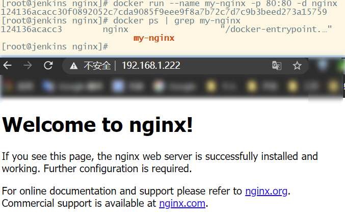

# Docker安装Nginx及常用配置

## 拉取镜像

```Bash
docker pull nginx
```

## 简单运行

> 单纯的启动一个Nginx服务

```Bash
docker run --name nginx -p 80:80 -d nginx
docker ps | grep nginx 
```

> --name nginx 指定容器的名称

-p 80:80 映射端口

-d 守护进程运行

nginx镜像版本，也可以指定版本，如：nginx:1.18.0

> 如果单纯启动一个测试用的nginx就启动完了，测试效果



## 工作常用启动方式

### 创建文件目录

```Bash
mkdir -p /opt/docker/nginx/conf/conf.d
mkdir -p /opt/docker/nginx/html
mkdir -p /opt/docker/nginx/logs
```

> conf 和conf.d分别用于保存配置文件

html用于放置静态文件

logs用于保存日志

### 拷贝默认设置

#### 第一步，按上面的方式启动一个最基础的容器，并获取其对应的容器id

```Bash
docker run --name nginx -p 80:80 -d nginx
docker ps | grep nginx
```

#### 第二步，拷贝容器中默认的配置文件

```Bash
docker cp 124136acacc3:/etc/nginx/nginx.conf /opt/docker/nginx/conf/nginx.conf
docker cp 124136acacc3:/etc/nginx/conf.d /opt/docker/nginx/conf
docker cp 124136acacc3:/usr/share/nginx/html /opt/docker/nginx

# 拷贝完之后就停止并删除容器
docker stop 124136acacc3
docker rm 124136acacc3
```

### 启动服务

```Bash
docker run \
-p 80:80 \
--name my-nginx \
--restart=always \
-v /opt/docker/nginx/conf/nginx.conf:/etc/nginx/nginx.conf \
-v /opt/docker/nginx/conf/conf.d:/etc/nginx/conf.d \
-v /opt/docker/nginx/html:/usr/share/nginx/html \
-v /opt/docker/nginx/logs:/var/log/nginx \
-d \
nginx
```

- 进入容器

```Bash
docker exec -it
```

- 容器重启、重新加载

```Bash
docker exec -t 容器id nginx -t
docker exec -t 容器id nginx -s reload
```

## 常用配置

- 请求代理

```Bash
location /abc/ {
    proxy_pass http://127.0.0.1:8880/;
    proxy_read_timeout 90;

    proxy_http_version 1.1;
    proxy_set_header Upgrade $http_upgrade;
    proxy_set_header Connection $http_connection;
    proxy_set_header Host $host;
    proxy_set_header X-Real-IP $remote_addr;
    proxy_set_header X-Forwarded-For $proxy_add_x_forwarded_for;
    proxy_set_header X-Forwarded-Proto $scheme;
    proxy_cache_bypass $http_upgrade;
}
```

> 请求 http://127.0.0.1/abc/index.html 会代理到 http://127.0.0.1:8080/index.html

- ssl证书配置

```Bash
listen 443 ssl;
#填写绑定证书的域名
server_name www.test.com;
ssl on;
ssl_certificate /路径/www.test.com.crt;
ssl_certificate_key /路径/www.test.com.key;
ssl_session_timeout 5m;
#按照这个协议配置
ssl_protocols TLSv1 TLSv1.1 TLSv1.2;
#按照这个套件配置
ssl_ciphers ECDHE-RSA-AES128-GCM-SHA256:HIGH:!aNULL:!MD5:!RC4:!DHE;
ssl_prefer_server_ciphers on;
```

- http强转https

> 所有的http请求都会被重写到https

```Vim
server {
    listen 80;
    server_name www.test.com;
    default_type 'text/html';
    charset utf-8;
    rewrite ^/(.*) https://$server_name/$1 permanent; #跳转到Https
}
```

- 特定地址重定向

```Bash
location /download.html {
    rewrite ^/(.*) https://sj.qq.com/myapp/detail.htm?apkName=com.xxx.yyy permanent;
}
```

- 将路径中特定的关键字转换为另外的关键字

> 如将请求地址中的AAA转换为abc http://127.0.0.1/AAA/index.html 会重写为 http://127.0.0.1/abc/index.html

```Bash
if ($request_uri ~* ^(/AAA/)) {
    rewrite ^/AAA/(.*)$ /abc/$1 last;
}
```

- 静态页面代理

```Bash
location /hello/ {
    index index.html;
    root /opt/docker/nginx/html/;
}
```

> 访问 http://127.0.0.1/hello/会代理到**/opt/docker/nginx/html/路径下的index.html**[页面](http://127.0.0.1/hello/会代理到**/opt/docker/nginx/html/路径下的index.html**页面)

- 代理静态文件（如图片）

```Bash
location /aaa/bbb/ {
    root /opt/docker/nginx/;
}
```

> 如访问 http://127.0.0.1/aaa/bbb/1.png实际是会代理到/opt/docker/nginx/aaa/bbb目录下的1.png

- 配置跨域

```Bash
proxy_set_header Host $host;
proxy_set_header X-Real-IP $remote_addr;
proxy_set_header X-Real-Port $remote_port;
proxy_set_header X-Forwarded-For $proxy_add_x_forwarded_for;
```

- 客户端保持连接的时间

```Bash
keepalive_timeout 60s;
```

## 公开来源项目Nginx Docker启动

```Bash
docker run -d \
-p 80:80 \
-p 9000:9000 \
-v /mnt:/mnt \
-v /root/gkly/html:/usr/share/nginx/html \
-v /root/nginx/nginx.conf:/etc/nginx/nginx.conf \
--name nginx nginx
```