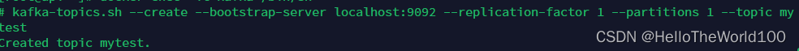
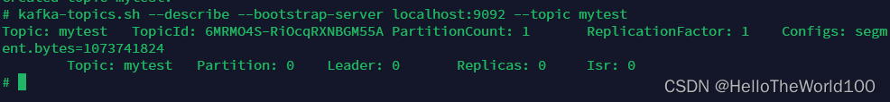

# docker安装kafka

## kafka2.8.1

1:[kafka](https://so.csdn.net/so/search?q=kafka&spm=1001.2101.3001.7020)需要zookeeper管理，所以需要先安装zookeeper。 

```shell
#拉取镜像
docker pull wurstmeister/zookeeper
 
#运行容器
docker run -d --name zookeeper -p 2181:2181 \
-v /etc/localtime:/etc/localtime wurstmeister/zookeeper
```

arm64架构的服务器安装方式如下：

```shell
#拉取镜像
docker pull arm64v8/zookeeper
 
#运行容器
docker run -d --name zookeeper -p 2181:2181 \
-v /etc/localtime:/etc/localtime  arm64v8/zookeeper
```

2：安装kafka。

```shell
#拉取镜像
docker pull wurstmeister/kafka
 
#运行容器
docker run -d --name kafka -p 9092:9092 -e KAFKA_BROKER_ID=0 \
-e KAFKA_ZOOKEEPER_CONNECT=192.168.200.10:2181/kafka \
-e KAFKA_ADVERTISED_LISTENERS=PLAINTEXT://192.168.200.10:9092 \
-e KAFKA_LISTENERS=PLAINTEXT://0.0.0.0:9092 \
-v /etc/localtime:/etc/localtime wurstmeister/kafka
```

说明：

-e KAFKA_BROKER_ID=0  在kafka集群中，每个kafka都有一个BROKER_ID来区分自己

-e KAFKA_ZOOKEEPER_CONNECT=192.168.0.2:2181/kafka 配置zookeeper管理kafka的路径

-e KAFKA_ADVERTISED_LISTENERS=PLAINTEXT://192.168.0.2:9092  把kafka的地址端口注册给zookeeper

-e KAFKA_LISTENERS=PLAINTEXT://0.0.0.0:9092 配置kafka的监听端口

-v /etc/localtime:/etc/localtime 容器时间同步虚拟机的时间

3：验证kafka是否可以使用

进入kakfa容器

```shell
docker exec -it kafka /bin/sh
```

创建topic

```bash
kafka-topics.sh --create --bootstrap-server localhost:9092 \
--replication-factor 1 --partitions 1 --topic mytest
```

如下图所示，创建topic成功。



查看topic

```bash
kafka-topics.sh --describe --bootstrap-server localhost:9092 --topic mytest
```

如下图所示，可以查看到mytest topic的基本信息。



## kafka2.4.1

首先创建一个网络
app-tier：网络名称
–driver：网络类型为bridge

```bash
docker network create app-tier --driver bridge
```

1、安装zookeeper

>  Kafka依赖zookeeper所以先安装zookeeper
> -p：设置映射端口（默认2181）
> -d：后台启动

```bash
docker run -d --name zookeeper-server \
    --network app-tier \
    -e ALLOW_ANONYMOUS_LOGIN=yes \
    bitnami/zookeeper:latest
```


查看zookeeper容器日志（可省略）

```bash
docker logs -f zookeeper
```

2、安装Kafka

> 安装并运行Kafka，
> –name：容器名称
> -p：设置映射端口（默认9092 ）
> -d：后台启动
> ALLOW_PLAINTEXT_LISTENER任何人可以访问
> KAFKA_CFG_ZOOKEEPER_CONNECT链接的zookeeper
> KAFKA_ADVERTISED_HOST_NAME当前主机IP或地址（重点：如果是服务器部署则配服务器IP或域名否则客户端监听消息会报地址错误）
> -e KAFKA_CFG_ADVERTISED_LISTENERS=PLAINTEXT://192.168.0.101:9092 \

```bash
docker run -d --name kafka-server \
    --network app-tier \
    -p 9092:9092 \
    -e ALLOW_PLAINTEXT_LISTENER=yes \
    -e KAFKA_CFG_ZOOKEEPER_CONNECT=zookeeper-server:2181 \
    -e KAFKA_CFG_ADVERTISED_LISTENERS=PLAINTEXT://192.168.0.101:9092 \
    bitnami/kafka:latest
```


查看kafka容器日志（可省略）

```bash
docker logs -f kafka
```


3、kafka-manager图形化管理工具(不好用)

> kafka-manager 只是一个简单的页面，浏览kafka中的信息，没有实际操作功能。
> -p：设置映射端口（默认9000）
> –name：容器名称
> -ZK_HOSTS：zookeeper服务地址，多个可用逗号隔开

```bash
docker run --name kafka-manager -d  \
    --network app-tier \
	-p 9000:9000  \
	-e ZK_HOSTS="zookeeper-server:2181" \
	sheepkiller/kafka-manager
```


查看kafka-manager容器日志（可省略）

```bash
docker logs -f kafka-manager
```


通过浏览器访问主机地址，如果是服务器则注意要放开9000端口
http://172.17.0.6:9000/

4、kafka-map图形化管理工具(好用)
图形化管理工具
访问地址：http://服务器IP:9001/
DEFAULT_USERNAME：默认账号admin
DEFAULT_PASSWORD：默认密码admin

Git 地址：https://github.com/dushixiang/kafka-map/blob/master/README-zh_CN.md

docker run -d --name kafka-map \
    --network app-tier \
    -p 9001:8080 \
    -v /opt/kafka-map/data:/usr/local/kafka-map/data \
    -e DEFAULT_USERNAME=admin \
    -e DEFAULT_PASSWORD=admin \
    --restart always dushixiang/kafka-map:latest