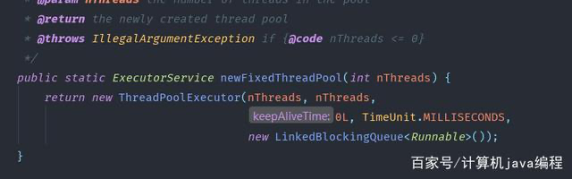

# 线程池

## 1、Executors

Executors是concurrent包下的一个类，为我们提供了创建线程池的简便方法。

Executors可以创建我们常用的四种线程池：

（1）`newCachedThreadPool`创建一个可缓存线程池，如果线程池长度超过处理需要，可灵活回收空闲线程，若无可回收，则新建线程。不设上限，提交的任务将立即执行，

（2）`newFixedThreadPool`创建一个定长线程池，可控制线程最大并发数，超出的线程会在队列中等待。

（3）`newScheduledThreadPool`创建一个定长线程池，支持定时及周期性任务执行。

（4）`newSingleThreadExecutor`创建一个单线程化的线程池执行任务。

### 1.1、Executors的缺点

正常来说，我们不应该使用这种方式创建线程池，应该使用`ThreadPoolExecutor`来创建线程池。`Executors`创建的线程池也是调用的`ThreadPoolExcutor`的构造函数。通过原来可以看出。



我们也看到了这里面的LinkedBlockingQueue并没有指定队列的大小是一个无界队列，这样可能会造成oom。所以我们要使用ThreadPoolExecutor这种方式。

## 2、ThreadPoolExecutor

### 2.1、7个核心参数


通过源码看到ThreadPoolExecutor比较全的构造函数如下：


*   `corePoolSize`：核心线程数，当提交一个任务到线程池时，线程池会创建一个线程来执行任务，即使其他空闲的基本线程能够执行新任务也会创建线程，等到需要执行的任务数大于线程池基本大小时就不再创建。如果调用了线程池的prestartAllCoreThreads()方法，线程池会提前创建并启动所有基本线程。    最多保留的线程数

*   `maximumPoolSize`：最大线程数目。如果队列满了，并且已创建的线程数小于最大线程数，则线程池会再创建新的线程执行任务。值得注意的是，如果使用了无界的任务队列这个参数就没什么效果。**核心线程+救急线程**

*   `keepAliveTime`：空闲的时间，超过这个空闲时间，线程将被回收。**救急线程生存时间，针对救急线程**

*   `unit`：空闲救急线程的时间单位，针对救急线程

*   `workQueue`：任务的排队队列，阻塞队列。
    1.  `ArrayBlockingQueue`：是一个基于数组结构的有界阻塞队列，此队列按FIFO（先进先出）原则对元素进行排序。
    
    2.  `LinkedBlockingQueue`：一个基于链表结构的阻塞队列，此队列按FIFO排序元素，吞吐量通常要高于ArrayBlockingQueue。静态工厂方法`Executors.newFixedThreadPool()`使用了这个队列
    
    3.  `SynchronousQueue`：一个不存储元素的阻塞队列。每个插入操作必须等到另一个线程调用移除操作，否则插入操作一直处于阻塞状态，吞吐量通常要高于LinkedBlockingQueue，静态工厂方法Executors.newCachedThreadPool使用了这个队列。
    
    4.  `PriorityBlockingQueue`：一个具有优先级的无限阻塞队列。
    
*   `threadFactory`：可以为线程创建时起个好名字。使用开源框架guava提供的ThreadFactoryBuilder可以快速给线程池里的线程设置有意义的名字

    *   new ThreadFactoryBuilder().setNameFormat("XX-task-%d").build;

*   `handler`：拒绝策略，当线程过多的时候的策略

    1.  `AbortPolicy`：直接抛出异常
    2.  `CallerRunsPolict`：只用调用者所在线程来运行任务
    3.  `DiscardOldestPolicy`：丢弃队列里最近的一个任务，并执行当前任务
    4.  `DiscardPolicy`：不处理，丢弃掉
    5.  也可以根据应用场景来实现`RejectedExecutionHandler`接口自定义策略：

### 2.3、线程池执行流程

首先任务过来之后，看看`corePoolSize`是否有空闲的，有的话就执行。没有的话，放入任务队列里面，当任务队列满了，查看线程数是否大于`maxPoolSize`，如果小于，就创建救急线程来执行任务，否则，就执行拒绝策略，拒绝执行。


### 2.4、submit()方法

线程池建立完毕之后，我们就需要往线程池提交任务。通过线程池的submit方法即可。

submit方法接收两种Runable和Callable。

区别如下：

*   Runable是实现该接口的run方法，callable是实现接口的call方法。

*   callable允许使用返回值。

*   callable允许抛出异常。

### 2.5、提交任务的方式

可以向线程池提交的任务有两种：`Runnable`和`Callable`，二者的区别如下：

1.  方法签名不同，`void Runnable.run()`, `V Callable.call() throws Exception`

2.  是否允许有返回值，`Callable`允许有返回值

3.  是否允许抛出异常，`Callable`允许抛出异常。

`Callable`是JDK1.5时加入的接口，作为`Runnable`的一种补充，允许有返回值，允许抛出异常。

#### 2.5.1、三种提交任务的方式

| 提交方式                                 | 是否关心返回结果                        |
| ------------------------------------ | ------------------------------- |
| `Future<T> submit(Callable<T> task)` | 是                               |
| `void execute(Runnable command)`     | 否                               |
| `Future<?> submit(Runnable task)`    | 否，虽然返回Future，但是其get()方法总是返回null |

```java

@FunctionalInterface
public interface Runnable {
    public abstract void run();
}
 
@FunctionalInterface
public interface Callable<V> {
    V call() throws Exception;
}
```

#### 2.5.2、Future和FutureTask

Future接口用来表示执行异步任务的结果存储器，当一个任务的执行时间过长就可以采用这种方式：把任务提交给子线程去处理，主线程不用同步等待，当向线程池提交了一个Callable或Runnable任务时就会返回Future，用Future可以获取任务执行的返回结果。Future的主要方法包括：

get()方法：返回任务的执行结果，若任务还未执行完，则会一直阻塞直到完成为止，如果执行过程中发生异常，则抛出异常，但是主线程是感知不到并且不受影响的，除非调用get()方法进行获取结果则会抛出ExecutionException异常；
get(long timeout, TimeUnit unit)：在指定时间内返回任务的执行结果，超时未返回会抛出TimeoutException，这个时候需要显式的取消任务；
cancel(boolean mayInterruptIfRunning)：取消任务，boolean类型入参表示如果任务正在运行中是否强制中断；
isDone()：判断任务是否执行完毕，执行完毕不代表任务一定成功执行，比如任务执行失但也执行完毕、任务被中断了也执行完毕都会返回true，它仅仅表示一种状态说后面任务不会再执行了；
isCancelled()：判断任务是否被取消；
下面来实际演示Future和FutureTask的用法：

```java
   public static void main(String[] args) throws ExecutionException, InterruptedException {
        ExecutorService executorService = Executors.newFixedThreadPool(10);
        Future<Integer> future = executorService.submit(new Task());
        Integer integer = future.get();
        System.out.println(integer);
        executorService.shutdown();
    }
 
    static class Task implements Callable<Integer> {
        @Override
        public Integer call() throws Exception {
            System.out.println("子线程开始计算");
            int sum = 0;
            for (int i = 0; i <= 100; i++) {
                sum += i;
            }
            return sum;
        }
    }
```

```java
  public static void main(String[] args) throws ExecutionException, InterruptedException {
        ExecutorService executorService = Executors.newFixedThreadPool(10);
        FutureTask<Integer> futureTask = new FutureTask<>(new Task());
        executorService.submit(futureTask);
        Integer integer = futureTask.get();
        System.out.println(integer);
        executorService.shutdown();
    }
 
    static class Task implements Callable<Integer> {
        @Override
        public Integer call() throws Exception {
            System.out.println("子线程开始计算");
            int sum = 0;
            for (int i = 0; i <= 100; i++) {
                sum += i;
            }
            return sum;
        }
    }
```

### 2.6、blockqueue的限制

我们在创建线程池的时候，如果使用Executors。创建的是无界队列，容易造成oom。所以我们要自己执行queue的大小。

```java
BlockingQueue qeue = new ArrayBlockingQueue<>(512);
```

### 2.7、拒绝策略

当任务队列的queue满了的时候，在提交任务，就要出发拒绝策略。队列中默认的拒绝策略是AbortPolicy。是直接抛出异常的一种策略。

如果是想实现自定义的策略，可以实现`RejectedExecutionHandler`接口。

线程池提供了如下的几种策略供选择：

*   `AbortPolicy`：默认策略，抛出RejectedExecutionException

*   `DiscardPolicy`：忽略当前提交的任务。

*   `DiscardOldestPolicy`：丢弃任务队列中最老的任务，给新任务腾出地方

*   `CallerRunsPolicy`：让提交任务的线程去执行任务

```java
ExecutorService executorService = new ThreadPoolExecutor(2, 2, 0, TimeUnit.SECONDS, new ArrayBlockingQueue<>(512), new ThreadPoolExecutor.DiscardPolicy());
```

## 捕捉异常

如之前所说Callable接口的实现，可以获取到结果和异常。通过返回的Future的get方法即可拿到。


## 正确构造线程池的方式


## 获取单个结果

通过submit提交一个任务后，可以获取到一个future，调用get方法会阻塞并等待执行结果。`get(long timeout, TimeUnit unit)`可以指定等待的超时时间。

## 获取多个结果

可以使用循环依次调用，也可以使用`ExecutorCompletionService`。该类的take方式，会阻塞等待某一任务完成。向CompletionService批量提交任务后，只需调用相同次数的CompletionService.take()方法，就能获取所有任务的执行结果，获取顺序是任意的，取决于任务的完成顺序。


这个类是对线程池的一个包装，包装完后，通过它进行submit和take。

## 单个任务超时

`Future.get(long timeout, TimeUnit unit)`方法可以指定等待的超时时间，超时未完成会抛出TimeOutException。

## 多个任务超时

等待多个任务完成，并设置最大等待时间，可以通过`CountDownLatch`完成：


`await()`是总的时间，即使100个任务，需要跑20分钟。我10s超时了也停止了。
