# ConcurrentHashMap

## 1、1.7版本

### 1.1、简介

JDK1.7中ConcurrentHashMap是通过“锁分段”来实现线程安全的。啥？什么是“锁分段”？其实就是ConcurrentHashMap将哈希表分成许多片段（segments），每个片段（table）都类似于HashMap，它有一个HashEntry数组，数组的每项又是HashEntry组成的链表。每个片段都是Segment类型的。

核心存储结构是segment，它是继承ReentrantLock的源码如下：

```Java
static class Segment<K, V> extends ReentrantLock implements Serializable {
    private static final long serialVersionUID = 2249069246763182397L;
    final float loadFactor;

    Segment(float lf) {
        this.loadFactor = lf;
    }
}
```

所以Segment本质上是一个可重入的互斥锁，这样每个片段都有了一个锁，这就是“锁分段”。

#### 1.1.1、结构

由多个Segment组合 而成，Segment本身就相当于一个HashMap对象。同HashMap一样，Segment包含一个HashEntry数组，数组中的每一个HashEntry即是一个键值对，也是一个链表的头节点。

单个`Segment`结构图：

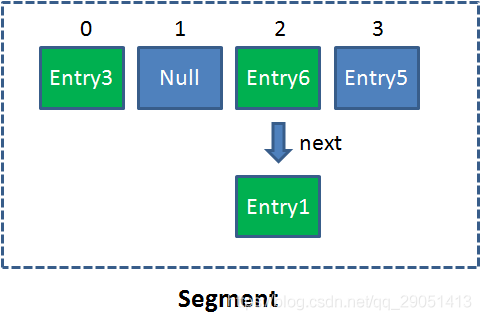

在ConcurrenthashMap集合中，有2的N次方个Segment，共同保存在一个名为segments的数组中。

ConcurrentHashMap结构图：

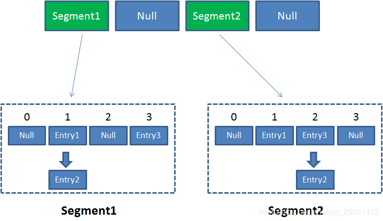

#### 1.2.1、核心属性

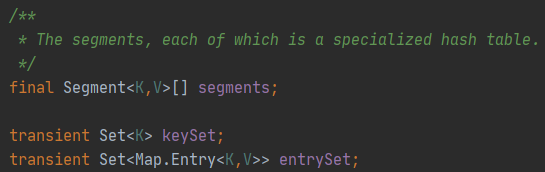

#### 1.2.1.1、Sement

`segment`是她的一个内部类，主要组成如下：

```Java
static final class Segment<K, V> extends ReentrantLock implements Serializable {

    private static final long serialVersionUID = 2249069246763182397L;

    // 和 HashMap 中的 HashEntry 作用一样，真正存放数据的桶
    transient volatile HashEntry<K, V>[] table;

    transient int count;
    transient int modCount;
    transient int threshold;
    final float loadFactor;

    // ...
}
```

`HashEntry`也是一个内部类，主要组成如下：

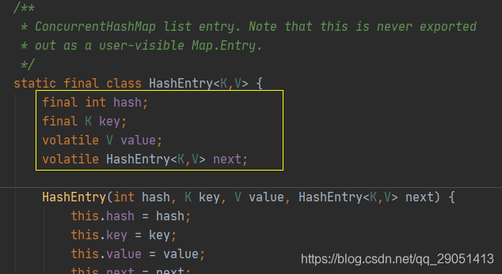

和HashMap的Entry基本一样，唯一的区别就是其中的核心数据如value，以及链表都是volatile修饰的，保证了获取时的可见性。

### 1.2、Put操作

查看源码：

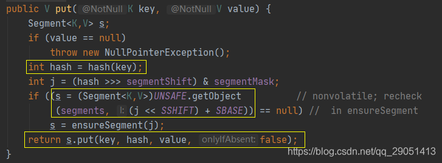

首先是通过 key 定位到 Segment，之后在对应的 Segment 中进行具体的 put。

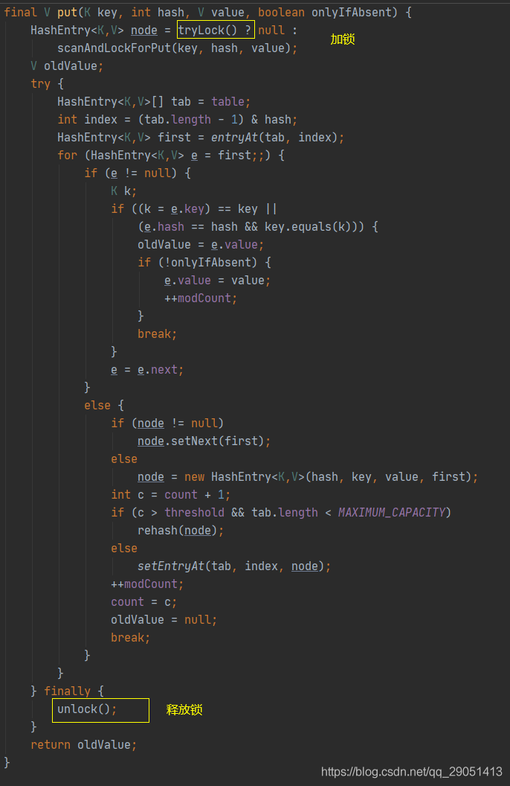

虽然 HashEntry 中的 value 是用 volatile 关键词修饰的，但是并不能保证并发的原子性，所以 put 操作时仍然需要加锁处理。

首先第一步的时候会尝试获取锁，如果获取失败肯定就有其他线程存在竞争，则利用 scanAndLockForPut() 自旋获取锁。

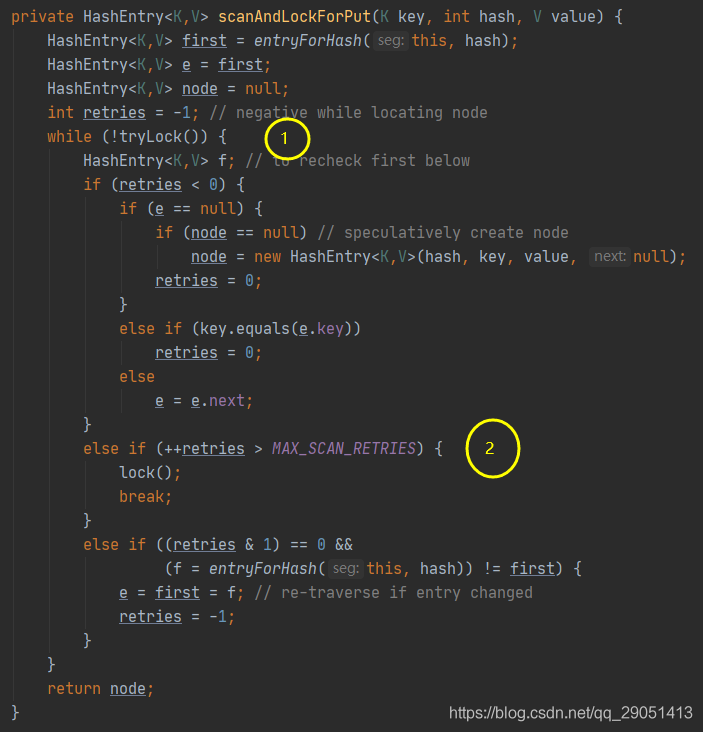

1、尝试自旋获取锁。

2、如果重试的次数达到了 `MAX_SCAN_RETRIES` 则改为阻塞锁获取，保证能获取成功。

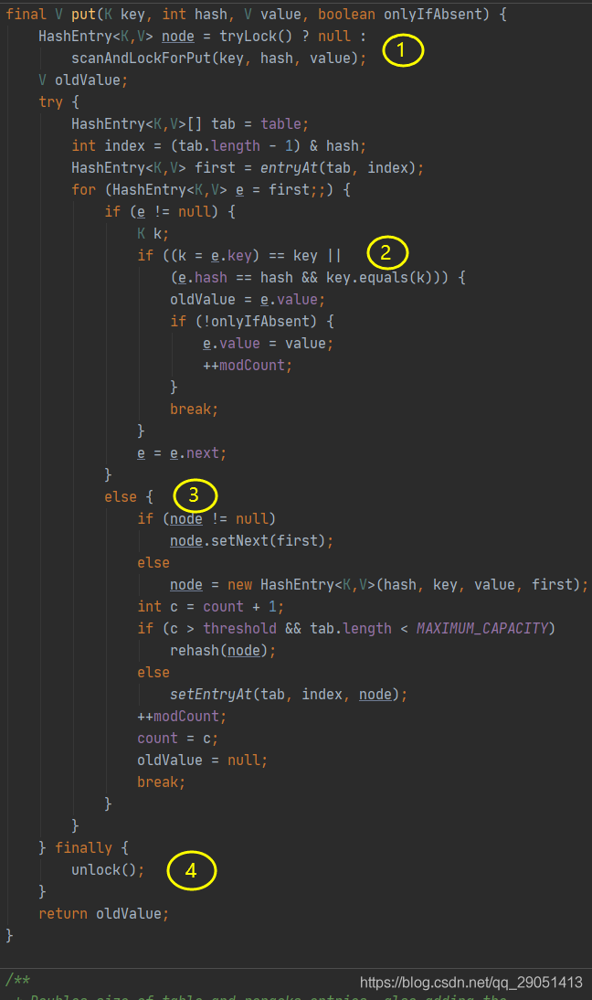

1、加锁操作；

2、遍历该 HashEntry，如果不为空则判断传入的 key 和当前遍历的 key 是否相等，相等则覆盖旧的 value。

3、为空则需要新建一个 HashEntry 并加入到 Segment 中，同时会先判断是否需要扩容。

4、释放锁；

### 1.3、Get操作

源码：

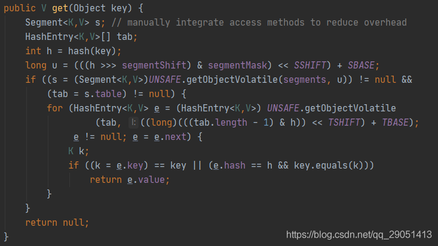

Get 操作比较简单：

1、Key 通过 Hash 之后定位到具体的 Segment；

2、再通过一次 Hash 定位到具体的元素上；

3、由于 HashEntry 中的 value 属性是用 volatile 关键词修饰的，保证了内存可见性，所以每次获取时都是最新值。

ConcurrentHashMap 的 get 方法是非常高效的，因为整个过程都不需要加锁。

### 1.4、高并发线程安全

Put 操作时，锁的是某个 Segment，其他线程对其他 Segment 的读写操作均不影响。因此解决了线程安全问题。

## 2、1.8版本

在JDK1.8中，ConcurrentHashMap没有用“锁分段”来实现线程安全，而是使用CAS算法和synchronized来确保线程安全，但是底层segment并没有被删除的。

### 2.1、结构

数组+链表改为**数组+链表+红黑树**

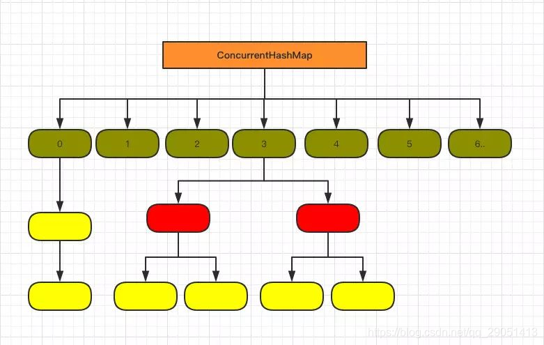

### 2.2、HashEntry改为Node

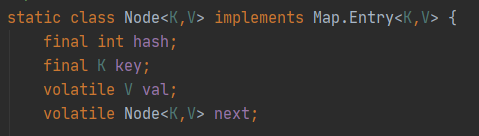

和 JDK7 的 HasEntry 作用相同，对 `val `和` next` 都用了` volatile `关键字，保证了可见性。

### 2.3、Put操作的改变

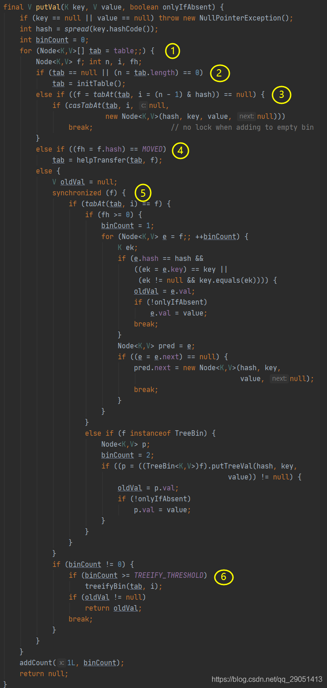

1、根据 key 计算出 hashcode，然后开始遍历 table；

2、判断是否需要初始化；

3、f 即为当前 key 定位出的 Node，如果为空表示当前位置可以写入数据，利用 CAS 尝试写入，失败则自旋保证成功。

4、如果当前位置的 hashcode == MOVED == -1,则需要进行扩容。

5、如果都不满足，则利用 synchronized 锁写入数据。

7、如果数量大于 TREEIFY_THRESHOLD 则要转换为红黑树。

### 2.4、Get操作的改变

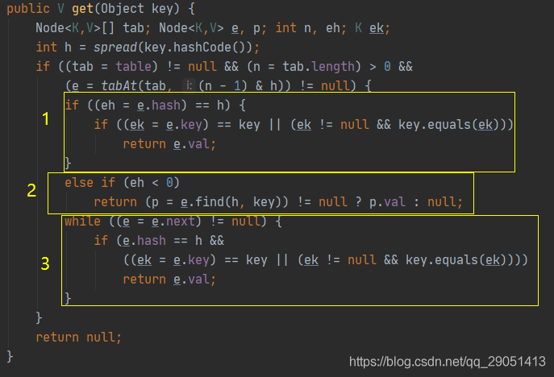

根据计算出来的 hashcode 寻址，如果就在桶上那么直接返回值。

如果是红黑树那就按照树的方式获取值。

都不满足那就按照链表的方式遍历获取值。

### 2.5、为什么在高并发的情况下高效？

ConcurrentHashMap中，无论是读操作还是写操作都能保证很高的性能：在进行读操作时(几乎)
不需要加锁，而在写操作时通过锁分段技术只对所操作的段加锁而不影响客户端对其它段的访问。特别地，在理想状态下，ConcurrentHashMap 可以支持 16 个线程执行并发写操作（如果并发级别设为16），及任意数量线程的读操作。

ConcurrentHashMap本质上是一个Segment数组，而一个Segment实例又包含若干个桶，每个桶中都包含一条由若干个 HashEntry 对象链接起来的链表

ConcurrentHashMap的高效并发机制是通过以下三方面来保证的

通过锁分段技术保证并发环境下的写操作通过 HashEntry的不变性、Volatile变量的内存可见性和加锁重读机制保证高效、安全的读操作；通过不加锁和加锁两种方案控制跨段操作的的安全性。

## 3、总结

1.8 在 1.7 的数据结构上做了大的改动，采用红黑树之后可以保证查询效率（`O(logn)`），甚至取消了 `ReentrantLock` 改为了 `synchronized`，这样可以看出在新版的 JDK 中对` synchronized`优化是很到位的。

