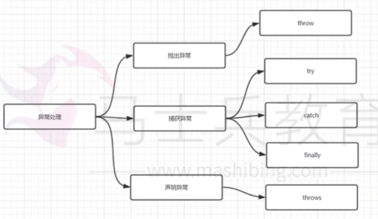

# Java异常处理方式

Java通过面向对象的方法进行异常处理，一旦方法抛出异常，系统自动根据该异常对象寻找合适处理器来处理该异常，把不同的异常进行分类，并提供了良好的接口。在Java中，每个异常都是一个对象，它是Throwable类或其子类的实例。当一个方法出现异常后便抛出一个异常对象，该对象中包含有异常信息，调用这个对象的方法可以捕获到这个异常并可以对其进行处理，java的异常处理是通过5个关键词来实现的：try、catch、throw、throws、finally。

在java应用中，异常的处理机制分为声明异常和抛出异常、捕获异常。

throw和throws的区别：

1.位置不同：

throw：方法内部

throws：方法的签名处，方法的声明处

2.内容不容

throw + 异常对象（检查异常，运行时异常）

throws+异常的类型（可以多个类型，用,进行拼接）

3.作用不同

throw：异常出现的源头，制造异常。

throws：在方法的声明处，告诉方法的调用者，这个方法可能会出现声明的这些异常，然后调用者对这个异常进行处理：要么自己处理要么再继续向外抛出异常