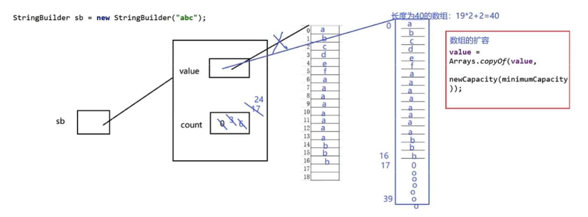

# String、StringBuffer、StringBuilder区别及使用场景

Java提供了两种类型的字符串：String和StringBuilder/StringBuffer，他们都可以存储和操作字符串

区别：

1、String是只读字符串，String引用的字符串内容是不能被改变的

```JAVA
String str = "abc";
str = "bcd";
```

字符串str明明是可以改变的呀！其实不然，str仅仅是一个引用对象，它指向一个字符串对象“abc”。第二行代码的含义是让str重新指向了一个新的字符串“bcd”对象，而“abc”对象并没有任何改变，只不过该对象已经成为一个不可及对象。

2、StringBuilder/StringBuffer表示的字符串对象可以直接进行修改

3、StringBuilder是java5中引用的，他和Stringbuffer的方法完全相同，区别在于他是在单线程环境下使用的，因为它的所有方法都没有被synchronized修饰，因此它的效率理论上也比Stringbuffer高。

