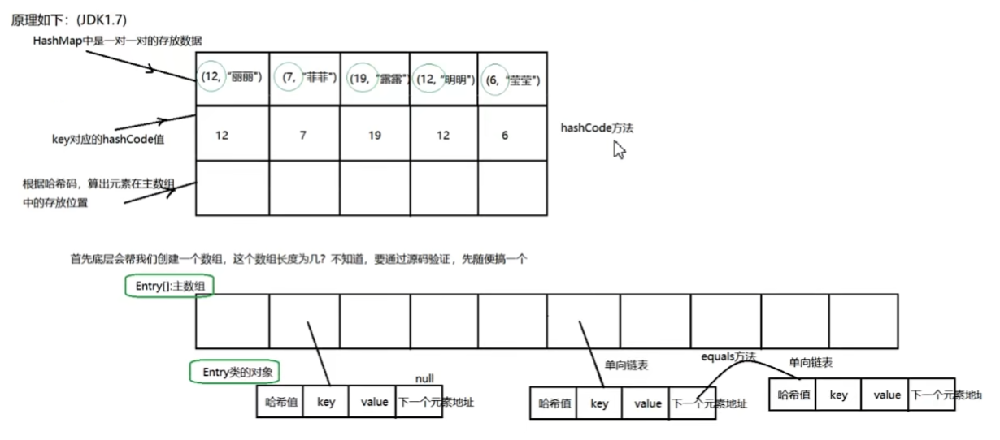

# hashcode和equals如何使用

equals()源自于java.lang.Object，该方法用来简单验证两个对象的相等性。object类中定义的默认实现只检查两个对象的对象引用，以验证它们的相等性。通过重写该方法，可以自定义验证对象相等，如果使用ORM处理一些对象的话，要确保hashcode()和equals()对象中使用getter和setter而不是直接引用成员变量。

hashcode()源自于java.lang.Object，该方法用于获取给定对象的唯一整数（散列码）。当着对象需要存储在哈希表这样的数据结构时，这个整数用于确定桶的位置。默认情况下，对象的hashCode()方法返回对象所在内存地址的整数表示。hashcode()是Hastable、hashMap和HashSet使用的。默认的object类的hashcode()方法返回这个对象存储的内存地址的编号。

hash散列算法，使得在hash表中查找一个记录速度变O(1)。每个记录都有自己的hashcode，散列算法按照hashcode把记录放置在合适的位置。在查找一个记录，首先通过hashcode快速定位记录的位置，然后再通过equals来比较是否相等。如果hashcode没找到，则不equals，元素不存在与哈希表中，即使找到了，也只需执行hashcode相同的几个元素的equals，如果不equals，还是不存在哈希表中。

