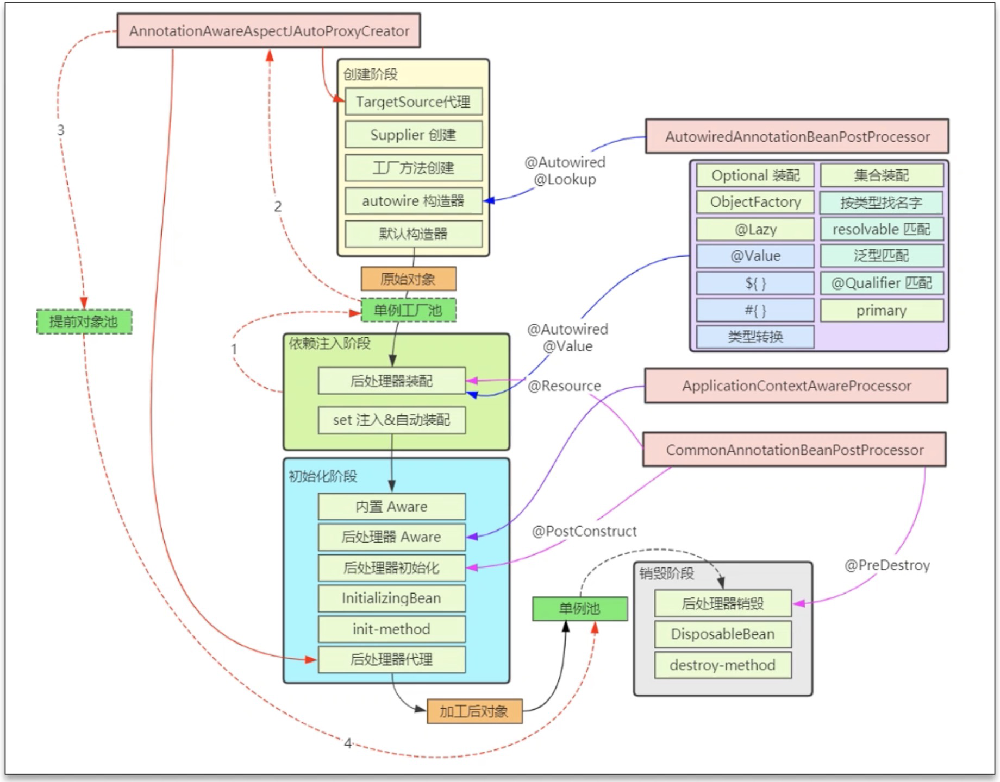

# Spring bean的生命周期

## 1.概述

```java
protected <T> T doGetBean(String name, @Nullable Class<T> requiredType, @Nullable Object[] args, boolean typeCheckOnly)
```

- 阶段1:处理名称，检查缓存
- 阶段2:检查父工厂
- 阶段3:检查DependsOn
- 阶段4:按Scope创建bean
  - 创建`singleton`
  - 创建`prototype`
  - 创建其他`scopre`
- 阶段5:创建bean
  - 创建bean实例
  - 依赖注入
  - 初始化
  - 登记可销毁bean
- 阶段6:类型转换
- 阶段7:销毁bean

### 1.1.处理名称，检查缓存

- 先把别名解析为实际名称，在进行后续处理
- 若要FactoryBean本身，需要使用&名称获取
- singletonObjects是一级缓存，放单例成品对象
- singletonFactories是三级缓存，放单例工厂
- earlySingletonObjects是二级缓存，放单例工厂的产品，可称为提前单例对象

### 1.2.处理父子容器

- 父子容器的bean名称可以重复
- 优先找子容器的bean，找到了直接返回，找不到继续到父容器找

### 1.3.dependsOn

dependsOn用在非显式依赖的bean的创建顺序控制

### 1.4.按Scope创建bean

- scope理解为从xxx范围内找这个bean更加贴切
- singleton scope表示从单例池范围内获取bean，如果没有，则创建并放入单例池
- prototype scope，它从不缓存bean，每次都创建新的
- request scope表示从request对象范围内获取bean，如果没有，则创建并放入request

### 1.5.创建bean



#### 1.5.1.创建bean实例

**AutowiredAnnotationBeanPostProcessor**选择构造

- 优先选择带`@Autowired`注解的构造
- 若有唯一的带参构造，也会入选

**采用默认构造**

如果上面的后处理器和BeanDefiniation都没找到构造，采用默认构造，即使是私有的

#### 1.5.2.依赖注入

**AutowiredAnnotationBeanPostProcessor** 注解匹配

识别`@Autowired`及`@Value`标注的成员，封装为`InjectionMetadata`进行依赖注入

**CommonAnnotationBeanPostProcessor** 注解匹配

识别`@Resource`标注的成员，封装为`InjectionMetadata`进行依赖注入

**AUTOWIRE_BY_NAME**（根据名字匹配）

根据成员名字找bean对象，修改mbd的propertyValues，不会考虑简单类型的成员

**AUTOWIRE_BY_TYPE**（根据类型匹配）

根据成员类型执行resolveDependency找到依赖注入的值，修改mbd的propertyValues

**applyPropertyValues**（即xml中`<property name ref|value/>`）(精确指定)

根据mbd的propertyValues进行依赖注入

#### 1.5.3.初始化

**内置Aware接口的装配**

包括BeanNameAware，BeanFactoryAware等

**扩展Aware接口的装配**

由ApplicationContextAwareProcessor解析，执行时机在postProcessBeforeInitialization

**@PostConstruct**

由CommonAnnotationBeanPostProcessor解析，执行时机在postProcessBeforeInitialization

**InitializingBean**

通过接口回调执行初始化

**initMethod**（即`<bean init-method>`或`@Bean(initMethod)`）

根据BeanDefinition得到的初始化方法执行初始化

**创建aop代理**

由`AnnotationAwareAspectJAutoProxyCreator`创建，执行时机在`postProcessAfterInitialization`

#### 1.5.4.注册可销毁bean

**判断依据**

- 如果实现了DisposableBean或AutoCloseable接口，则为可销毁bean
- 如果自定义了destroyMethod，则为可销毁bean
- 如果采用@Bean没有制定destoryMethod，则采用自动推断方式获取销毁方法名（close，shutdown）
- 如果有@PreDestroy标注的方法

**存储位置**

- singleton scope的可销毁bean会存储与beanFactory的成员当中
- 自定义scope的可销毁bean会存储于对应的域对象当中
- prototype scope不会存储，需要自己找到此对象销毁

**存储时都会封装为`DisposableBeanAdapter`类型对销毁方法的调用进行适配**

## 1.6.类型转换

如果getBean的requiredType参数与实际得到的对象类型不同，会尝试进行类型转换

## 1.7.销毁bean

- singleton bean的销毁在ApplicationContext.close时，此时会找到所有DisposableBean的名字，逐一销毁
- 自定义scope bean的销毁在作用域对象生命周期结束时
- prototype bean的销毁可以通过自动手动调用AutowireCapableBeanFactory.destrotBean方法执行销毁

