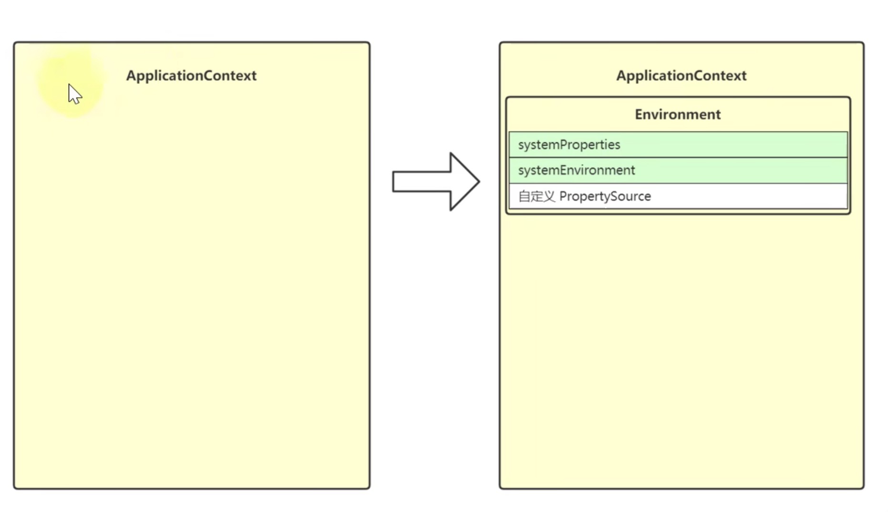
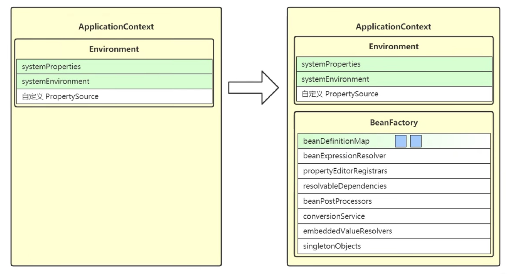
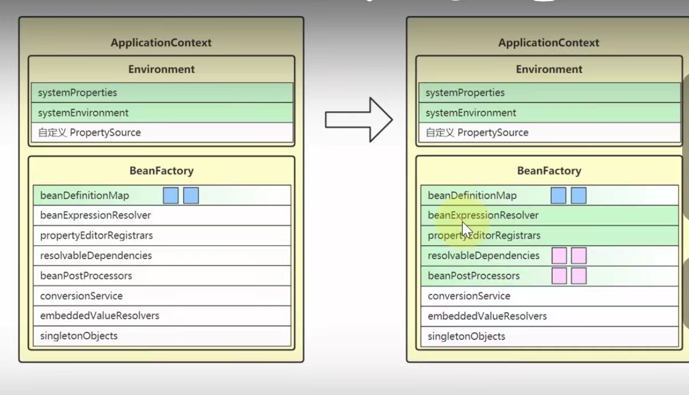
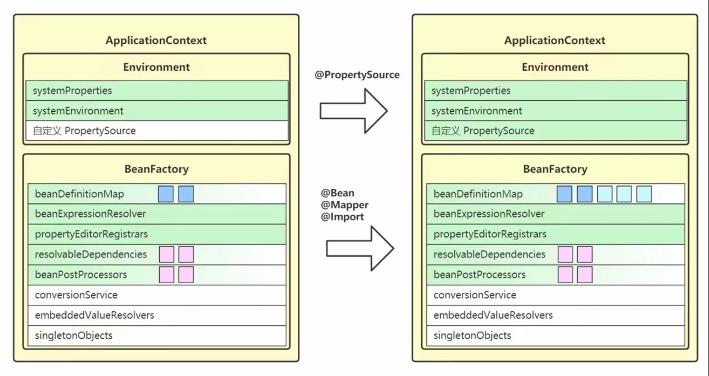
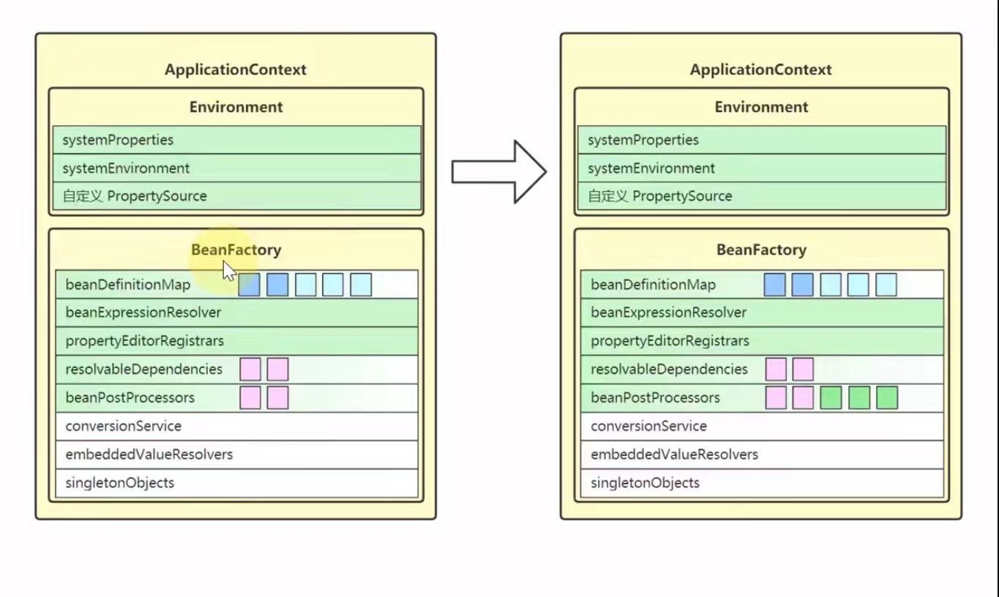
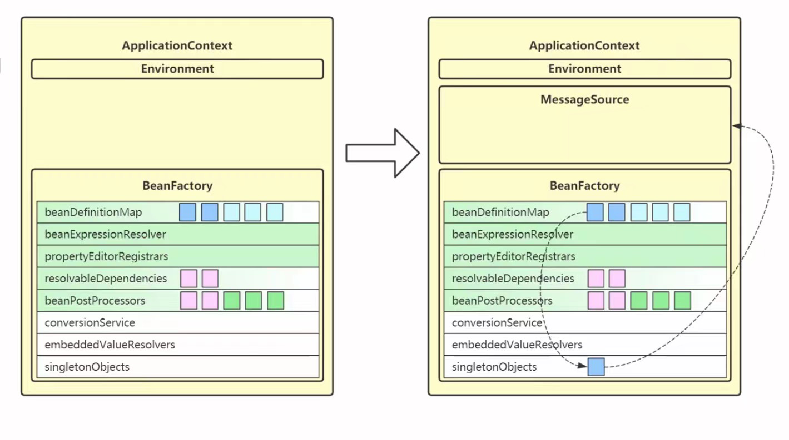
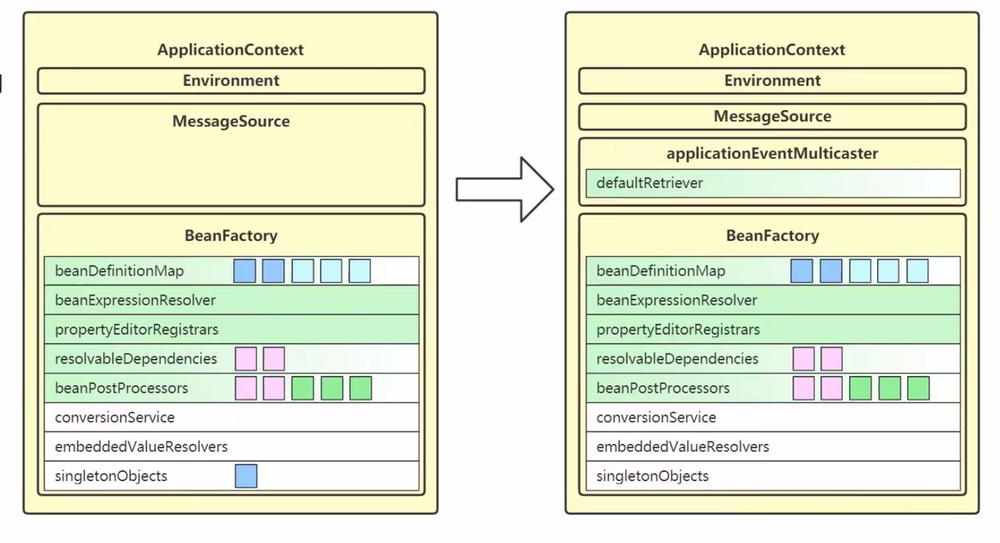
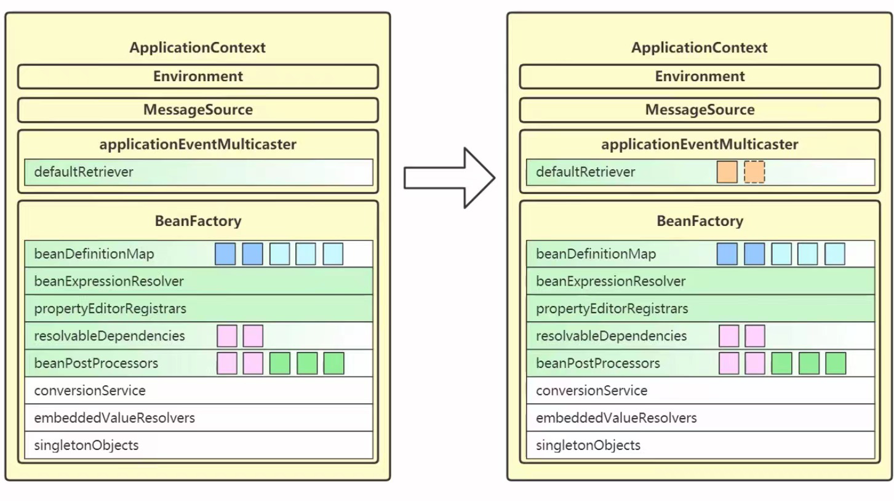
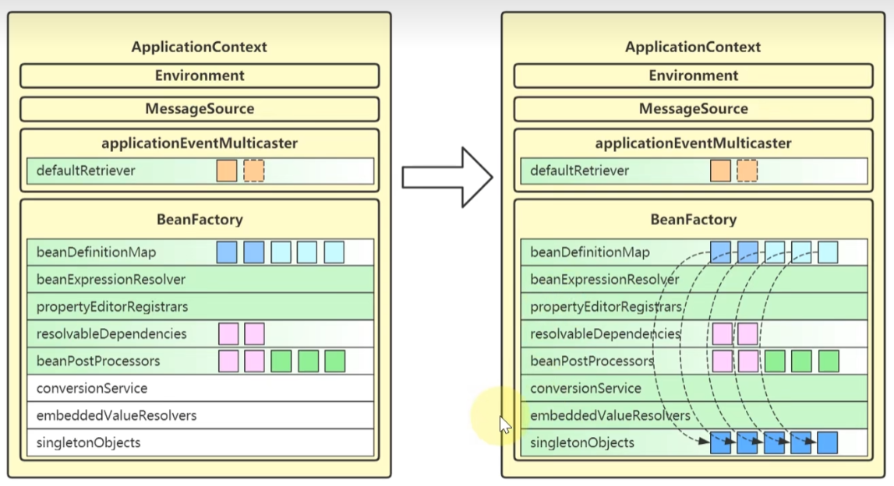
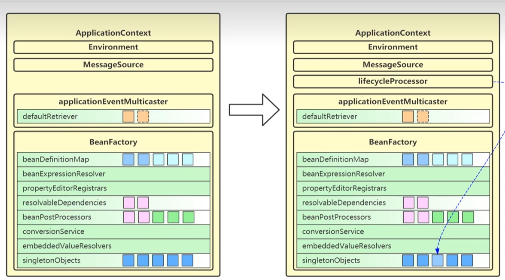

# Spring refresh

## 1.refresh12个步骤

1.  `prepareRefresh`：做好准备工作
2.  `obtainFreshBeanFactory`：创建或获取BeanFactory
3.  `prepareBeanFactory`：准备BeanFactory
4.  `postProcessBeanFactory`：子类扩展BeanFactory
5.  `invokeBeanFactroyPostProcessors`：后处理器扩展BeanFactory
6.  `registerBeanPostProcessors`：准备Bean后处理器
7.  `initMessageSource`：为ApplicationContext提供国际化功能
8.  `initApplicationEventMulticaster`：为ApplicationContext提供事件发布器
9.  `onRefresh`：留给子类扩展
10. `registerListeners`：为ApplicationContext准备监听器
11. `finishBeanFactoryInitialization`：初始化单例Bean，执行Bean后处理器扩展
12. `finishRefresh`：准备生命周期管理器，发布ContextRefreshed

`1`是准备工作

`2-6`是创建和初始化一个BeanFactory

`7-12`是创建和准备ApplicationContext

`11`创建和初始化单例对象

### 1.1.prepareRefresh

这一步创建和准备了`Environment`对象

`Environment`的作用之一是为后续@Value，值注入时提供键值

### 1.2.obtainFreshBeanFactory

这一步获取（或创建）BeanFactory

- `BeanFactory`的作用是负责bean的创建、依赖注入和初始化
- `BeanDefinition`作为bean的设计蓝图，规定了bean的特征，如单例多例、依赖关系、初始销毁方法等
- `BeanDefinition`的来源有多种多样，可以是通过xml获得、通过配置类获得、通过组件扫描获得，也可以是编程添加

### 1.3.prepareBeanFactory

完善BeanFactory

- `StandardBeanExpressionResolver`来解析SpEL
- `ResourceEditorRegistrar`会注释类型转换器，并应用ApplicationContext提供的Environment完成${}解析
- 特殊Bean指beanFactory以及ApplicationContext，通过registerResolvableDependency来注册它们
- `ApplicationContextAwarePrecessor`用来解析Aware接口

### 1.4.postProcessBeanFactory

这一步是空实现，留给子类扩展

- 一般web环境的ApplicationContext都要利用它注册新的Scope，完善web下的BeanFactory
- 体现的是模版方法设计模式

### 1.5.invokeBeanFactoryPostProcessors

- beanFactory后处理器，充当beanFactory的扩展点，可以用来补充或修改BeanDefinition
- `ConfigurationClassPostProcessor `- 解析 `@Configuration`、`@Bean`、`@Import`、`@PropertySource`等
- `PropertySourcesPlaceHolderConfigurer` - 替换`BeanDefinition`中的${}

### 1.6.registerBeanPostProcessors

- bean后处理器，充当bean的扩展点，可以工作在bean的实例化、依赖注入、初始化阶段
- `AutowiredAnnotationBeanPostProcessor`功能有：解析@Autowired，@Value注解
- `CommonAnnotationBeanPostProcessor`功能有：解析@Resource，@PostConstruct，@PreDestroy
- `AnnotationAwareAspectJAutoProxyCreator`功能有：为符合切点的目标bean自动创建代理

### 1.7.initMessageSource

- 实现国际化
- 容器中一个名为messageSource的bean，如果没有，则提供空的MessageSource实现

### 1.8.initApplicationEventMulticaster

- 用来发布事件给监听器
- 可以从容器中找名为`applicationEventMulticaster`的bean作为事件广播器，若没有，也会新建默认的事件广播器
- 可以调用`ApplicationContext.publishEvent`(事件对象)来发布事件

### 1.9.onRefresh

- 这一步是空实现，留给子类扩展

- Springboot中的子类可以在这里准备WebServer，即内嵌web容器

- 体现的是模版方法设计模式

### 1.10.registerListeners

- 用来接收事件
- 一部分监听器是事先编程添加的、另一部分监听器来自容器中的bean、还有一部分来自于`@EventListener`的解析
- 实现ApplicationListener接口，重写其中`onApplicationEvent(E e)`方法即可

### 1.11.finishBeanFactoryInitialization

- conversionService也是一套转换机制，作为对PropertyEditor的补充
- 内嵌值解析器用来解析@Value中的${}，借用的是Environment的功能
- 单例池用来缓存所有单例对象，对象的创建都分三个阶段，每一阶段都有不同的bean后处理器参与进来，扩展功能

### 1.12.finishRefresh

- 用来控制容器内需要生命周期管理的bean
- 如果容器中有名称为`lifecycleProcessor`的bean就用它，否则就创建默认的生命周期管理器
- 调用context的start，即可触发所有实现LifeCycle接口的bean的start
- 调用context的stop，即可触发所有实现LifeCycle接口的bean的stop

