# SpringBoot+Swagger2

1.  什么是Swgger

号称世界上最流行的API框架

Restful Api 文档在线自动生成器 => API 文档 与API 定义同步更新

直接运行，在线测试API

支持多种语言 （如：Java，PHP等）

Swgger官网：[https://swagger.io/](https://swagger.io/ "https://swagger.io/")

1.  SpringBoot集成Swagger2

2.1 引入依赖

```xml
<!-- [https://mvnrepository.com/artifact/io.springfox/springfox-swagger2](https://mvnrepository.com/artifact/io.springfox/springfox-swagger2) -->

<dependency>

  <groupId>io.springfox</groupId>

  <artifactId>springfox-swagger2</artifactId>

  <version>2.9.2</version>

</dependency>

<!-- [https://mvnrepository.com/artifact/io.springfox/springfox-swagger-ui](https://mvnrepository.com/artifact/io.springfox/springfox-swagger-ui) -->

<dependency>

  <groupId>io.springfox</groupId>

  <artifactId>springfox-swagger-ui</artifactId>

  <version>2.9.2</version>

</dependency>
```

2.2 编写控制器

```java
HelloWord.java

@RestController
public class HelloWord {

  @RequestMapping("/hello")

  public String hello() {

    return "hello word";

  }

}

```

2.3 建立SwaggerConfig配置类
SwaggerConfig.java

```java
@Configuration //配置类
@EnableSwagger2// 开启Swagger2的自动配置
public class SwaggerConfig {
}
```

2.4 启动测试
浏览器输入：[http://localhost:8080/swagger-ui.html](http://localhost:8080/swagger-ui.html "http://localhost:8080/swagger-ui.html")

1.  配置SwaggerConfig

3.1 配置SwaggerConfig

```java
@Configuration //配置类

@EnableSwagger2// 开启Swagger2的自动配置

public class SwaggerConfig {

  @Bean //配置docket以配置Swagger具体参数

  public Docket docket() {

    return new Docket(DocumentationType.SWAGGER_2).apiInfo(apiInfo());

  }

  //配置文档信息

  private ApiInfo apiInfo() {

    Contact contact = new Contact("联系人名字", "[http://xxx.xxx.com/联系人访问链接](http://xxx.xxx.com/联系人访问链接)", "联系人邮箱");

    return new ApiInfo(

      "Swagger学习", // 标题

      "学习演示如何配置Swagger", // 描述

      "v1.0", // 版本

      "[http://terms.service.url/组织链接](http://terms.service.url/组织链接)", // 组织链接

      contact, // 联系人信息

      "Apach 2.0 许可", // 许可

      "许可链接", // 许可连接

      new ArrayList<>()// 扩展

    );

  }

}
```

3.2 启动测试

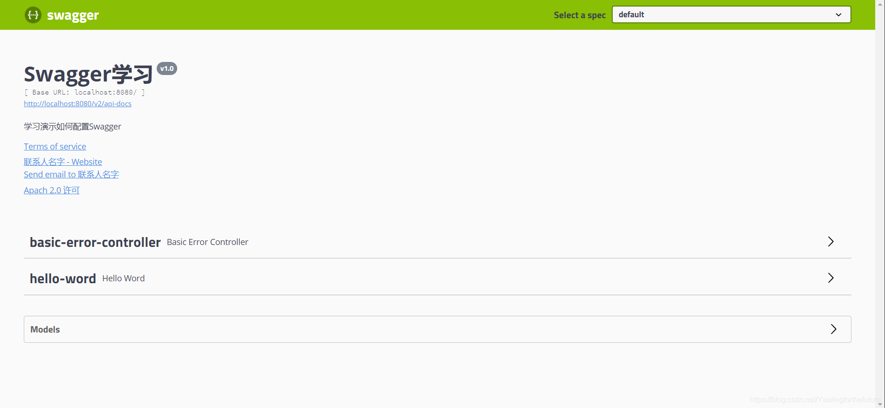

4、配置扫描接口

通过Docket.select()配置怎么扫描

序号  方法  说明

1  RequestHandlerselectors  配置要扫描接口的方式

2  basePackage  指定要扫描的包

3  any  扫描全部

4  none()  不扫描

5  withClassAnnotation  扫描类上的注解，多数是一个注解的反射对象

6  withMethodAnnotation  扫描方法上的注解

7  paths  过滤，只看到过滤的接口

8  enable  是否开启swagger，默认为true

9  regex  正则表达式

10  ant  通过ant()控制

```java
@Configuration //配置类

@EnableSwagger2// 开启Swagger2的自动配置

public class SwaggerConfig {

  @Bean //配置docket以配置Swagger具体参数

  public Docket docket() {

    return new Docket(DocumentationType.SWAGGER_2)

      .apiInfo(apiInfo())

      .select()

      //RequestHandlerselectors,配置要扫描接口的方式

      //basePackage:指定要扫描的包

      //any():扫描全部

      //none():不扫描

      //withClassAnnotation:扫描类上的注解，多数是一个注解的反射对象

      //withMethodAnnotation:扫描方法上的注解

      .apis(RequestHandlerSelectors.basePackage("com.test.controller"))

      .paths(PathSelectors.ant("/user/**"))

      .build();

  }

  //配置文档信息

  private ApiInfo apiInfo() {

    Contact contact = new Contact("联系人名字", "[http://xxx.xxx.com/联系人访问链接](http://xxx.xxx.com/联系人访问链接)", "联系人邮箱");

    return new ApiInfo(

      "Swagger学习", // 标题

      "学习演示如何配置Swagger", // 描述

      "v1.0", // 版本

      "[http://terms.service.url/组织链接](http://terms.service.url/组织链接)", // 组织链接

      contact, // 联系人信息

      "Apach 2.0 许可", // 许可

      "许可链接", // 许可连接

      new ArrayList<>()// 扩展

    );

  }
}
```

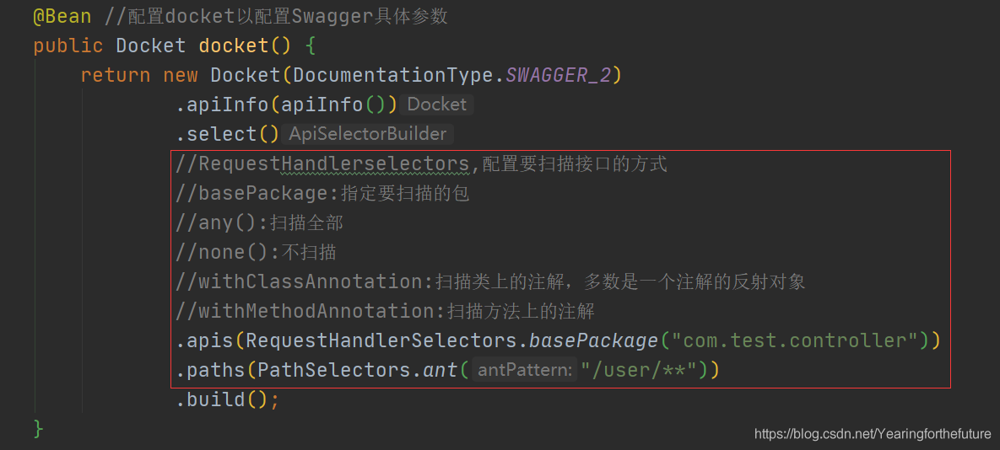

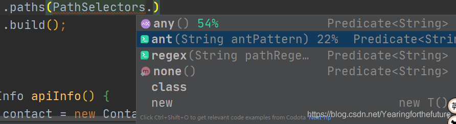

5、配置Swagger开关

5.1 enable()使用

配置是否启用Swagger，如果是false，在浏览器将无法访问

5.2 非生产环境使用swagger
application.properties切换环境

```.properties
spring.profiles.active=pro
```

```java
@Configuration //配置类

@EnableSwagger2// 开启Swagger2的自动配置

public class SwaggerConfig {

  @Bean //配置docket以配置Swagger具体参数

  public Docket docket(Environment environment) {

    // 设置要显示swagger的环境

    Profiles of = Profiles.of("dev", "test");

    // 判断当前是否处于该环境

    // 通过 enable() 接收此参数判断是否要显示

    boolean flag = environment.acceptsProfiles(of);

    return new Docket(DocumentationType.SWAGGER_2)

      .apiInfo(apiInfo())

      .enable(flag) //配置是否启用Swagger，如果是false，在浏览器将无法访问

      .select()

      //RequestHandlerselectors,配置要扫描接口的方式

      //basePackage:指定要扫描的包

      //any():扫描全部

      //none():不扫描

      //withClassAnnotation:扫描类上的注解，多数是一个注解的反射对象

      //withMethodAnnotation:扫描方法上的注解

      .apis(RequestHandlerSelectors.basePackage("com.test.controller"))

      .paths(PathSelectors.ant("/user/**"))

      .build();

  }

  //配置文档信息

  private ApiInfo apiInfo() {

    Contact contact = new Contact("联系人名字", "[http://xxx.xxx.com/联系人访问链接](http://xxx.xxx.com/联系人访问链接)", "联系人邮箱");

    return new ApiInfo(

      "Swagger学习", // 标题

      "学习演示如何配置Swagger", // 描述

      "v1.0", // 版本

      "[http://terms.service.url/组织链接](http://terms.service.url/组织链接)", // 组织链接

      contact, // 联系人信息

      "Apach 2.0 许可", // 许可

      "许可链接", // 许可连接

      new ArrayList<>()// 扩展

    );

  }

}
```

关闭swagger2使用显示页面：


6、配置API分组

6.1 默认分组

如果没有配置分组，默认是default。

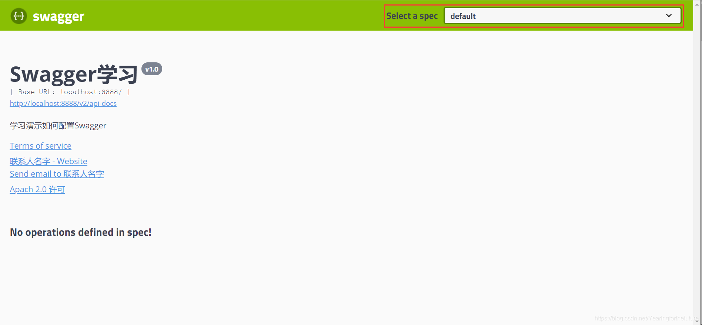

6.2 groupName()使用
通过groupName()方法即可配置分组：
默认

```java
@Bean //配置docket以配置Swagger具体参数

  public Docket docket(Environment environment) {

    // 设置要显示swagger的环境

    Profiles of = Profiles.of("dev", "test");

    // 判断当前是否处于该环境

    // 通过 enable() 接收此参数判断是否要显示

    boolean flag = environment.acceptsProfiles(of);

    return new Docket(DocumentationType.SWAGGER_2)

      .apiInfo(apiInfo())

      .enable(flag) //配置是否启用Swagger，如果是false，在浏览器将无法访问

      .groupName("分组")

      .select()

      .apis(RequestHandlerSelectors.basePackage("com.test.controller"))

      .paths(PathSelectors.ant("/user/**"))

      .build();

  }
```

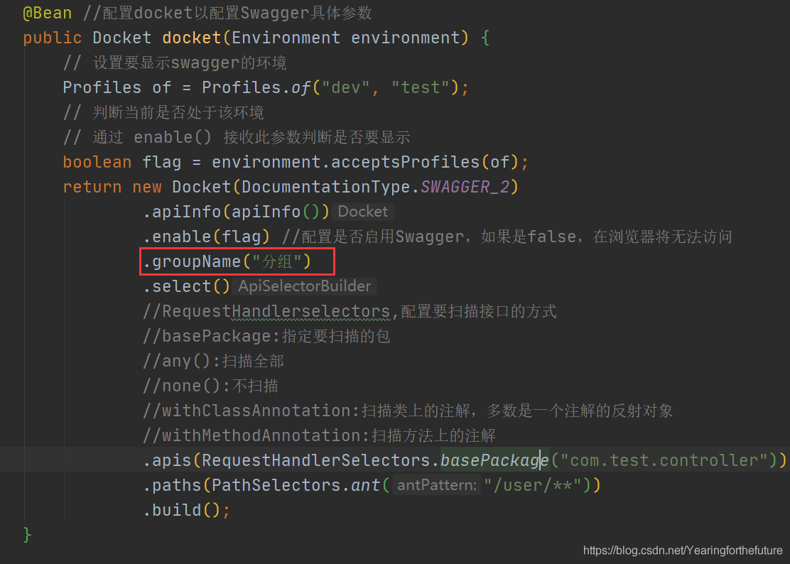

6.3 启动测试

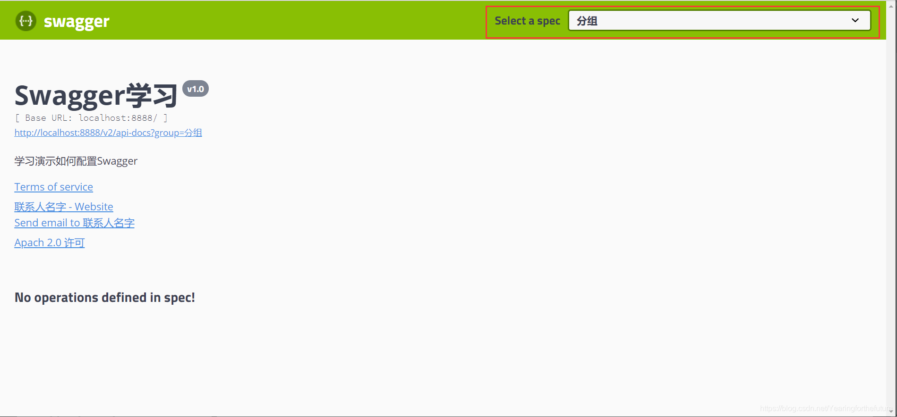

6.4 配置多个分组
一个Docket对应一个分组

```java
@Bean 

public Docket docketA() {

  return new Docket(DocumentationType.SWAGGER_2).groupName("A");

  }

  @Bean

  public Docket docketB() {

    return new Docket(DocumentationType.SWAGGER_2).groupName("B");

  }

  @Bean

  public Docket docketC() {

    return new Docket(DocumentationType.SWAGGER_2).groupName("C");

}
```

6.5 启动测试

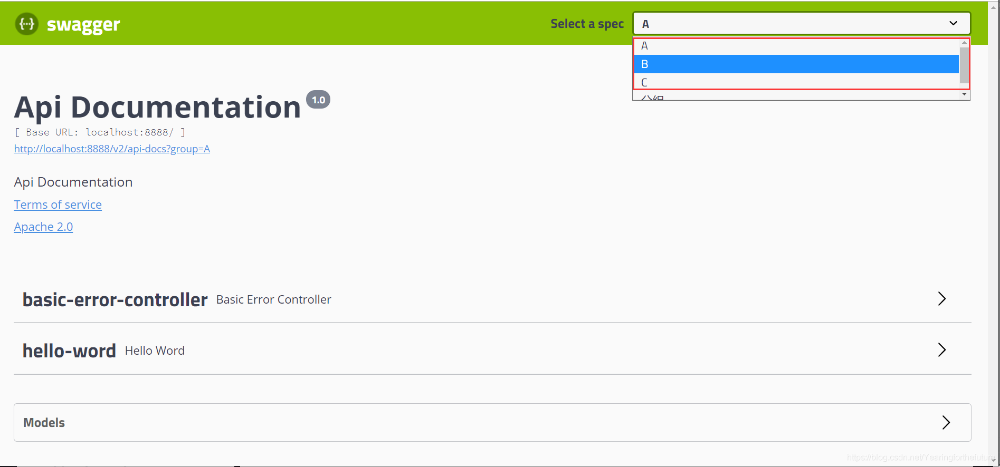

7、实体配置

只要我们的接口中，返回值中存在实体类，他就会被扫描到Swagger中

7.1 创建实体类
User.java

```java
@ApiModel("用户实体")

public class User {

  @ApiModelProperty("用户名")

  public String username;

  @ApiModelProperty("密码")

  public String password;

}
```

7.2 只要这个实体在请求接口的返回值上（即使是泛型），都能映射到实体项中：

```java
@RequestMapping("/getUser")

  public User getUser(){

    return new User();

  }
```

7.3 测试

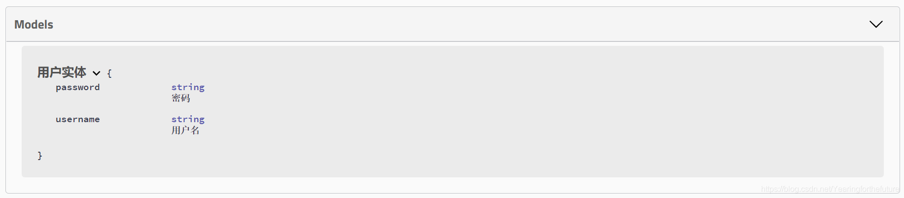

注：并不是因为@ApiModel这个注解让实体显示在这里了，而是只要出现在接口方法的返回值上的实体都会显示在这里，而@ApiModel和@ApiModelProperty这两个注解只是为实体添加注释的。

@ApiModel为类添加注释

@ApiModelProperty为类属性添加注释

@@ApiOperation为方法添加注释

1.  常用注解

Swagger注解  简单说明

@Api(tags = “xxx模块说明”)  作用在模块类上

@ApiOperation(“xxx接口说明”)  作用在接口方法上

@ApiModel(“xxxPOJO说明”)  作用在模型类上：如VO、BO

@ApiModelProperty(value = “xxx属性说明”,hidden = true)  作用在类方法和属性上，hidden设置为true可以隐藏该属性

@ApiParam(“xxx参数说明”)  作用在参数、方法和字段上，类似@ApiModelProperty

1.  拓展：其他皮肤

我们可以导入不同的包实现不同的皮肤定义：

1、默认的访问 [http://localhost:8080/swagger-ui.html](http://localhost:8080/swagger-ui.html "http://localhost:8080/swagger-ui.html")

```xml
<dependency>

  <groupId>io.springfox</groupId>

  <artifactId>springfox-swagger-ui</artifactId>

  <version>2.10.0</version>

</dependency>
```

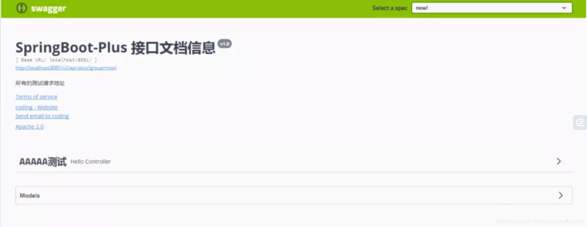

2、bootstrap-ui 访问 [http://localhost:8080/doc.html](http://localhost:8080/doc.html "http://localhost:8080/doc.html")

```xml
<dependency>

  <groupId>com.github.xiaoymin</groupId>

  <artifactId>swagger-bootstrap-ui</artifactId>

  <version>1.9.1</version>

</dependency>
```

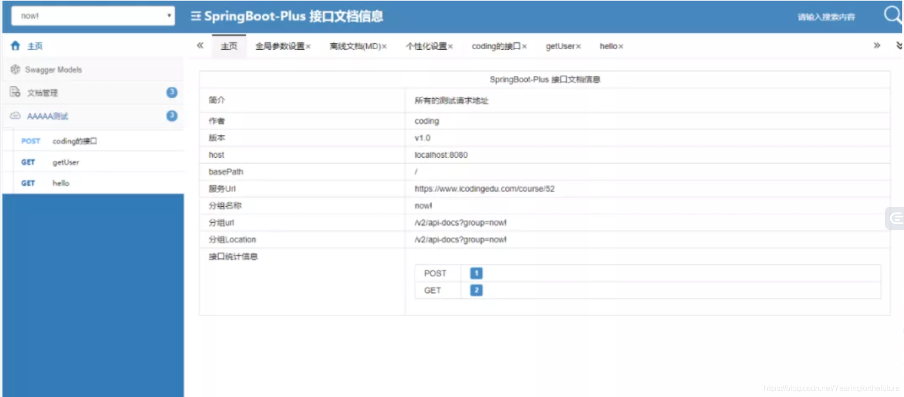

3、Layui-ui 访问 [http://localhost:8080/docs.html](http://localhost:8080/docs.html "http://localhost:8080/docs.html")

```xml
<!-- 引入swagger-ui-layer包 /docs.html-->

<dependency>

  <groupId>com.github.caspar-chen</groupId>

  <artifactId>swagger-ui-layer</artifactId>

  <version>1.1.3</version>

</dependency>
```

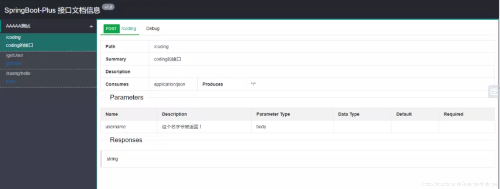

4、mg-ui 访问 [http://localhost:8080/document.html](http://localhost:8080/document.html "http://localhost:8080/document.html")

```xml
<dependency>

  <groupId>com.zyplayer</groupId>

  <artifactId>swagger-mg-ui</artifactId>

  <version>1.0.6</version>

</dependency>
```

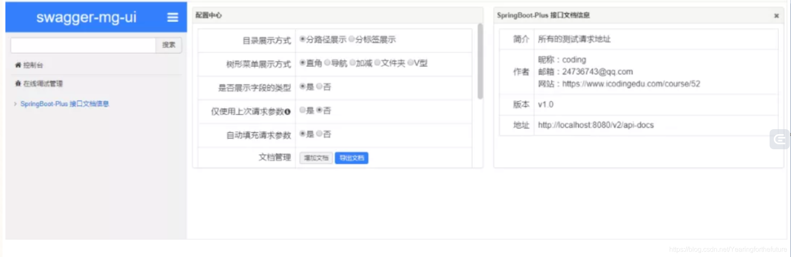
