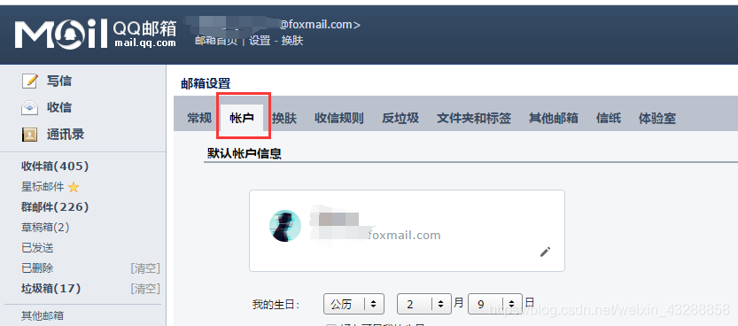
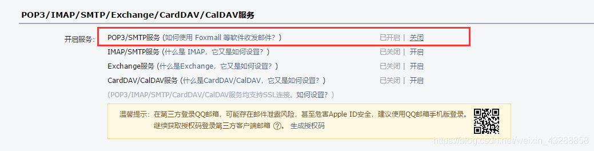
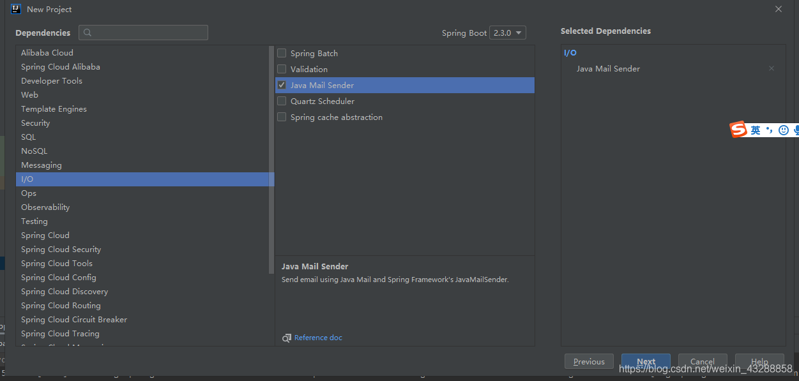
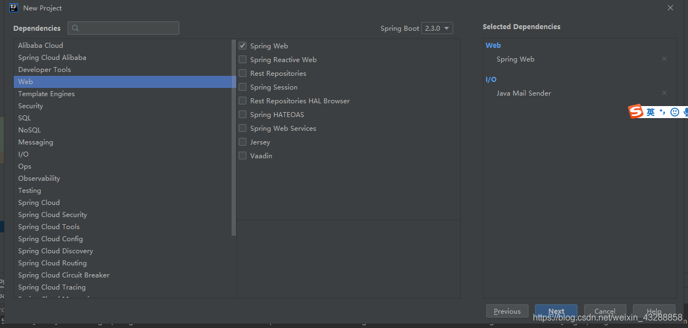

## 目录

*   [Springboot+email](#springbootemail)

    *   [开启 SMTP、POP3](#开启-smtppop3)

    *   [Idea创建一个Java项目](#idea创建一个java项目)

    *   [配置application.yml](#配置applicationyml)

    *   [第一种、发送简单邮件](#第一种发送简单邮件)

    *   [第二种、发送带附件的邮件](#第二种发送带附件的邮件)

    *   [第三种、带图片资源的邮件](#第三种带图片资源的邮件)

    *   [第四种 Freemarker 邮件模板](#第四种-freemarker-邮件模板)

    *   [第五种、使用 Thymeleaf 作邮件模板](#第五种使用-thymeleaf-作邮件模板)

# Springboot+email

## 开启 SMTP、POP3

点进QQ邮箱，点击设置点击账户，往下面拉，开启SMTP服务





## Idea创建一个Java项目

加入web依赖，和发送邮件的依赖





依赖如下所示：

```java
        <dependency>
            <groupId>org.springframework.boot</groupId>
            <artifactId>spring-boot-starter-mail</artifactId>
        </dependency>
        <dependency>
            <groupId>org.springframework.boot</groupId>
            <artifactId>spring-boot-starter-web</artifactId>
        </dependency>
```

## 配置application.yml

```.properties

#配置 SMTP 服务器地址
spring.mail.host=smtp.qq.com
#SMTP 服务器的端口
spring.mail.port=465
#配置邮箱用户名
spring.mail.username=492930223@qq.com
#配置密码，注意，不是真正的密码，而是刚刚申请到的授权码
spring.mail.password=jyehjymkrfipbief
#默认的邮件编码
spring.mail.default-encoding=UTF-8
#配饰 SSL 加密工厂
spring.mail.properties.mail.smtp.socketFactoryClass=javax.net.ssl.SSLSocketFactory
#表示开启 DEBUG 模式，这样，邮件发送过程的日志会在控制台打印出来，方便排查错误
spring.mail.properties.mail.debug=true

#官方建议使用 465 端口，而 465 端口是 SSL 协议的，所以不仅要换端口，
#还需要进行 SSL 协议替换。下面是在 application.properties 进行的邮件发送相关配置，
spring.mail.protocol=smtp
spring.mail.properties.mail.smtp.ssl.enable=true
spring.mail.properties.mail.smtp.socketFactory.port=465
```

## 第一种、发送简单邮件

```java
package com.hello.springbootaddemailhelloworld;

import org.junit.jupiter.api.Test;
import org.springframework.beans.factory.annotation.Autowired;
import org.springframework.boot.test.context.SpringBootTest;
import org.springframework.mail.SimpleMailMessage;
import org.springframework.mail.javamail.JavaMailSender;

import java.util.Date;

@SpringBootTest
class SpringbootAddEmailHelloWorldApplicationTests {

    @Autowired
    JavaMailSender javaMailSender;

    @Test
    void sendSimpleMail() {
        SimpleMailMessage message = new SimpleMailMessage();
        message.setSubject("这是一封测试邮件");
        message.setFrom("492930223@qq.com");
        message.setTo("1217262565@qq.com");
        message.setSentDate(new Date());
        message.setText("这是测试邮件的正文");
        javaMailSender.send(message);
    }

}

```

## 第二种、发送带附件的邮件

```java
 @Test
    public void sendAttachFileMail() throws MessagingException {
        MimeMessage mimeMessage = javaMailSender.createMimeMessage();
        MimeMessageHelper helper = new MimeMessageHelper(mimeMessage,true);
        helper.setSubject("这是一封测试邮件");
        helper.setFrom("857903497@qq.com");
        helper.setTo("1559***26@qq.com");
//        helper.setCc("37xxxxx37@qq.com");
//        helper.setBcc("14xxxxx098@qq.com");
        helper.setSentDate(new Date());
        helper.setText("这是测试邮件的正文");
        helper.addAttachment("测试图片.jpg",new File("C:\\Users\\Administrator\\Desktop\\11.jpg"));
        javaMailSender.send(mimeMessage);
    }

```

## 第三种、带图片资源的邮件

```java
  @Test
    public void sendImgResMail() throws MessagingException {
        MimeMessage mimeMessage = javaMailSender.createMimeMessage();
        MimeMessageHelper helper = new MimeMessageHelper(mimeMessage, true);
        helper.setSubject("这是一封测试邮件");
        helper.setFrom("857903497@qq.com");
        helper.setTo("1559908926@qq.com");
//        helper.setCc("37xxxxx37@qq.com");
//        helper.setBcc("14xxxxx098@qq.com");
        helper.setSentDate(new Date());
        helper.setText("<p>hello 大家好，这是一封测试邮件，这封邮件包含两种图片，分别如下</p><p>第一张图片：</p><p>第二张图片：</p>",true);
        helper.addInline("p01",new FileSystemResource(new File("C:\\Users\\Administrator\\Desktop\\11.jpg")));
        helper.addInline("p02",new FileSystemResource(new File("C:\\Users\\Administrator\\Desktop\\11.jpg")));
        javaMailSender.send(mimeMessage);
    }

```

这里的邮件 text 是一个 HTML 文本，里边涉及到的图片资源先用一个占位符占着，setText 方法的第二个参数 true 表示第一个参数是一个 HTML 文本。

setText 之后，再通过 addInline 方法来添加图片资源。

在公司实际开发中，第一种和第三种都不是使用最多的邮件发送方案。因为正常来说，邮件的内容都是比较的丰富的，所以大部分邮件都是通过 HTML 来呈现的，如果直接拼接 HTML 字符串，这样以后不好维护，为了解决这个问题，一般邮件发送，都会有相应的邮件模板。最具代表性的两个模板就是 Freemarker 模板和 Thyemeleaf 模板了

## 第四种 Freemarker 邮件模板

引入Freemarker依赖

```xml
<dependency>
    <groupId>org.springframework.boot</groupId>
    <artifactId>spring-boot-starter-freemarker</artifactId>
</dependency>

```

在templatest文件夹下面创建mail.ftl文件，模板如下所示

```html
<!DOCTYPE html>
<html lang="en">
<head>
    <meta charset="UTF-8">
    <title>Title</title>
</head>
<body>
<#--Freemarker 作邮件模板-->
<p>hello 欢迎加入 xxx 大家庭，您的入职信息如下：</p>
<table border="1">
    <tr>
        <td>姓名</td>
        <td>${username}</td>
    </tr>
    <tr>
        <td>工号</td>
        <td>${num}</td>
    </tr>
    <tr>
        <td>薪水</td>
        <td>${salary}</td>
    </tr>
</table>
<div style="color: #ff1a0e">一起努力创造辉煌</div>
</body>
</html>

```

接下来，将邮件模板渲染成 HTML ，然后发送即可。发送模板代码如下，

```java
//    Freemarker 作邮件模板
    @Test
    public void sendFreemarkerMail() throws MessagingException, IOException, TemplateException {
        MimeMessage mimeMessage = javaMailSender.createMimeMessage();
        MimeMessageHelper helper = new MimeMessageHelper(mimeMessage, true);
        helper.setSubject("这是一封测试邮件");
        helper.setFrom("857903497@qq.com");
        helper.setTo("1559908926@qq.com");
//        helper.setCc("37xxxxx37@qq.com");
//        helper.setBcc("14xxxxx098@qq.com");
        helper.setSentDate(new Date());
        //构建 Freemarker 的基本配置
        Configuration configuration = new Configuration(Configuration.VERSION_2_3_0);
        // 配置模板位置，启动类的位置JhjmailApplication
        ClassLoader loader = JhjmailApplication.class.getClassLoader();
        configuration.setClassLoaderForTemplateLoading(loader, "templates");
        //加载模板
        Template template = configuration.getTemplate("mail.ftl");
        User user = new User();
        user.setUsername("蒋皓洁");
        user.setNum(1);
        user.setSalary( 99999);
        StringWriter out = new StringWriter();
        //模板渲染，渲染的结果将被保存到 out 中 ，将out 中的 html 字符串发送即可
        template.process(user, out);
        helper.setText(out.toString(),true);
        javaMailSender.send(mimeMessage);
    }

```

需要注意的是，虽然引入了 Freemarker 的自动化配置，但是我们在这里是直接 new Configuration 来重新配置 Freemarker 的，所以 Freemarker 默认的配置这里不生效，因此，在填写模板位置时，值为 templates 。

当然里面涉及到一个new一个User对象，则要新建一个User类

```java
public class User {
    private  String username;
    private  int num;
    private int Salary;

    public String getUsername() {
        return username;
    }

    public void setUsername(String username) {
        this.username = username;
    }

    public int getNum() {
        return num;
    }

    public void setNum(int num) {
        this.num = num;
    }

    public int getSalary() {
        return Salary;
    }

    public void setSalary(int salary) {
        Salary = salary;
    }
}

```

## 第五种、使用 Thymeleaf 作邮件模板

推荐在 Spring Boot 中使用 Thymeleaf 来构建邮件模板。因为 Thymeleaf 的自动化配置提供了一个 TemplateEngine，通过 TemplateEngine 可以方便的将 Thymeleaf 模板渲染为 HTML ，同时，Thymeleaf 的自动化配置在这里是继续有效的 。

首先，引入 Thymeleaf 依赖：

```xml
<dependency>
    <groupId>org.springframework.boot</groupId>
    <artifactId>spring-boot-starter-thymeleaf</artifactId>
</dependency>

```

Thymeleaf 模板如下

```html
<!DOCTYPE html>
<html lang="en" xmlns:th="http://www.thymeleaf.org">
<head>
    <meta charset="UTF-8">
    <title>Title</title>
</head>
<body>
<p>hello 欢迎加入 xxx 大家庭，您的入职信息如下：</p>
<table border="1">
    <tr>
        <td>姓名</td>
        <td th:text="${username}"></td>
    </tr>
    <tr>
        <td>工号</td>
        <td th:text="${num}"></td>
    </tr>
    <tr>
        <td>薪水</td>
        <td th:text="${salary}"></td>
    </tr>
</table>
<div style="color: #ff1a0e">一起努力创造辉煌</div>
</body>
</html>

```

```java

    @Autowired
    TemplateEngine templateEngine;

    @Test
    public void sendThymeleafMail() throws MessagingException {
        MimeMessage mimeMessage = javaMailSender.createMimeMessage();
        MimeMessageHelper helper = new MimeMessageHelper(mimeMessage, true);
        helper.setSubject("这是一封测试邮件");
        helper.setFrom("857903497@qq.com");
        helper.setTo("1559908926@qq.com");
//        helper.setCc("37xxxxx37@qq.com");
//        helper.setBcc("14xxxxx098@qq.com");
        helper.setSentDate(new Date());
        Context context = new Context();
        context.setVariable("username", "javaboy");
        context.setVariable("num","000001");
        context.setVariable("salary", "99999");
        String process = templateEngine.process("mail.html", context);
        helper.setText(process,true);
        javaMailSender.send(mimeMessage);
    }

```

注意一点，下面这个Context类不是自定义的，是thymeleaf.context.Context中的

```java
 Context context = new Context();

```

所有要引入下面这个

```java
import org.thymeleaf.context.Context;

```
