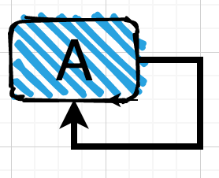
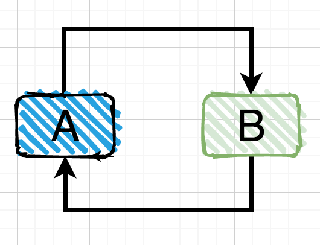
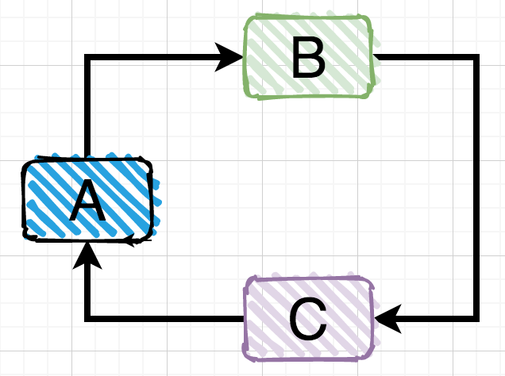
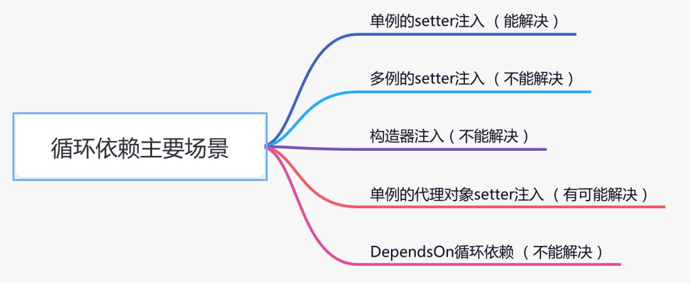

# Spring如何解决循环依赖问题

## 什么是循环依赖

一个或多个对象实例之间存在直接或间接的依赖关系，这种依赖关系构成了构成一个环形调用。

**第一种情况**：自己依赖自己的直接依赖

**第二种情况**：两个对象之间的直接依赖

**第三种情况**：多个对象之间的间接依赖

## 循环依赖的N中场景

spring中出现循环依赖主要有以下场景：

Spring进行扫描 → 反射后封装成beanDefinition对象 → 放入beanDefinitionMap → 遍历Map → 验证（是否单例、是否延迟加载、是否抽象） → 推断构造方法 → 准备开始进行实例 → 去单例池中查，没有 → 去二级缓存中找，没有提前暴露 → 生成一个objectFactory对象暴露到二级缓存中 → 属性注入，发现依赖Y → 此时Y开始它的生命周期直到属性注入，发现依赖X → X又走一遍生命周期，当走到去二级缓存中找的时候找到了 → 往Y中注入X的ObjectFactory对象 → 完成循环依赖。

1、为什么要使用x的obejctFactory对象而不是直接使用X对象？

利于拓展，可以通过beanPostProcess接口操作objectFactory对象生成自己想要的对象

&#x20;2、是不是只能支持单例（scope=singleton）而不支持原型（scope=prototype）？

是。因为单例是spring在启动时进行bean加载放入单例池中，在依赖的bean开始生命周期后，可以直接从二级缓存中取到它所依赖的bean的objectFactory对象从而结束循环依赖。而圆形只有在用到时才会走生命周期流程，但是原型不存在一个已经实例化好的bean，所以会无限的创建→依赖→创建→依赖...

3、循环依赖是不是只支持非构造方法？

是，类似死锁问题。
