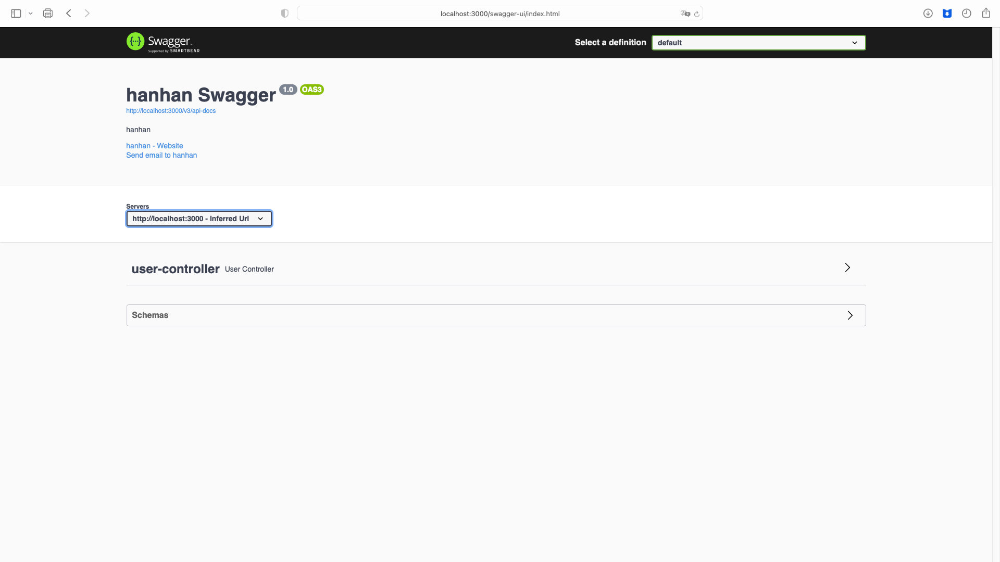
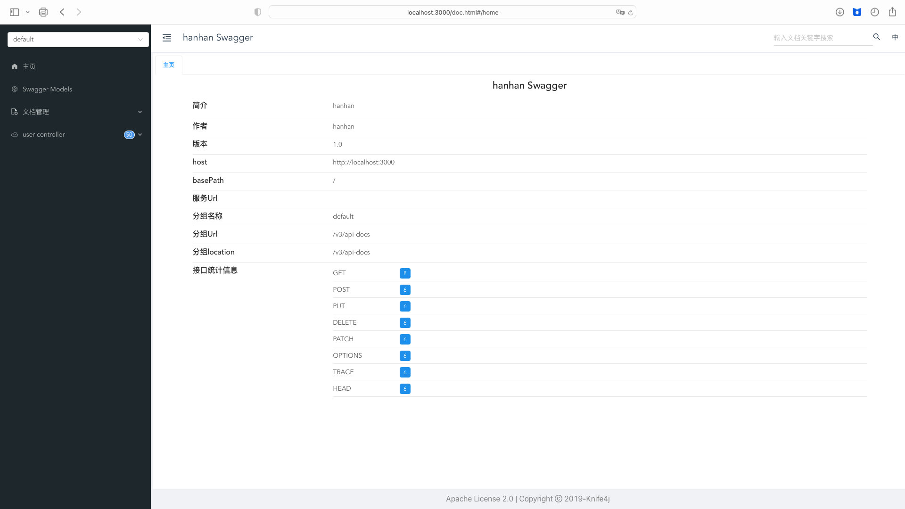

## 目录

*   [springboot2.6.x+swagger3.0](#springboot26xswagger30)

    *   [1. 添加Swagger3 pom依赖](#1-添加swagger3-pom依赖)

    *   [2. 添加yml/properties依赖](#2-添加ymlproperties依赖)

    *   [3. 新建SwaggerConfig配置类](#3-新建swaggerconfig配置类)

    *   [4. 在启动类上面加注释](#4-在启动类上面加注释)

    *   [5. run](#5-run)

# springboot2.6.x+swagger3.0

## 1. 添加Swagger3 pom依赖

这里强调一下，SpringBoot2.6.0之上只能装Swagger3

```xml
<!-- Swagger3 -->
<dependency>
  <groupId>io.springfox</groupId>
  <artifactId>springfox-boot-starter</artifactId>
  <version>3.0.0</version>
</dependency>

```

这里补充一个依赖，我觉得比较好看的ui界面：

```xml
<dependency>
  <groupId>com.github.xiaoymin</groupId>
  <artifactId>knife4j-spring-ui</artifactId>
  <version>3.0.2</version>
</dependency>

```

这是knife4j的界面，可以和[Swagger](https://so.csdn.net/so/search?q=Swagger\&spm=1001.2101.3001.7020 "Swagger")共存，同时单纯加入这个ui的话，两个接口界面都可以看。

## 2. 添加yml/properties依赖

```yaml
spring:
  mvc:
    pathmatch:
      matching-strategy: ant_path_matcher

```

## 3. 新建SwaggerConfig配置类

```java
package com.framework.control.config;

import org.springframework.beans.BeansException;
import org.springframework.beans.factory.config.BeanPostProcessor;
import org.springframework.context.annotation.Bean;
import org.springframework.context.annotation.Configuration;
import org.springframework.util.ReflectionUtils;
import org.springframework.web.servlet.mvc.method.RequestMappingInfoHandlerMapping;
import springfox.documentation.builders.ApiInfoBuilder;
import springfox.documentation.builders.PathSelectors;
import springfox.documentation.service.ApiInfo;
import springfox.documentation.service.Contact;
import springfox.documentation.spi.DocumentationType;
import springfox.documentation.spring.web.plugins.Docket;
import springfox.documentation.spring.web.plugins.WebFluxRequestHandlerProvider;
import springfox.documentation.spring.web.plugins.WebMvcRequestHandlerProvider;
import springfox.documentation.swagger2.annotations.EnableSwagger2;

import java.lang.reflect.Field;
import java.util.ArrayList;
import java.util.List;
import java.util.stream.Collectors;

@Configuration
public class SwaggerConfig {
    @Bean
    public Docket createRestApi() {
        return new Docket(DocumentationType.OAS_30)
                .apiInfo(apiInfo())
                .select()
                .paths(PathSelectors.any())
                .build();
    }

    private ApiInfo apiInfo() {
        return new ApiInfoBuilder()
                .title("采集控制单元接口文档")
                .description("采集控制单元")
                .contact(new Contact("采集控制单元", "", ""))
                .version("1.0")
                .build();
    }

    /**
     * 解决springboot版本过高问题
     * @return
     */
    @Bean
    public static BeanPostProcessor springfoxHandlerProviderBeanPostProcessor() {
        return new BeanPostProcessor() {

            @Override
            public Object postProcessAfterInitialization(Object bean, String beanName) throws BeansException {
                if (bean instanceof WebMvcRequestHandlerProvider || bean instanceof WebFluxRequestHandlerProvider) {
                    customizeSpringfoxHandlerMappings(getHandlerMappings(bean));
                }
                return bean;
            }

            private <T extends RequestMappingInfoHandlerMapping> void customizeSpringfoxHandlerMappings(List<T> mappings) {
                List<T> copy = mappings.stream()
                        .filter(mapping -> mapping.getPatternParser() == null)
                        .collect(Collectors.toList());
                mappings.clear();
                mappings.addAll(copy);
            }

            @SuppressWarnings("unchecked")
            private List<RequestMappingInfoHandlerMapping> getHandlerMappings(Object bean) {
                try {
                    Field field = ReflectionUtils.findField(bean.getClass(), "handlerMappings");
                    field.setAccessible(true);
                    return (List<RequestMappingInfoHandlerMapping>) field.get(bean);
                } catch (IllegalArgumentException | IllegalAccessException e) {
                    throw new IllegalStateException(e);
                }
            }
        };
    }
}

```

## 4. 在启动类上面加注释

加一个`@EnableOpenApi`就好了

```java
@EnableOpenApi
@SpringBootApplication
public class SpringBootDemoApplication {

    public static void main(String[] args) {
        SpringApplication.run(SpringBootDemoApplication.class, args);
    }

}

```

## 5. run

这里的地址要注意一下，就和swagger2不一样，多了一个index.html

[http://localhost:3000/swagger-ui/index.html](http://localhost:3000/swagger-ui/index.html "http://localhost:3000/swagger-ui/index.html")

（端口自觉改一下）



然后再展示一下knife4j的界面，这里的地址后缀为doc.html：

[http://localhost:3000/doc.html](http://localhost:3000/doc.html "http://localhost:3000/doc.html")

（端口不说了）


