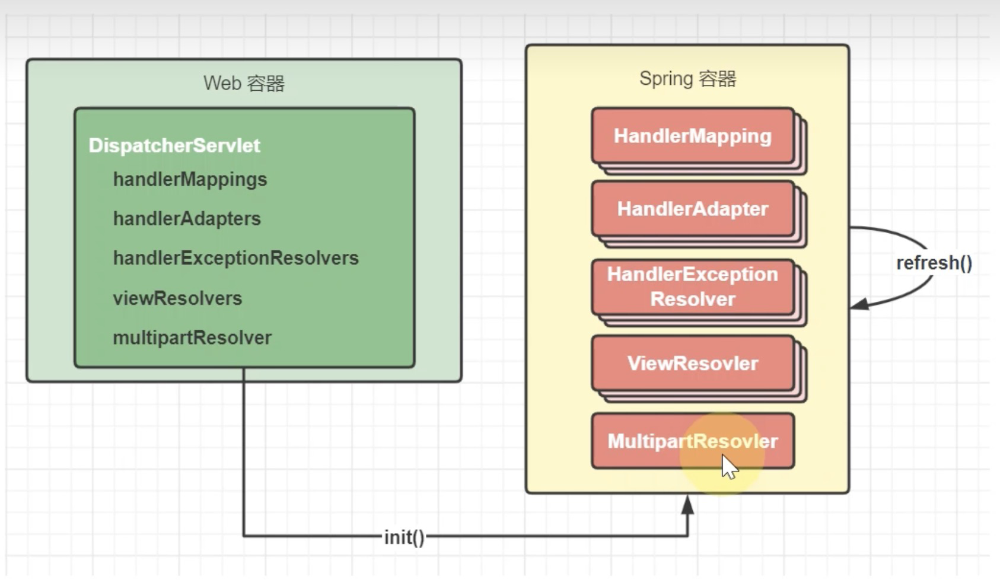

# SpringMVC执行流程

## 1.简单概述

1. 用户发送请求到DispatchServlet（前端控制器）
2. DispatchServlet收到请求调用HandlerMapping（处理器映射器）
3. HandlerMapping找到具体的处理器，生成处理器对象及处理器和拦截器，再一起返回给DispatchServlet
4. DispatchServlet调用HandlerAdapter（处理器适配器）
5. HandlerAdapter经过适配调用具体的处理器（Handler/Controller）
6. Handler（处理器）执行完成返回ModelAndView对象
7. HandlerAdapter将Controller执行结果ModelAndView返回给DispatchServlet
8. DispatchServlet将ModelAndView传给ViewReslover（视图解析器）
9. ViewReslover解析后返回具体的View（视图）
10. DispatchServlet根据View进行渲染视图
11. DispatchServlet响应用户

## 2.详解

### 2.1.初始化阶段：

1. 在web容器第一次用到`DispatcherServlet`的时候，会创建其对象并执行init方法
2. init方法内会创建Spring Web容器，并调用容器refresh方法
3. refresh过程中会创建并初始化SpringMVC中的重要组件，例如`MultipartResolver、HandlerMapping、HandlerAdapter、HandlerExceptionResolver、ViewResolver等`
4. 容器初始化后，会将上一步初始化好的重要组件，赋值给`DispatcherServlet`的成员变量，留待后用

### 2.2.匹配阶段

1. 用户发送的请求统一到达前端控制器DispatcherServlet
2. DispatcherServlet遍历所有的HanlderMapping，找到与路径匹配的处理器
   1. HandlerMapping有多个，每个HandlerMapping会返回不同的处理器对象，谁先匹配，返回谁的处理器。其中能识别@RequestMapping的优先级最高
   2. 对应@RequestMapping的处理器是HandlerMethod，他包含了控制器对象和控制器方法信息
   3. 其中路径与处理器的映射关系在HandlerMapping初始化时就会建立好
3. 将HandlerMethod连同匹配到的拦截器，生成调用链对象HandlerExcutionChain返回
4. 遍历HandlerAdapter处理器适配器，找到能处理HandlerMethod的适配器对象，开始调用

### 2.3.执行阶段

1. 执行拦截器preHandle
2. 由HandlerAdapter调用HandlerMethod
   1. 调用前处理不同类型的参数
   2. 调用后处理不同类型的返回值
3. 第2步没有异常
   1. 返回ModelAndView
   2. 执行拦截器postHandle方法
   3. 解析视图，得到View对象，进行视图渲染
4. 第2步有异常，进入HandlerExceptionResolver异常处理流程
5. 最后都会执行拦截器的afterCompletion方法
6. 如果控制器方法标注了@ResponseBody注解，则在第2步，就会生成json结果，并标记ModelAndView已处理，这样就不会执行第3步的视图渲染