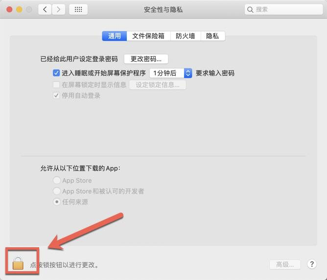

在安装Mac电脑应用程序的时候，经常会遇到“xxx.app已损坏，打不开。您应该将它移到废纸篓“或”打不开的xxx.app，因为它来自身份不明的开发者”，如图：

遇到上述情况是不是真的要移动到废纸篓呢？下面小编就为您带来Mac应用程序无法打开提示不明开发者或文件损坏的处理方法，解答Mac应用程序无法打开的问题。

1. 打开系统偏好设置界面，进入安全性与隐私，如下图所示：

2.点按左下角的锁头图标，解锁更改权限

3.将允许从以下位置下载的应用，更改为 “ 任何来源 ” ，然后再打开应用即可

有朋友就说了，我这直接打开没有显示任何来源这一项怎么办？小编这就说下Mac没有任何来源选项怎么打开任何来源 若没有“任何来源”这个选项，按以下步骤执行：

1. 打开终端（Terminal.app）
2. 拷贝粘贴 `sudo spctl --master-disable`，按回车键
3. 输入你的账户密码，按回车键确认执行（输入密码不会显示，直接输入确定正确即可）

需要注意的是：拷贝粘贴`sudo spctl --master-disable`的时候注意不要有多余的空格，输入密码的时候不会显示密码，别以为没输上呢，只要你输入对了回车就可以了。输入后到”隐私性与安全“那里看下，任何来源已经选中并已打开，这个时候不需要再解锁选中等其他操作。

## apple m1 芯片电脑出现闪退要安装Rosetta2

- 安装Rosetta2
- 打开终端执行这个命令 softwareupdate --install-rosetta
- 输入 A，回车，等待进度完成
- 完成后，在打开终端，执行这个命令 /usr/sbin/softwareupdate --install-rosetta --agree-to-license

如已经开启任何来源，但依旧打不开（macOS Catalina 10.15以上会遇到）按以下步骤执行：

1. 打开终端；
2. 输入以下命令，回车；

`sudo xattr -d com.apple.quarantine /Applications/xxxx.app`。

3.重启App即可。

还有一种情况，如安装应用时，出现 “ 打不开 XXX.app，因为它来自身份不明的开发者 ” ，并提示你的软件在什么位置什么时间下载了磁盘影像。如图所示：

遇到这种情况，方法如下：

将软件放入“应用程序”后，点击软件 右键-打开 ，如图所示：

打开应用程序文件夹，找到 Final Cut Pro，然后按住 control 键，点击 Final Cut Pro，然后在弹出的菜单上面，点击打开。（通俗的讲就是在FCPX上右键打开） 接下来出现了一个对话框，上面有“打开”按钮，点击“打开”按钮，如下图，见证奇迹吧！

这样就轻松解决了安装FCPX后在打开任意来源的情况下还是打不开软件的问题。另外相信您也会和小编一样懂得举一反三，这种方法大多数情况下也适用于其他Mac软件，在遇到打不开的情况下不要放弃，试一试这种方法。

> 以上就是MacW小编为大家带来的“Mac应用程序无法打开提示不明开发者或文件损坏的处理方法”，本文关键词：“Mac应用程序无法打开”，链接：“https://www.macw.com/news/1.html”，转载请保留。