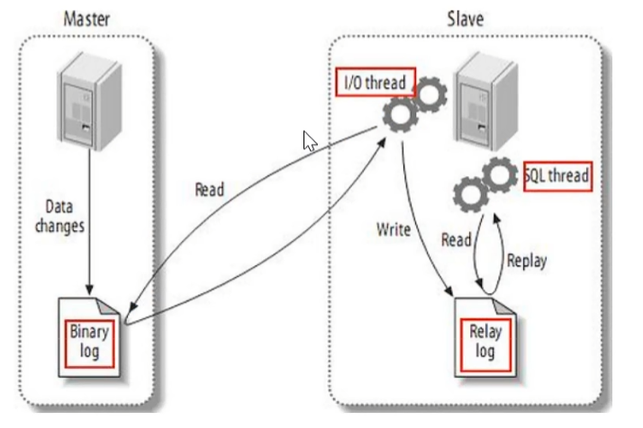

# 主从复制的原理

1. master服务器将数据的改变记录到二进制bin log日志，当master上的数据发生改变时，则将其改变写入到二进制日志中。
2. slave服务器会在一定时间间隔内对master二进制日志进行探测其是否发生改变，如果发生改变，则开始一个I/O thread请求master二进制事件
3. 同时主节点为每个I/O线程启动一个dump线程，用于向其发送二进制事件，并保存至从节点本地的中继日志中，从节点将启动SQL线程从中继日志中读取二进制日志，在本地重放，使得其数据和主节点的保持一致，最后I/O thread和SQL thread将进入睡眠状态，等待下一次被唤醒。

也就是说：

- 从库会生成两个线程，一个I/O线程，一个SQL线程
- I/O线程会去请求主库的bin log日志，并将得到的bin log日志写到本地的relay-log（中继日志）文件中；
- 主库会生成一个log dump线程，用来给从库I/O线程传bin log；
- SQL线程，会读取relay log文件中的日志，并解析成sql语句逐一执行；

注意：

1. master将操作语句记录到binlog日志中，然后授予slave远程连接的权限（master一定要开启bin log二进制日志功能；通常为了数据安全考虑，slave也开启bin log功能）
2. slave开启两个线程：IO线程和SQL线程。其中：IO线程负责读取master的bin log内容到中继日志relay log里；SQL线程负责从relay log日志里读取bin log内容，并更新到slave的数据库里，这样就能保证slave数据和master数据保持一致了。
3. Mysql复制至少需要两个MySQL服务，当然mySQL服务可以分布在不同的服务器上，也可以在一台服务器上启动多个服务。
4. MySQL复制最好确保master和slave服务器上的mysql版本相同（如果不能满足版本一致，那么要保证master主节点的版本低于slave从节点的版本）
5. master和slave两节点间时间需同步

具体步骤：

1. 从库通过手工执行change master to语句连接主库，提供了连接的用户一切条件（user, password, port, ip），并且让从库知道，二进制日志的起点位置（file名 position号）；start slave
2. 从库的IO线程和主库的dump线程建立连接
3. 从库根据change master to语句提供的file名和position号，IO线程向主库发起bin log的请求
4. 主库dump线程根据从库的请求，将本地bin log以events的方式发给从库IO线程
5. 从库IO线程接收bin log events，并存放到本地relay-log中，传送过来的信息，会记录到master.info中
6. 从库SQL线程应用relay-log，并且把应用过的记录到relay-log.info中，默认情况下，已经应用过的relay会自动被清理purge

