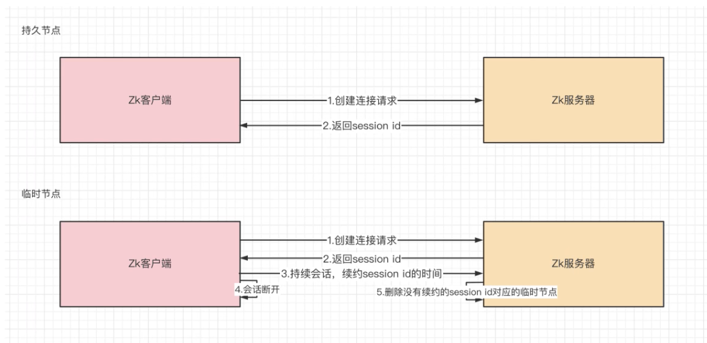

# Zookeeper基础

## 1. znode结构

zk中的znode，包含了四部分：

- data：保存数据
- acl：权限，定义了什么样的用户能够操作这个节点，且能够进行怎样的操作。
  - c：`create`创建权限，允许在该节点下创建子节点
  - w：`write`更新权限，允许更新该节点的数据
  - r：`read`读取权限，允许读取该节点的内容以及子节点的列表信息。
  - d：`delete`删除权限，允许删除该节点的子节点
  - a：`admin`管理者权限，允许对该节点进行`acl`权限设置
- stat：描述当前znode的元数据
- child：当前节点的子节点

## 2. 节点信息

- `cZxid`：创建节点的事务ID
- `mZxid`：修改节点的事务ID
- `pZxid`：添加和删除子节点的事务ID
- `ctime`：节点创建的时间
- `mtime`：节点最近修改的时间
- `dataVersion`：节点内数据的版本，每更新一次数据，版本会+1
- `aclVersion`：此节点的权限版本
- `ephemeralOwner`：如果当前节点是临时节点，该值是当前节点所有者的seesion id。如果节点不是临时节点，则该值为0
- `dataLength`：节点内数据的长度
- `numChildren`：该节点的子节点个数

## 3. znode节点类型

- 持久节点：创建出的节点，在会话结束后依然存在，保存数据
- 持久序号节点：创建出的节点，根据先后顺序，会在节点之后带上一个数值，越后执行数值越大，适用于分布式锁的应用场景-单调递增
- 临时节点：临时节点是在会话结束后，自动被删除的，通过这个特性，zk可以实现服务注册与发现的效果。

- 临时序号节点：跟持久序号节点相同，适用于临时的分布式锁。
- Container节点（3.5.3版本新增）：`Container`容器节点，当容器中没有任何子节点，该容器节点会被zk定期删除（60s）
- TTL节点：可以指定节点的到期时间，到期后被zk定时删除。只能通过系统配置`zookeeper.extendTypesEnabled=true`开启

## 4. zk的数据持久化

zk的数据是运行在内存中，zk提供了两种持久化机制：

- 事务日志

zk把执行的命令以日志形式保存在dataLogDir指定的路径中的文件中（如果没有指定dataLogDir，则按dataDir指定的路径）。

- 数据快照

zk会在一定的时间间隔内做一次内存数据的快照，把该时刻的内存数据保存在快照文件中。

> zk通过两种形式的持久化，在恢复时先恢复快照文件中的数据到内存中，再用日志文件中的数据做增量恢复，这样的恢复速度更快。