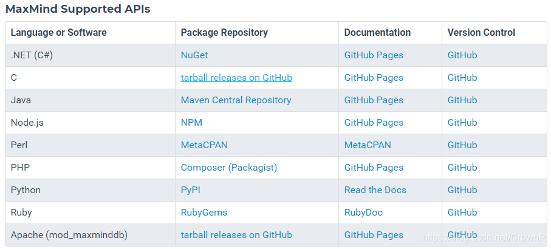
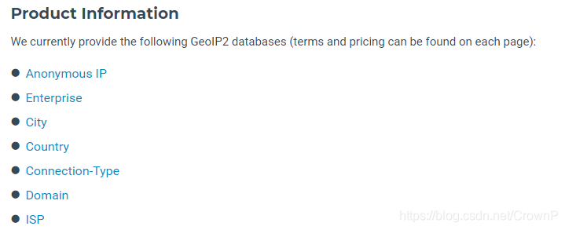

# IP信息解析和地理定位（判断经纬度）

## 下载IP数据文件

https://dev.maxmind.com/geoip/geoip2/geolite2/



**下载City的mmdb数据文件，较于其他两者信息更丰富。**

**这三种离线数据包都是免费的，相对应的也有收费版本 Geo-IP2，提供更准确更详细的信息，如果需要解析获取IPS则需要用到收费版本，如下，提供了7种不同的离线数据文件：**



## 使用参照收费版的geo-ip2文档说明

提供了多种语言使用

https://dev.maxmind.com/geoip/geoip2/downloadable/#MaxMind_APIs


## 使用教程

### 添加maven依赖

```XML
<!-- GeoLite2依赖 -->
<dependency>
    <groupId>com.maxmind.geoip2</groupId>
    <artifactId>geoip2</artifactId>
    <version>2.12.0</version>
</dependency>
```

### 封装IP解析后的数据实体

```Java
package com.qgp.my_demo.GeoLite2Demo;
import lombok.Data;
 
/**
 * @ClassName IPEntity
 * @Author qgp
 * @Date 2019/9/24 17:50
 **/
@Data
public class IPEntity {
 
    //国家
    String countryName;
    //国家代码
    String countryCode;
 
    //省份
    String provinceName;
    String provinceCode;
 
    //城市名称
    String cityName;
 
    //邮政编码
    String postalCode;
 
    //经度
    Double longitude;
    //纬度
    Double latitude;
 
}
```

**编写解析IP的工具方法，GeoLite2-City.mmdb数据文件放在resources目录下，通过InputStream流式读取，保证了，打包成Jar包部署服务器后，依然能读取文件。**

```Java
/**
 * @ClassName IPUtils
 * @Author qgp
 * @Date 2019/9/24 17:51
 **/
public class IPUtils {
    private static Logger logger = LoggerFactory.getLogger(IPUtils.class);
 
    /**
     * 全局静态变量，DatabaseReader，保证类加载时加载一次
     */
    private static DatabaseReader reader;
 
    /**
     * 静态代码块，保证项目启动只获取一次文件
     */
    static {
 
        File database = null;
 
        try {
            //绝对路径读取文件方式
            //database = new File("F:\\IDEA project\\my_demo\\src\\main\\resources\\GeoLite2-City.mmdb");  
 
            // 通过 InputStream 流式读取文件，目的解决无法通过File方式读取jar包内的文件的问题·1
            database = getFile("GeoLite2-City.mmdb","geolite2.mmdb");
            logger.info("-------加载文件");
            reader = new DatabaseReader.Builder(database).build();
        } catch (IOException e) {
            e.printStackTrace();
        }
 
    }
 
 
    /**
     * 解析IP
     * @param ip
     * @return
     */
    public static IPEntity getIPMsg(String ip){
 
        IPEntity msg = new IPEntity();
 
        try {
            InetAddress ipAddress = InetAddress.getByName(ip);
            CityResponse response = reader.city(ipAddress);
            Country country = response.getCountry();
            Subdivision subdivision = response.getMostSpecificSubdivision();
            City city = response.getCity();
            Postal postal = response.getPostal();
            Location location = response.getLocation();
 
            msg.setCountryName(country.getNames().get("zh-CN"));
            msg.setCountryCode(country.getIsoCode());
            msg.setProvinceName(subdivision.getNames().get("zh-CN"));
            msg.setProvinceCode(subdivision.getIsoCode());
            msg.setCityName(city.getNames().get("zh-CN"));
            msg.setPostalCode(postal.getCode());
            //经度
            msg.setLongitude(location.getLongitude());
            //纬度
            msg.setLatitude(location.getLatitude());
 
        } catch (IOException e) {
            e.printStackTrace();
        } catch (GeoIp2Exception e) {
            e.printStackTrace();
        }
 
        return msg;
    }
 
 
    /**
     * 读取classpath下的文件
     * @param fileName 原文件全名
     * @param newFileName  缓存的新文件的名称
     * @return
     * @throws IOException
     */
    public static File getFile(String fileName, String newFileName) throws IOException {
        //读取 ClassPath 路径下指定资源的输入流
        ClassPathResource resource = new ClassPathResource(fileName);
        InputStream inputStream = resource.getInputStream();
 
        File file = new File(newFileName);
 
        inputstreamToFile(inputStream, file);
 
        return file;
    }
 
    /**
     * InputStream -> File
     * @param inputStream
     * @param file
     */
    private static void inputstreamToFile(InputStream inputStream,File file) {
        try {
            OutputStream os = new FileOutputStream(file);
            int bytesRead = 0;
            byte[] buffer = new byte[8192];
            while ((bytesRead = inputStream.read(buffer, 0, 8192)) != -1) {
                os.write(buffer, 0, bytesRead);
            }
            os.close();
            inputStream.close();
        } catch (Exception e) {
            e.printStackTrace();
        }
    }
}
```