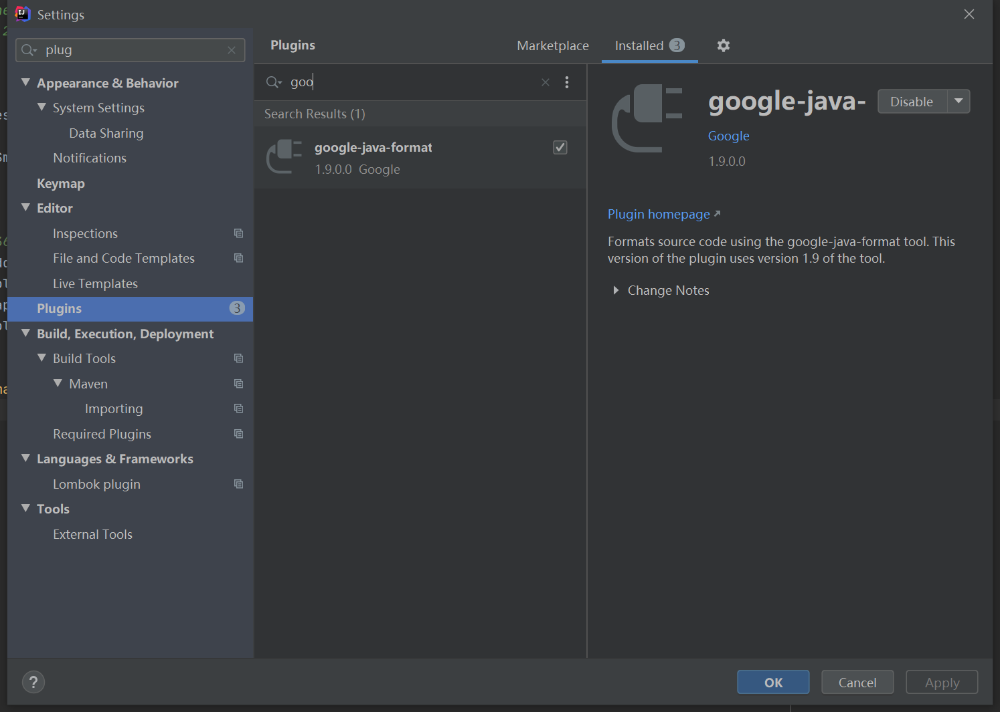

# Intellij Idea 使用google-java-format代码格式化/保存时自动格式化

## 1.idea项目统一格式化

- 安装google-java-format
- 安装save actions
- 自动优化导包选项
- 检查行分隔符/缩进大小

## 2.安装google-java-format

启用google-java-format

## 3.安装save actions

启用save actions
保存时自动格式化
将没用的import 语句删除

## 3.自动优化导包选项

## 4.检查行分隔符/缩进大小

行分隔符需要统一，不得使用windows

缩进大小需要统一

