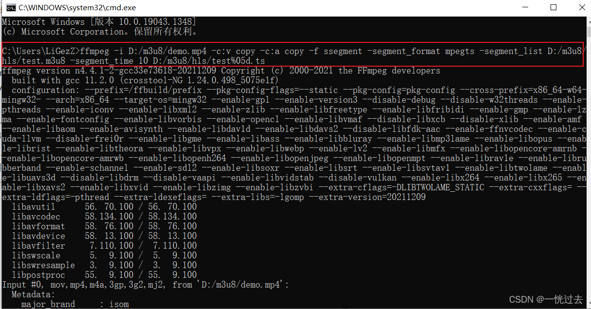
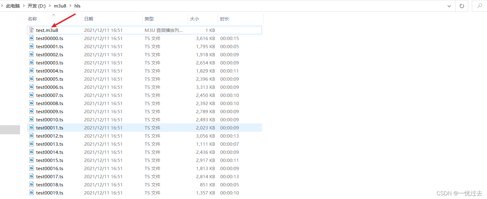
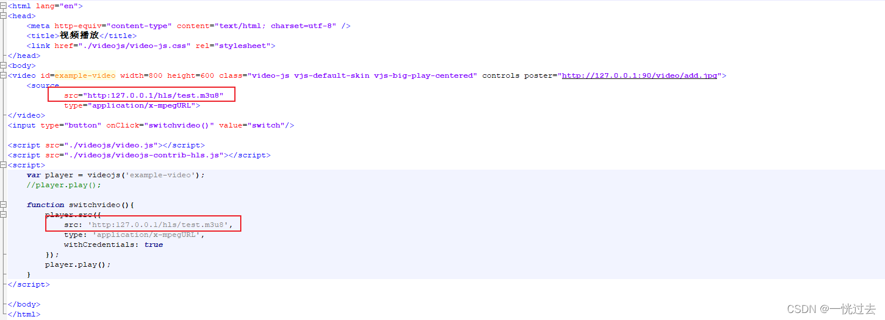
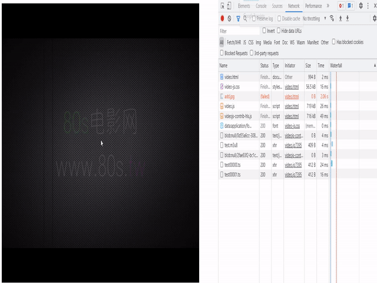

# Java+ffmpeg实现MP4转m3u8切片

首先需要安装[ffmpeg](https://so.csdn.net/so/search?q=ffmpeg&spm=1001.2101.3001.7020)，参考[《Linux+Windows实现ffmpeg配置安装》](https://editor.csdn.net/md/?articleId=121875350)

## 1.MP4转m3u8

```Bash
ffmpeg -i D:/m3u8/demo.mp4 -c:v copy -c:a copy -f ssegment -segment_format mpegts -segment_list D:/m3u8/hls/test.m3u8 -segment_time 10 D:/m3u8/hls/test%05d.ts
```

D:/m3u8/demo.mp4输入的mp4文件

D:/m3u8/hls/test.m3u8输出的m3u8文件

-segment_time设置每片的长度，单位为秒

-segment_list ：段文件的名称，%05d表示5位数字

生成的效果是：将demo.mp4视频文件每10秒生成一个ts文件，最后生成一个m3u8文件，m3u8文件是ts的索引文件。





## 2.播放测试

### 2.1.html

为了方便测试，写了一个简单的html，详细代码见[《测试html》](https://download.csdn.net/download/zhuocailing3390/60974013)，html只需要解压后，修改里面的src地址，设置为实际的m3u8播放地址

**比如：**



### 2.2.NGINX

除此之外需要配置，nginx实现资源播放，配置如下：

```text
location /hls {
            add_header Access-Control-Allow-Origin *;
            add_header Access-Control-Allow-Headers X-Requested-With;
            add_header Access-Control-Allow-Methods GET,POST,PUT,DELETE,OPTIONS;
            
            types {  
                application/vnd.apple.mpegurl m3u8;  
                video/mp2t ts;  
            }
        alias  D:/m3u8/hls/; #切片存放地址
            expires -1;
            add_header Cache-Control no-cache;  
    }
```

本地的m3u8播放路径为：`http:127.0.0.1/hls/test.m3u8`

## 3.Java实现

### 3.1.ProcessUtil.java

```Java
public class ProcessUtil {

    public static String execute(List<String> command) {
        StringBuffer inputStringBuffer = new StringBuffer();
        StringBuffer errorStringBuffer = new StringBuffer();
        try {
            ProcessBuilder builder = new ProcessBuilder(command);
            Process process = builder.start();
            System.out.println("============inputStream============");
            // 处理InputStream
            Thread t1 = new Thread(() -> {
                InputStream input = null;
                InputStreamReader reader = null;
                BufferedReader buffer = null;

                try {
                    input = process.getInputStream();
                    reader = new InputStreamReader(input);
                    buffer = new BufferedReader(reader);
                    String inputLine = "";
                    while ((inputLine = buffer.readLine()) != null) {
                        System.out.println(inputLine);
                        inputStringBuffer.append(inputLine);
                    }
                    //退出循环后表示结束流
                    System.out.println("===》》退出循环后表示结束流");
                } catch (IOException e) {
                    e.printStackTrace();
                } finally {
                    try {
                        if (buffer != null) {
                            buffer.close();
                        }
                        if (reader != null) {
                            reader.close();
                        }
                        if (input != null) {
                            input.close();
                        }
                    } catch (IOException e) {
                        e.printStackTrace();
                    }
                }
            });
            t1.setName("deviceName");
            t1.start();

            System.out.println("============errorStream============");
            // 处理ErrorStream
            new Thread(() -> {
                InputStream input = null;
                InputStreamReader reader = null;
                BufferedReader buffer = null;
                try {
                    input = process.getErrorStream();
                    reader = new InputStreamReader(input);
                    buffer = new BufferedReader(reader);
                    String errorLine = "";
                    while ((errorLine = buffer.readLine()) != null) {
                        System.out.println(errorLine);
                        errorStringBuffer.append(errorLine);
                    }
                } catch (IOException e) {
                    e.printStackTrace();
                } finally {
                    try {
                        if (buffer != null) {
                            buffer.close();
                        }
                        if (reader != null) {
                            reader.close();
                        }
                        if (input != null) {
                            input.close();
                        }
                    } catch (IOException e) {
                        e.printStackTrace();
                    }
                }
            }).start();

            // 这里进程阻塞，将等待外部转换成功后，才往下执行
            //process.waitFor();
            t1.wait();

            /**
             * 只会存在一个输入流返回
             */
            if (inputStringBuffer != null) {
                return inputStringBuffer.toString();
            }
            if (errorStringBuffer != null) {
                return errorStringBuffer.toString();
            }

        } catch (InterruptedException | IOException e) {
            e.printStackTrace();
            return null;
        }
        return null;
    }
}
```

### 3.2. Main.java

```Java
public class Main {
    public static void main(String[] args) {
        String input = "D:/m3u8/demo.mp4";
        String output = "D:/m3u8/hls/test.m3u8";
        List<String> command = new ArrayList<>();
        command.add("ffmpeg");
        command.add("-i");
        command.add(input);
        command.add("-c:v");
        command.add("copy");
        command.add("-c:a");
        command.add("copy");
        command.add("-f");
        command.add("ssegment");
        command.add("-segment_format");
        command.add("mpegts");
        command.add("-segment_list");
        command.add(output);
        command.add("-segment_time");
        command.add("10");
        command.add("D:/m3u8/hls/test%05d.ts");
        String result = ProcessUtil.execute(command);
    }
}
```

### 3.3. 验证测试

再执行完java程序以后，如果在`D:/m3u8/hls`生成了ts和m3u8文件，则表示成功；

## 4. TS切片好处

比如：我们上传一个10MB的视频进行播放，如果不进行切片话，前端页面在播放时需要先下载完整的视频，这样会导致视频加载时间过长。如果使用ts切片后使用m3u8进行播放，在前端播放时页面会自动间隔一定时间下载ts文件进行播放。

**下面视频展示，动态加载ts的过程：**

