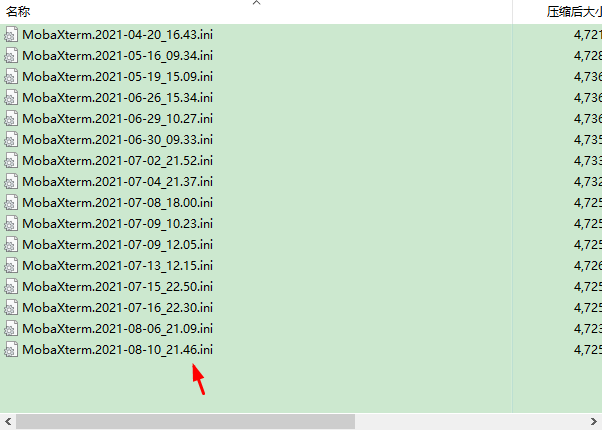
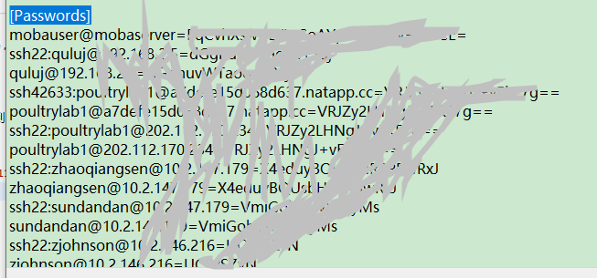

# MobaXterm主密码重置

## 摘要

在一台新PC上安装[MobaXterm](https://mobaxterm.mobatek.net/)，并且导入之前自动备份的配置文件时，忘记了之前设置的主密码，尽管其提示与之前的Windows账户密码一致，仍然不能尝试出来。

## 分析

其配置文件中记录了所有的偏好及账户密码等信息，且有关键字段，找到自动备份的配置文件的最近一个日期，搜索pass发现关键字段[Passwords]

## 尝试

尝试删除第一行，因为其字段为mobauser@mobaserver，删除后再打开便提示重新设置主密码。建议设置Windows账户密码。这里已经设置过了所以没有设置过程截图。

## 结果

这里是只重置了主密码，其他连接过的服务器地址账户密码仍然还在。