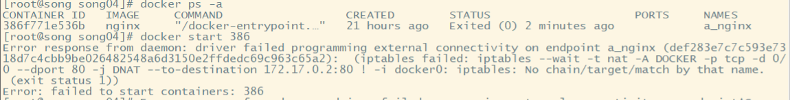

# Linux中启动Docker容器报错：Error response from daemon: driver failed programming external connectivity

自己遇到的场景：在docker运行过程中，将关闭的防火墙给启动了，然后再重新run一个docker容器，就报错了

在启动Docker的容器时，会出现报错：Error response from daemon: driver failed programming external connectivity on endpoint XXX（端口映射或启动容器时报错）

如下：

原因：在我们启动了Docker后，我们再对防火墙firewalld进行操作，就会发生上述报错，

详细原因：docker服务启动时定义的自定义链DOCKER，当 centos7 firewall 被清掉时，

firewall的底层是使用iptables进行数据过滤，建立在iptables之上，这可能会与 Docker 产生冲突。

当 firewalld 启动或者重启的时候，将会从 iptables 中移除 DOCKER 的规则，从而影响了 Docker 的正常工作。

当你使用的是 Systemd 的时候， firewalld 会在 Docker 之前启动，但是如果你在 Docker 启动之后操作 firewalld ，你就需要重启 Docker 进程了。