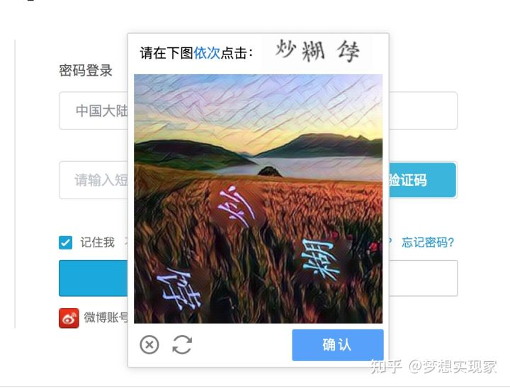
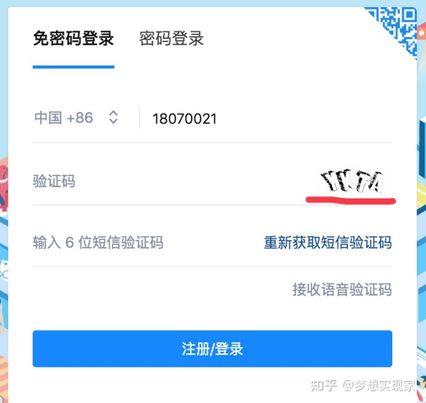
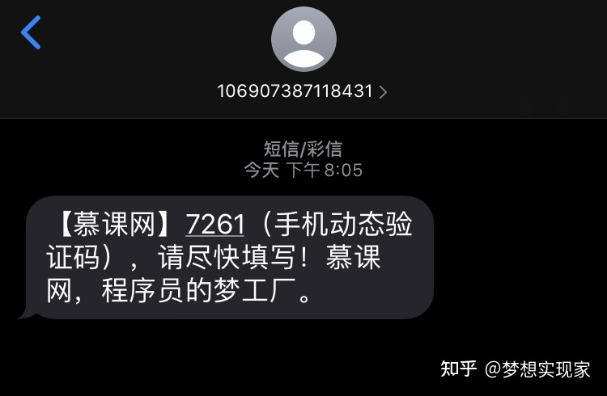
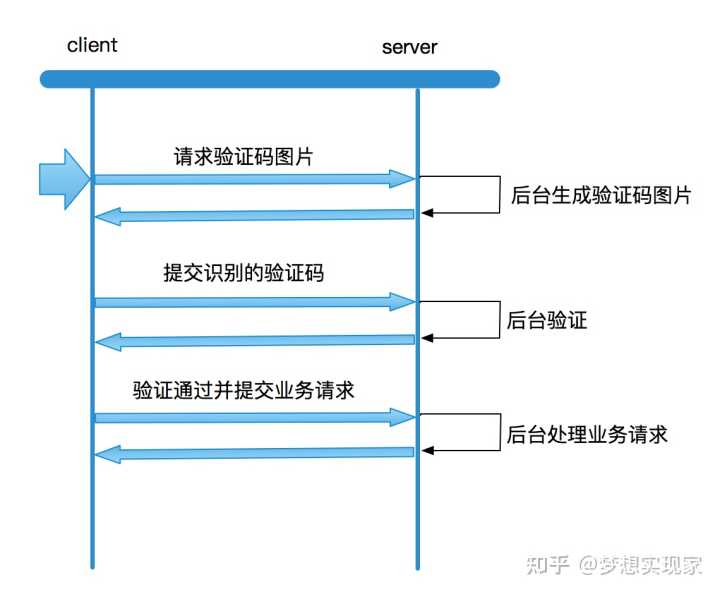
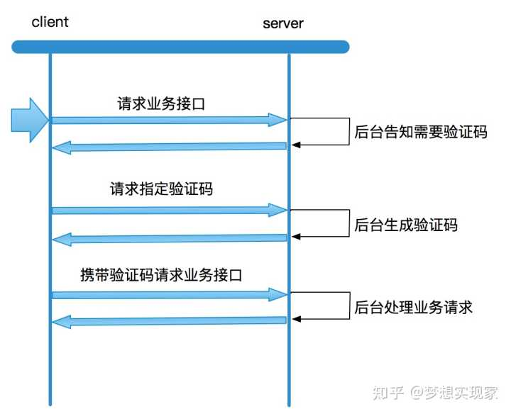
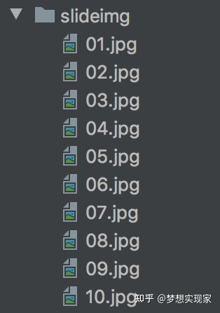
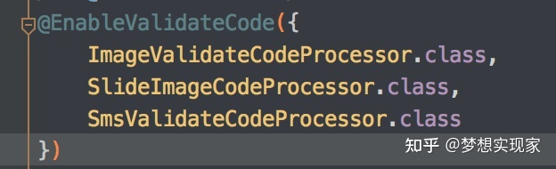
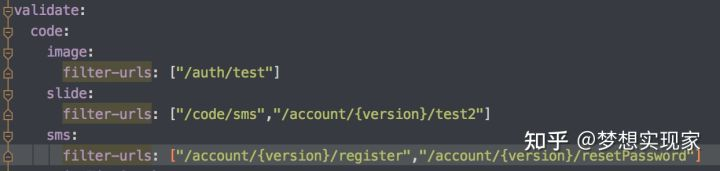

# 生成验证码

作者：梦想实现家
链接：https://www.zhihu.com/question/453441667/answer/1917017337
来源：知乎
著作权归作者所有。商业转载请联系作者获得授权，非商业转载请注明出处。


前言：平时咱们在使用各类平台或系统的时候，都会弹出验证码，类似这种：



亦或是这种



还有就是这种：


好吧，这种也算：



所有的验证码，无论是图片验证码，还是滑块验证码，亦或是短信验证码、语音验证码，它们的作用都是为了防止应用接口被恶意的非人为操作不断调用。

以第一张图或第二张图为例，不针对这个发短信的接口做一个图片验证码的话，那么就很可能被恶意程序调用，导致后台程序不断地发送短信验证码给指定手机号码的人，这样不仅会造成公司的损失，也会给接收短信的人造成不必要的困扰。有了图片验证码后，调用接口的时候需要带上被识别的验证码，恶意程序就相对有难度才能调用你的这个被保护的接口了，大大降低了这方面的困扰。

**注意点：**很多同学在这个验证码的时候，仅仅是简单地通过前端调用获取验证码的接口，然后再把用户提交的验证码交给后台验证，验证通过后再发起业务请求。这种做法只是做到了表面上有验证码的验证过程，实际上还是没有做到对业务接口的保护。交互过程如下图：



这样的交互逻辑是有很明显的漏洞的，它把验证的权限交给了客户端，前端说通过就通过，那么对于任何一个了解并且会使用一定手段或工具的人来说，这样的验证码就是形同虚设。使用api工具就可以直接跳到第三步直接调用业务接口。

真正的验证码应该做到和业务接口绑定，如下图的交互逻辑：



按照以上交互逻辑，无论如何，客户端必须带上验证码才能真正地调用后台服务处理业务请求，否则就无法达到目的。

后面就以java web为例来实现上述的交互逻辑：

为了可以将验证码逻辑和具体业务逻辑解藕，利用了servlet的Filter作为过滤器来判断当前请求的接口是否需要通过验证码验证后才能被调用

```java

import com.zx.silverfox.common.exception.GlobalException;
import com.zx.silverfox.common.validate.code.AbstractValidateCodeProcessor;
import com.zx.silverfox.common.vo.CommonResponse;
import lombok.SneakyThrows;
import org.apache.commons.lang3.ArrayUtils;
import org.apache.commons.lang3.StringUtils;
import org.springframework.beans.factory.annotation.Autowired;
import org.springframework.boot.web.servlet.filter.OrderedFilter;
import org.springframework.http.HttpMethod;
import org.springframework.http.MediaType;
import org.springframework.util.AntPathMatcher;
import org.springframework.web.context.request.ServletWebRequest;

import javax.servlet.*;
import javax.servlet.http.HttpServletRequest;
import javax.servlet.http.HttpServletResponse;
import java.io.IOException;
import java.util.List;
import java.util.Objects;

/** @author zouwei */
public class ValidateCodeFilter implements OrderedFilter {
  //利用spring特性获取所有的验证码处理器
    @Autowired private List<AbstractValidateCodeProcessor> validateCodeProcessorList;

    @Override
    public void init(FilterConfig filterConfig) {}

    @Override
    public void doFilter(ServletRequest request, ServletResponse response, FilterChain chain)
            throws IOException, ServletException {
        HttpServletRequest req = (HttpServletRequest) request;
        HttpServletResponse res = (HttpServletResponse) response;
        AntPathMatcher matcher = new AntPathMatcher();
      // 判断当前这个请求是否需要验证，并且验证请求中携带的验证码
        if (!validateCode(req, res, matcher)) {
            return;
        }
      // 生成验证码
        if (generatorCode(req, res, matcher)) {
            return;
        }
        chain.doFilter(request, response);
    }

    @Override
    public void destroy() {}
    /**
     * 验证操作
     * @param request
     * @param response
     * @param matcher
     * @return
     */
    private boolean validateCode(
            HttpServletRequest request, HttpServletResponse response, AntPathMatcher matcher) {
        String url = request.getRequestURI();
      //循环调用验证码处理器进行验证
        for (AbstractValidateCodeProcessor processor : validateCodeProcessorList) {
            String[] filterUrls = processor.filterUrls();
            if (ArrayUtils.isEmpty(filterUrls)) {
                continue;
            }
            for (String filterUrl : filterUrls) {
              // 先判断当前接口是否需要拦截，如果匹配成功，就开始进行验证
                if (matcher.match(filterUrl, url)) {
                    return validate(request, response, processor);
                }
            }
        }
        return true;
    }

    @SneakyThrows
    private boolean validate(
            HttpServletRequest request,
            HttpServletResponse response,
            AbstractValidateCodeProcessor processor) {
        if (Objects.isNull(processor)) {
            return false;
        }
        try {
          // 执行验证
            processor.validate(new ServletWebRequest(request, response));
        } catch (GlobalException e) {
          // 验证失败的话，捕获异常，并处理响应
            response.setContentType(MediaType.APPLICATION_JSON_VALUE);
            response.getOutputStream()
                    .write(CommonResponse.exceptionInstance(e).toJson().getBytes());
            return false;
        }
        return true;
    }

    /**
     * 生成验证码
     * @param request
     * @param response
     * @param matcher
     * @return
     */
    @SneakyThrows
    private boolean generatorCode(
            HttpServletRequest request, HttpServletResponse response, AntPathMatcher matcher) {
      // 获取验证码只能通过GET请求
        if (!StringUtils.equalsIgnoreCase(request.getMethod(), HttpMethod.GET.name())) {
            return false;
        }
        String url = request.getRequestURI();
      // 依然还是通过验证码处理器去做生成验证码的操作
        for (AbstractValidateCodeProcessor processor : validateCodeProcessorList) {
          // 检查当前请求是要生成哪种类型的验证码
            if (matcher.match(processor.generatorUrl(), url)) {
                try {
                  // 生成验证码
                    processor.create(new ServletWebRequest(request, response));
                } catch (GlobalException e) {
                    //失败后捕获异常，并处理响应
                  response.setContentType(MediaType.APPLICATION_JSON_VALUE);
                    response.getOutputStream()
                            .write(CommonResponse.exceptionInstance(e).toJson().getBytes());
                }
                return true;
            }
        }
        return false;
    }
// 设置当前过滤器的优先级
    @Override
    public int getOrder() {
        return REQUEST_WRAPPER_FILTER_MAX_ORDER - 104;
    }
}
```

上述ValidateCodeFilter是一个验证码逻辑入口类，也是整个逻辑的黏合剂，真正实现还是要靠AbstractValidateCodeProcessor这个处理器

```java
import com.zx.silverfox.common.exception.GlobalException;
import com.zx.silverfox.common.properties.ValidateCodeProperties;
import org.apache.commons.lang3.StringUtils;
import org.springframework.beans.BeansException;
import org.springframework.beans.factory.annotation.Autowired;
import org.springframework.context.ApplicationContext;
import org.springframework.context.ApplicationContextAware;
import org.springframework.util.CollectionUtils;
import org.springframework.web.bind.ServletRequestBindingException;
import org.springframework.web.bind.ServletRequestUtils;
import org.springframework.web.context.request.ServletWebRequest;

import javax.servlet.http.HttpServletRequest;
import javax.servlet.http.HttpServletResponse;
import java.util.List;
import java.util.Objects;

/** @author zouwei */
public abstract class AbstractValidateCodeProcessor<C extends ValidateCode>
        implements ValidateCodeProcessor, ApplicationContextAware {

    /** 标记验证码的唯一key */
    protected static final String CODE_KEY = "code_key";
    /** 发送验证码前需要调用的操作 */
    @Autowired(required = false)
    private List<ValidateCodeHandler> handlerList;
    /** 实现ApplicationContextAware，获取ApplicationContext */
    private static ApplicationContext APPLICATION_CONTEXT;
    /** 用作生成验证码 */
    private ValidateCodeGenerator validateCodeGenerator;
    /** 用作存取验证码 */
    private ValidateCodeRepository validateCodeRepository;
    /** 用作获取验证码相关系统配置 */
    private ValidateCodeProperties.CodeProperties codeProperties;

  /** 构造函数 */
    public AbstractValidateCodeProcessor(
            ValidateCodeGenerator validateCodeGenerator,
            ValidateCodeRepository validateCodeRepository,
            ValidateCodeProperties.CodeProperties codeProperties) {
        this.validateCodeGenerator = validateCodeGenerator;
        this.validateCodeRepository = validateCodeRepository;
        this.codeProperties = codeProperties;
    }

    protected static ApplicationContext getApplicationContext() {
        return APPLICATION_CONTEXT;
    }

    @Override
    public void setApplicationContext(ApplicationContext applicationContext) throws BeansException {
        APPLICATION_CONTEXT = applicationContext;
    }
    /** 生成验证码逻辑 */
    @Override
    public void create(ServletWebRequest request) throws GlobalException {
        // 生成指定验证码
        C validateCode = generate(request);
        ValidateCodeType codeType = getValidateCodeType();
       // 检查是否需要在发送该验证码之前执行一些指定的操作；比如注册的时候验证一下手机号码是否已经被注册；
        if (!CollectionUtils.isEmpty(handlerList)) {
            for (ValidateCodeHandler handler : handlerList) {
                if (handler.support(request, codeType)) {
                    handler.beforeSend(request, codeType, validateCode);
                }
            }
        }
        HttpServletResponse response = request.getResponse();
        // 用作保存验证码的key，方便后续的验证操作
        String codeKeyValue = request.getSessionId();
        response.setHeader(CODE_KEY, codeKeyValue);
        // 保存验证码数据
        save(request, validateCode, codeKeyValue);
        // 发送验证码
        send(request, validateCode);
    }

    /**
     * 保存验证码
     *
     * @param request
     * @param validateCode
     */
    private void save(ServletWebRequest request, C validateCode, String codeKeyValue) {
        validateCodeRepository.save(request, validateCode, getValidateCodeType(), codeKeyValue);
    }

    /**
     * 获取ValidateCodeType
     *
     * @return
     */
    protected abstract ValidateCodeType getValidateCodeType();
    /**
     * 验证码发送
     *
     * @param request
     * @param validateCode
     * @throws Exception
     */
    protected abstract void send(ServletWebRequest request, C validateCode) throws GlobalException;

    /**
     * 创建验证码
     *
     * @param request
     * @return
     */
    private C generate(ServletWebRequest request) {
        return (C) validateCodeGenerator.createValidateCode(request);
    }

    private String getCodeKeyValue(ServletWebRequest servletWebRequest)
            throws ServletRequestBindingException {
        HttpServletRequest request = servletWebRequest.getRequest();
        // 从请求头或者参数中获取用户输入的验证码
        String codeKeyValue = request.getHeader(CODE_KEY);
        codeKeyValue =
                StringUtils.isBlank(codeKeyValue)
                        ? ServletRequestUtils.getStringParameter(request, CODE_KEY)
                        : codeKeyValue;
        return codeKeyValue;
    }
    /**
     * 校验验证码
     *
     * @param servletWebRequest
     * @return
     * @throws GlobalException
     */
    @Override
    public boolean validate(ServletWebRequest servletWebRequest) throws GlobalException {
        // 获取验证码类型
        ValidateCodeType codeType = getValidateCodeType();
        C codeInSession;
        String codeKeyValue;
        String codeInRequest;
        try {
            codeKeyValue = getCodeKeyValue(servletWebRequest);
            // 使用codeKeyValue取出保存在后台验证码数据
            codeInSession =
                    (C) validateCodeRepository.get(servletWebRequest, codeType, codeKeyValue);
            // 获取请求中用户输入的验证码
            codeInRequest =
                    ServletRequestUtils.getStringParameter(
                            servletWebRequest.getRequest(), codeType.getParamNameOnValidate());
        } catch (Exception e) {
            throw GlobalException.newInstance(
                    "VALIDATE_CODE_OBTAIN_ERROR", "获取验证码失败，应该是前端请求中没有提交验证码");
        }
        if (StringUtils.isBlank(codeInRequest)) {
            throw GlobalException.newInstance("VALIDATE_CODE_EMPTY_ERROR", "验证码为空，用户没有填写验证码");
        }
        if (Objects.isNull(codeInSession) || Objects.isNull(codeInSession.getCode())) {
            throw GlobalException.newInstance(
                    "VALIDATE_CODE_VALIDATE_ERROR", "存储的验证码没有找到，应该是验证码失效了");
        }
        if (codeInSession.isExpired()) {
            validateCodeRepository.remove(servletWebRequest, codeType, codeKeyValue);
            throw GlobalException.newInstance("VALIDATE_CODE_VALIDATE_ERROR", "验证码已过期,请重新获取");
        }
        if (!validate(codeInRequest, codeInSession)) {
            throw GlobalException.newInstance("VALIDATE_CODE_VALIDATE_ERROR", "验证码匹配错误");
        }
        // 验证成功后移除保存的数据
        validateCodeRepository.remove(servletWebRequest, codeType, codeKeyValue);
        return true;
    }

    /**
     * 验证
     *
     * @param code
     * @return
     */
    protected abstract boolean validate(String code, C validateCode);
    /**
     * 生成验证码的url
     *
     * @return
     */
    public String generatorUrl() {
        return this.codeProperties.getGeneratorUrl();
    }

    /**
     * 需要拦截的url
     *
     * @return
     */
    public String[] filterUrls() {
        return this.codeProperties.getFilterUrls();
    }
}

```

所有的验证码处理器必须实现的接口，创建和验证

```java
import com.zx.silverfox.common.exception.GlobalException;
import org.springframework.web.context.request.ServletWebRequest;

/**
 * @author zouwei
 */
public interface ValidateCodeProcessor {

    /**
     * 创建验证码
     *
     * @param request
     * @throws Exception
     */
    void create(ServletWebRequest request) throws GlobalException;

    /**
     * 校验验证码
     *
     * @param servletWebRequest
     */
    boolean validate(ServletWebRequest servletWebRequest) throws GlobalException;
}
```

创建验证码接口：

```java
import org.springframework.web.context.request.ServletWebRequest;

public interface ValidateCodeGenerator {

    /**
     * 生成验证码
     *
     * @param request
     * @return
     */
    ValidateCode createValidateCode(ServletWebRequest request);
}
```

存取验证码接口：

```java
import org.springframework.web.context.request.ServletWebRequest;

/** @author zouwei */
public interface ValidateCodeRepository {
    /**
     * 保存验证码
     *
     * @param request
     * @param code
     * @param validateCodeType
     */
    void save(
            ServletWebRequest request,
            ValidateCode code,
            ValidateCodeType validateCodeType,
            String codeKeyValue);
    /**
     * 获取验证码
     *
     * @param request
     * @param validateCodeType
     * @return
     */
    ValidateCode get(
            ServletWebRequest request, ValidateCodeType validateCodeType, String codeKeyValue);
    /**
     * 移除验证码
     *
     * @param request
     * @param codeType
     */
    void remove(ServletWebRequest request, ValidateCodeType codeType, String codeKeyValue);
}
```

存取验证码的具体实现，我就使用了redis来做，其他的小伙伴也可以使用其他存储方案来做：

```java
import com.zx.silverfox.common.validate.code.ValidateCode;
import com.zx.silverfox.common.validate.code.ValidateCodeRepository;
import com.zx.silverfox.common.validate.code.ValidateCodeType;
import org.springframework.beans.factory.annotation.Autowired;
import org.springframework.data.redis.core.RedisTemplate;
import org.springframework.web.context.request.ServletWebRequest;

import java.util.concurrent.TimeUnit;

/** @author zouwei */
public class RedisValidateCodeRepository implements ValidateCodeRepository {

    @Autowired private RedisTemplate<Object, Object> redisTemplate;

    @Override
    public void save(
            ServletWebRequest request,
            ValidateCode code,
            ValidateCodeType type,
            String codeKeyValue) {
        redisTemplate.opsForValue().set(buildKey(type, codeKeyValue), code, 30, TimeUnit.MINUTES);
    }

    @Override
    public ValidateCode get(ServletWebRequest request, ValidateCodeType type, String codeKeyValue) {
        Object value = redisTemplate.opsForValue().get(buildKey(type, codeKeyValue));
        if (value == null) {
            return null;
        }
        return (ValidateCode) value;
    }

    @Override
    public void remove(ServletWebRequest request, ValidateCodeType type, String codeKeyValue) {
        redisTemplate.delete(buildKey(type, codeKeyValue));
    }

    /**
     * @param type
     * @param key
     * @return
     */
    private String buildKey(ValidateCodeType type, String key) {
        return "code:" + type.toString().toLowerCase() + ":" + key;
    }
}
```

发送验证码前需要处理的接口：

```java
import com.zx.silverfox.common.exception.GlobalException;
import org.springframework.web.context.request.ServletWebRequest;

/**
 * @author zouwei
 */
public interface ValidateCodeHandler<C extends ValidateCode> {
    /**
     * 是否匹配成功
     * @param request
     * @param validateCodeType
     * @return
     */
    boolean support(ServletWebRequest request, ValidateCodeType validateCodeType);

    /**
     * 开始处理发送验证码前的逻辑
     * @param request
     * @param validateCodeType
     * @param validateCode
     * @throws GlobalException
     */
    void beforeSend(ServletWebRequest request, ValidateCodeType validateCodeType, C validateCode) throws GlobalException;
}

```

验证码实体类：

```java
import lombok.Data;

import java.io.Serializable;
import java.time.LocalDateTime;

/** @author zouwei */
@Data
public class ValidateCode implements Serializable {
    private static final long serialVersionUID = -7827043337909063779L;

    private String code;

    private long expireInSeconds;

    private LocalDateTime expireTime;

    public ValidateCode(String code, LocalDateTime expireTime) {
        this.code = code;
        this.expireTime = expireTime;
    }

    public ValidateCode(String code, long expireInSeconds) {
        this.code = code;
        this.expireInSeconds = expireInSeconds;
        this.expireTime = LocalDateTime.now().plusSeconds(expireInSeconds);
    }

    /**
     * 判断是否过期
     *
     * @return
     */
    public boolean isExpired() {
        return LocalDateTime.now().isAfter(expireTime);
    }

    /**
     * 转换成分钟
     *
     * @return
     */
    public long minute() {
        return this.expireInSeconds / 60;
    }
}

```

各种验证码类型，可无限扩展：

```java

public enum ValidateCodeType {
    /** 短信验证码 */
    SMS {
        @Override
        public String getParamNameOnValidate() {
            return "smsCode";
        }
    },

    /** 图片验证码 */
    IMAGE {
        @Override
        public String getParamNameOnValidate() {
            return "imageCode";
        }
    },
    /** 滑动图片验证码 */
    SLIDE {
        @Override
        public String getParamNameOnValidate() {
            return "slideCode";
        }
    };

    public abstract String getParamNameOnValidate();
}

```

还有相关配置类：

```java
import lombok.Data;
import lombok.EqualsAndHashCode;
import org.springframework.boot.context.properties.ConfigurationProperties;
import org.springframework.context.annotation.Configuration;

/** @author zouwei */
@Data
@Configuration
@ConfigurationProperties(prefix = "validate.code")
public class ValidateCodeProperties {
    /** 图像验证码 */
    private ImageProperties image = new ImageProperties();
    /** 短信验证码 */
    private SmsProperties sms = new SmsProperties();
    /** 滑动验证码 */
    private SlideImageProperties slide = new SlideImageProperties();

    @Data
    @EqualsAndHashCode(callSuper = true)
    public static class SlideImageProperties extends CodeProperties {

        private String generatorUrl = "/code/slide";
    }

    @Data
    @EqualsAndHashCode(callSuper = true)
    public static class ImageProperties extends CodeProperties {

        private int length = 6;

        private int height = 23;

        private int width = 67;

        private String generatorUrl = "/code/image";
    }

    @Data
    @EqualsAndHashCode(callSuper = true)
    public static class SmsProperties extends CodeProperties {

        private int length = 6;

        private String generatorUrl = "/code/sms";
    }

    @Data
    public abstract static class CodeProperties {

        private long expiredInSecond = 300;

        private String[] filterUrls;

        private String generatorUrl;
    }
}
```

为了开发者使用方便，我也模仿spring boot的方式使用注解自动化配置：

```java
import java.lang.annotation.ElementType;
import java.lang.annotation.Retention;
import java.lang.annotation.RetentionPolicy;
import java.lang.annotation.Target;

/** @author zouwei */
@Target({ElementType.TYPE, ElementType.ANNOTATION_TYPE})
@Retention(RetentionPolicy.RUNTIME)
@Import(ValidateCodeConfigSelector.class)
public @interface EnableValidateCode {
    /**
     * 验证码实现类
     *
     * @return
     */
    Class<? extends AbstractValidateCodeProcessor>[] value() default {
        ImageValidateCodeProcessor.class
    };

    /**
     * 验证码存储方式
     *
     * @return
     */
    Class<? extends ValidateCodeRepository> repository() default RedisValidateCodeRepository.class;
}

import com.zx.silverfox.common.filter.ValidateCodeFilter;
import com.zx.silverfox.common.validate.code.AbstractValidateCodeProcessor;
import com.zx.silverfox.common.validate.code.ValidateCodeRepository;
import org.apache.commons.lang3.ArrayUtils;
import org.springframework.beans.factory.support.BeanDefinitionRegistry;
import org.springframework.beans.factory.support.RootBeanDefinition;
import org.springframework.context.annotation.ImportBeanDefinitionRegistrar;
import org.springframework.core.annotation.AnnotationAttributes;
import org.springframework.core.type.AnnotationMetadata;

import java.util.Map;

public class ValidateCodeConfigSelector implements ImportBeanDefinitionRegistrar {
    @Override
    public void registerBeanDefinitions(
            AnnotationMetadata importingClassMetadata, BeanDefinitionRegistry registry) {
        Map<String, Object> attributeMap =
                importingClassMetadata.getAnnotationAttributes(
                        EnableValidateCode.class.getName());
        AnnotationAttributes attributes = AnnotationAttributes.fromMap(attributeMap);
        Class<? extends ValidateCodeRepository> repositoryClass = attributes.getClass("repository");

        Class<? extends AbstractValidateCodeProcessor>[] imageProcessorClass =
                (Class<? extends AbstractValidateCodeProcessor>[])
                        attributes.getClassArray("value");

        if (!registry.containsBeanDefinition("validateCodeRepository")) {
            registry.registerBeanDefinition(
                    "validateCodeRepository", new RootBeanDefinition(repositoryClass));
        }
        if (ArrayUtils.isNotEmpty(imageProcessorClass)) {
            for (Class<? extends AbstractValidateCodeProcessor> clazz : imageProcessorClass) {
                registry.registerBeanDefinition(
                        clazz.getSimpleName(), new RootBeanDefinition(clazz));
            }
        }
        if (!registry.containsBeanDefinition("validateCodeFilter")) {
            registry.registerBeanDefinition(
                    "validateCodeFilter", new RootBeanDefinition(ValidateCodeFilter.class));
        }
    }
}

```

上述代码基本框架已经完成，后续代码就是真正地实现图片验证码及短信验证码:

简单图片验证码：

```java
import com.zx.silverfox.common.validate.code.ValidateCode;
import lombok.Data;
import lombok.EqualsAndHashCode;

import java.awt.image.BufferedImage;

/** @author zouwei */
@Data
@EqualsAndHashCode(callSuper = true)
public class ImageValidateCode extends ValidateCode {

    private transient BufferedImage image;

    public ImageValidateCode(BufferedImage image, String code, long expireInSeconds) {
        super(code, expireInSeconds);
        this.image = image;
    }
}
import com.zx.silverfox.common.properties.ValidateCodeProperties;
import com.zx.silverfox.common.validate.code.ValidateCode;
import com.zx.silverfox.common.validate.code.ValidateCodeGenerator;
import org.springframework.web.bind.ServletRequestUtils;
import org.springframework.web.context.request.ServletWebRequest;

import java.awt.*;
import java.awt.image.BufferedImage;
import java.util.Random;

/** @author zouwei */
public class ImageValidateCodeGenerator implements ValidateCodeGenerator {

    private ValidateCodeProperties.ImageProperties imageProperties;

    public ImageValidateCodeGenerator(ValidateCodeProperties.ImageProperties imageProperties) {
        this.imageProperties = imageProperties;
    }

    @Override
    public ValidateCode createValidateCode(ServletWebRequest request) {
        int height =
                ServletRequestUtils.getIntParameter(
                        request.getRequest(), "height", imageProperties.getHeight());
        int width =
                ServletRequestUtils.getIntParameter(
                        request.getRequest(), "width", imageProperties.getWidth());
        BufferedImage image = new BufferedImage(width, height, BufferedImage.TYPE_INT_RGB);

        Graphics g = image.getGraphics();

        Random random = new Random();

        g.setColor(getRandColor(200, 250));
        g.fillRect(0, 0, width, height);
        g.setFont(new Font("Times New Roman", Font.ITALIC, 20));
        g.setColor(getRandColor(160, 200));
        for (int i = 0; i < 155; i++) {
            int x = random.nextInt(width);
            int y = random.nextInt(height);
            int xl = random.nextInt(12);
            int yl = random.nextInt(12);
            g.drawLine(x, y, x + xl, y + yl);
        }

        String sRand = "";
        for (int i = 0; i < imageProperties.getLength(); i++) {
            String rand = String.valueOf(random.nextInt(10));
            sRand += rand;
            g.setColor(
                    new Color(
                            20 + random.nextInt(110),
                            20 + random.nextInt(110),
                            20 + random.nextInt(110)));
            g.drawString(rand, 13 * i + 6, 16);
        }

        g.dispose();

        return new ImageValidateCode(image, sRand, imageProperties.getExpiredInSecond());
    }

    /**
     * 生成随机背景条纹
     *
     * @param fc
     * @param bc
     * @return
     */
    private Color getRandColor(int fc, int bc) {
        Random random = new Random();
        if (fc > 255) {
            fc = 255;
        }
        if (bc > 255) {
            bc = 255;
        }
        int r = fc + random.nextInt(bc - fc);
        int g = fc + random.nextInt(bc - fc);
        int b = fc + random.nextInt(bc - fc);
        return new Color(r, g, b);
    }
}
import com.zx.silverfox.common.exception.GlobalException;
import com.zx.silverfox.common.properties.ValidateCodeProperties;
import com.zx.silverfox.common.validate.code.AbstractValidateCodeProcessor;
import com.zx.silverfox.common.validate.code.ValidateCodeRepository;
import com.zx.silverfox.common.validate.code.ValidateCodeType;
import org.apache.commons.lang3.StringUtils;
import org.springframework.beans.factory.annotation.Autowired;
import org.springframework.web.context.request.ServletWebRequest;

import javax.imageio.ImageIO;
import java.io.IOException;

/** @author zouwei */
public class ImageValidateCodeProcessor extends AbstractValidateCodeProcessor<ImageValidateCode> {
    /** 生成的图片的格式 */
    private static final String JPEG_IMAGE_TYPE = "JPEG";

    public ImageValidateCodeProcessor(
            @Autowired ValidateCodeProperties validateCodeProperties,
            @Autowired ValidateCodeRepository repository) {
        super(
                new ImageValidateCodeGenerator(validateCodeProperties.getImage()),
                repository,
                validateCodeProperties.getImage());
    }

    @Override
    protected ValidateCodeType getValidateCodeType() {
        return ValidateCodeType.IMAGE;
    }

    @Override
    protected void send(ServletWebRequest request, ImageValidateCode validateCode)
            throws GlobalException {
        try {
            ImageIO.write(
                    validateCode.getImage(),
                    JPEG_IMAGE_TYPE,
                    request.getResponse().getOutputStream());
        } catch (IOException e) {
            throw GlobalException.newInstance("IMAGE_CODE_CREATE_FAIL", "图片验证码生成失败");
        }
    }

    @Override
    protected boolean validate(String code, ImageValidateCode validateCode) {
        return StringUtils.equalsIgnoreCase(code, validateCode.getCode());
    }
}
```

滑块验证码：

```java
import com.zx.silverfox.common.validate.code.ValidateCode;
import lombok.Data;
import lombok.EqualsAndHashCode;

/** @author zouwei */
@Data
@EqualsAndHashCode(callSuper = true)
public class SlideImageCode extends ValidateCode {

    private double heightYPercentage;

    private transient String srcImg;

    private transient String markImg;

    public SlideImageCode(
            double heightYPercentage,
            String srcImg,
            String markImg,
            String code,
            long expireInSeconds) {
        super(code, expireInSeconds);
        this.heightYPercentage = heightYPercentage;
        this.srcImg = srcImg;
        this.markImg = markImg;
    }
}
import com.zx.silverfox.common.properties.ValidateCodeProperties;
import com.zx.silverfox.common.validate.code.ValidateCode;
import com.zx.silverfox.common.validate.code.ValidateCodeGenerator;
import lombok.extern.slf4j.Slf4j;
import org.springframework.core.io.ClassPathResource;
import org.springframework.web.context.request.ServletWebRequest;

import javax.imageio.ImageIO;
import java.io.File;
import java.io.FileInputStream;
import java.io.IOException;
import java.io.InputStream;
import java.util.Random;

@Slf4j
public class SlideImageCodeGenerator implements ValidateCodeGenerator {

    private ValidateCodeProperties.SlideImageProperties slideImageProperties;

    public SlideImageCodeGenerator(
            ValidateCodeProperties.SlideImageProperties slideImageProperties) {
        this.slideImageProperties = slideImageProperties;
    }

    @Override
    public ValidateCode createValidateCode(ServletWebRequest request) {
        try (InputStream in = getOriginImage()) {
            SlideImageUtil.SlideImage slideImage = SlideImageUtil.getVerifyImage(ImageIO.read(in));
            int width = slideImage.getWidth();
            int x = slideImage.getX();
            int height = slideImage.getHeight();
            int y = slideImage.getY();
            double widthXPercentage = width / (x * 1.0);
            double heightYPercentage = height / (y * 1.0);
            String code = widthXPercentage + ":" + heightYPercentage;
            return new SlideImageCode(
                    heightYPercentage,
                    slideImage.getSrcImg(),
                    slideImage.getMarkImg(),
                    code,
                    slideImageProperties.getExpiredInSecond());
        } catch (IOException e) {
            e.printStackTrace();
        }
        return null;
    }

    private InputStream getOriginImage() throws IOException {
        // 从resources下的slideimg文件夹中随机获取一张图片进行处理
        ClassPathResource classPathResource = new ClassPathResource("slideimg");
        File dirFile = classPathResource.getFile();
        File[] listFiles = dirFile.listFiles();
        int index = new Random().nextInt(listFiles.length);
        return new FileInputStream(listFiles[index]);
    }
}

import com.zx.silverfox.common.exception.GlobalException;
import com.zx.silverfox.common.properties.ValidateCodeProperties;
import com.zx.silverfox.common.util.CastUtil;
import com.zx.silverfox.common.validate.code.AbstractValidateCodeProcessor;
import com.zx.silverfox.common.validate.code.ValidateCodeRepository;
import com.zx.silverfox.common.validate.code.ValidateCodeType;
import com.zx.silverfox.common.vo.CommonResponse;
import lombok.AllArgsConstructor;
import lombok.Data;
import lombok.NoArgsConstructor;
import org.apache.commons.lang3.StringUtils;
import org.springframework.beans.factory.annotation.Autowired;
import org.springframework.http.MediaType;
import org.springframework.web.context.request.ServletWebRequest;

import javax.servlet.http.HttpServletResponse;
import java.io.IOException;

/**
 * 滑动验证码
 *
 * @author zouwei
 */
public class SlideImageCodeProcessor extends AbstractValidateCodeProcessor<SlideImageCode> {

    public SlideImageCodeProcessor(
            @Autowired ValidateCodeProperties validateCodeProperties,
            @Autowired ValidateCodeRepository validateCodeRepository) {
        super(
                new SlideImageCodeGenerator(validateCodeProperties.getSlide()),
                validateCodeRepository,
                validateCodeProperties.getSlide());
    }

    @Override
    protected ValidateCodeType getValidateCodeType() {
        return ValidateCodeType.SLIDE;
    }

    @Override
    protected void send(ServletWebRequest request, SlideImageCode validateCode)
            throws GlobalException {
        double heightY = validateCode.getHeightYPercentage();
        try {
            HttpServletResponse response = request.getResponse();
            response.setContentType(MediaType.APPLICATION_JSON_VALUE);
            response.getOutputStream()
                    .write(
                            CommonResponse.successInstance(
                                            new SlideValidateCodeImage(
                                                    heightY,
                                                    validateCode.getSrcImg(),
                                                    validateCode.getMarkImg()))
                                    .toJson()
                                    .getBytes());
        } catch (IOException e) {
            throw GlobalException.newInstance("", "图片验证码生成失败");
        }
    }

    /**
     * 滑动验证码验证
     *
     * @param code
     * @param validateCode
     * @return
     */
    @Override
    protected boolean validate(String code, SlideImageCode validateCode) {
        try {
            String[] location = StringUtils.splitByWholeSeparatorPreserveAllTokens(code, ":");
            double x1 = CastUtil.castDouble(location[0]);
            double y1 = CastUtil.castDouble(location[1]);
            String sessionCode = validateCode.getCode();
            String[] sessionLocation =
                    StringUtils.splitByWholeSeparatorPreserveAllTokens(sessionCode, ":");
            double x2 = CastUtil.castDouble(sessionLocation[0]);
            double y2 = CastUtil.castDouble(sessionLocation[1]);
            double distance = Math.sqrt(Math.pow((x1 - x2), 2) + Math.pow((y1 - y2), 2));
            return distance < 0.06;
        } catch (Exception e) {
            return false;
        }
    }

    @Data
    @NoArgsConstructor
    @AllArgsConstructor
    private static class SlideValidateCodeImage {

        private double heightY;

        private String srcImg;

        private String markImg;
    }
}
```

滑块处理工具类：

```java
import lombok.AllArgsConstructor;
import lombok.Data;
import lombok.NoArgsConstructor;
import org.springframework.util.Base64Utils;

import javax.imageio.ImageIO;
import java.awt.*;
import java.awt.image.BufferedImage;
import java.io.*;
import java.util.ArrayList;
import java.util.List;
import java.util.Random;

/**
 * @author zouwei
 */
public final class SlideImageUtil {

    private static final String IMAGE_TYPE = "png";

    /** 源文件宽度 */
    private static int ORI_WIDTH = 300;
    /** 源文件高度 */
    private static int ORI_HEIGHT = 150;
    /** 模板图宽度 */
    private static int CUT_WIDTH = 50;
    /** 模板图高度 */
    private static int CUT_HEIGHT = 50;
    /** 抠图凸起圆心 */
    private static int circleR = 5;
    /** 抠图内部矩形填充大小 */
    private static int RECTANGLE_PADDING = 8;
    /** 抠图的边框宽度 */
    private static int SLIDER_IMG_OUT_PADDING = 1;

    @Data
    @AllArgsConstructor
    @NoArgsConstructor
    public static class SlideImage {
        /** 底图 */
        private String srcImg;
        /** 标记图片 */
        private String markImg;
        /** x轴 */
        private int x;
        /** y轴 */
        private int y;
        /** 原图的宽度 */
        private int width;
        /** 原图的高度 */
        private int height;
    }
    /**
     * 根据传入的路径生成指定验证码图片
     *
     * @param originImage
     * @return
     * @throws IOException
     */
    public static SlideImage getVerifyImage(BufferedImage originImage) throws IOException {
        int width = originImage.getWidth();
        int height = originImage.getHeight();
        int locationX = CUT_WIDTH + new Random().nextInt(width - CUT_WIDTH * 3);
        int locationY = CUT_HEIGHT + new Random().nextInt(height - CUT_HEIGHT) / 2;
        BufferedImage markImage =
                new BufferedImage(CUT_WIDTH, CUT_HEIGHT, BufferedImage.TYPE_4BYTE_ABGR);
        int[][] data = getBlockData();
        cutImgByTemplate(originImage, markImage, data, locationX, locationY);
        return new SlideImage(
                getImageBASE64(originImage),
                getImageBASE64(markImage),
                locationX,
                locationY,
                width,
                height);
    }

    /**
     * 生成随机滑块形状
     *
     * <p>0 透明像素 1 滑块像素 2 阴影像素
     *
     * @return int[][]
     */
    private static int[][] getBlockData() {
        int[][] data = new int[CUT_WIDTH][CUT_HEIGHT];
        Random random = new Random();
        // (x-a)²+(y-b)²=r²
        // x中心位置左右5像素随机
        double x1 =
                RECTANGLE_PADDING
                        + (CUT_WIDTH - 2 * RECTANGLE_PADDING) / 2.0
                        - 5
                        + random.nextInt(10);
        // y 矩形上边界半径-1像素移动
        double y1_top = RECTANGLE_PADDING - random.nextInt(3);
        double y1_bottom = CUT_HEIGHT - RECTANGLE_PADDING + random.nextInt(3);
        double y1 = random.nextInt(2) == 1 ? y1_top : y1_bottom;

        double x2_right = CUT_WIDTH - RECTANGLE_PADDING - circleR + random.nextInt(2 * circleR - 4);
        double x2_left = RECTANGLE_PADDING + circleR - 2 - random.nextInt(2 * circleR - 4);
        double x2 = random.nextInt(2) == 1 ? x2_right : x2_left;
        double y2 =
                RECTANGLE_PADDING
                        + (CUT_HEIGHT - 2 * RECTANGLE_PADDING) / 2.0
                        - 4
                        + random.nextInt(10);

        double po = Math.pow(circleR, 2);
        for (int i = 0; i < CUT_WIDTH; i++) {
            for (int j = 0; j < CUT_HEIGHT; j++) {
                // 矩形区域
                boolean fill;
                if ((i >= RECTANGLE_PADDING && i < CUT_WIDTH - RECTANGLE_PADDING)
                        && (j >= RECTANGLE_PADDING && j < CUT_HEIGHT - RECTANGLE_PADDING)) {
                    data[i][j] = 1;
                    fill = true;
                } else {
                    data[i][j] = 0;
                    fill = false;
                }
                // 凸出区域
                double d3 = Math.pow(i - x1, 2) + Math.pow(j - y1, 2);
                if (d3 < po) {
                    data[i][j] = 1;
                } else {
                    if (!fill) {
                        data[i][j] = 0;
                    }
                }
                // 凹进区域
                double d4 = Math.pow(i - x2, 2) + Math.pow(j - y2, 2);
                if (d4 < po) {
                    data[i][j] = 0;
                }
            }
        }
        // 边界阴影
        for (int i = 0; i < CUT_WIDTH; i++) {
            for (int j = 0; j < CUT_HEIGHT; j++) {
                // 四个正方形边角处理
                for (int k = 1; k <= SLIDER_IMG_OUT_PADDING; k++) {
                    // 左上、右上
                    if (i >= RECTANGLE_PADDING - k
                            && i < RECTANGLE_PADDING
                            && ((j >= RECTANGLE_PADDING - k && j < RECTANGLE_PADDING)
                                    || (j >= CUT_HEIGHT - RECTANGLE_PADDING - k
                                            && j < CUT_HEIGHT - RECTANGLE_PADDING + 1))) {
                        data[i][j] = 2;
                    }

                    // 左下、右下
                    if (i >= CUT_WIDTH - RECTANGLE_PADDING + k - 1
                            && i < CUT_WIDTH - RECTANGLE_PADDING + 1) {
                        for (int n = 1; n <= SLIDER_IMG_OUT_PADDING; n++) {
                            if (((j >= RECTANGLE_PADDING - n && j < RECTANGLE_PADDING)
                                    || (j >= CUT_HEIGHT - RECTANGLE_PADDING - n
                                            && j <= CUT_HEIGHT - RECTANGLE_PADDING))) {
                                data[i][j] = 2;
                            }
                        }
                    }
                }

                if (data[i][j] == 1
                        && j - SLIDER_IMG_OUT_PADDING > 0
                        && data[i][j - SLIDER_IMG_OUT_PADDING] == 0) {
                    data[i][j - SLIDER_IMG_OUT_PADDING] = 2;
                }
                if (data[i][j] == 1
                        && j + SLIDER_IMG_OUT_PADDING > 0
                        && j + SLIDER_IMG_OUT_PADDING < CUT_HEIGHT
                        && data[i][j + SLIDER_IMG_OUT_PADDING] == 0) {
                    data[i][j + SLIDER_IMG_OUT_PADDING] = 2;
                }
                if (data[i][j] == 1
                        && i - SLIDER_IMG_OUT_PADDING > 0
                        && data[i - SLIDER_IMG_OUT_PADDING][j] == 0) {
                    data[i - SLIDER_IMG_OUT_PADDING][j] = 2;
                }
                if (data[i][j] == 1
                        && i + SLIDER_IMG_OUT_PADDING > 0
                        && i + SLIDER_IMG_OUT_PADDING < CUT_WIDTH
                        && data[i + SLIDER_IMG_OUT_PADDING][j] == 0) {
                    data[i + SLIDER_IMG_OUT_PADDING][j] = 2;
                }
            }
        }
        return data;
    }

    /**
     * 裁剪区块 根据生成的滑块形状，对原图和裁剪块进行变色处理
     *
     * @param oriImage 原图
     * @param targetImage 裁剪图
     * @param blockImage 滑块
     * @param x 裁剪点x
     * @param y 裁剪点y
     */
    private static void cutImgByTemplate(
            BufferedImage oriImage, BufferedImage targetImage, int[][] blockImage, int x, int y) {
        for (int i = 0; i < CUT_WIDTH; i++) {
            for (int j = 0; j < CUT_HEIGHT; j++) {
                int _x = x + i;
                int _y = y + j;
                int rgbFlg = blockImage[i][j];
                int rgb_ori = oriImage.getRGB(_x, _y);
                // 原图中对应位置变色处理
                if (rgbFlg == 1) {
                    // 抠图上复制对应颜色值
                    targetImage.setRGB(i, j, rgb_ori);
                    // 原图对应位置颜色变化
                    oriImage.setRGB(_x, _y, Color.LIGHT_GRAY.getRGB());
                } else if (rgbFlg == 2) {
                    targetImage.setRGB(i, j, Color.WHITE.getRGB());
                    oriImage.setRGB(_x, _y, Color.GRAY.getRGB());
                } else if (rgbFlg == 0) {
                    // int alpha = 0;
                    targetImage.setRGB(i, j, rgb_ori & 0x00ffffff);
                }
            }
        }
    }

    /**
     * 随机获取一张图片对象
     *
     * @param path
     * @return
     * @throws IOException
     */
    public static BufferedImage getRandomImage(String path) throws IOException {
        File files = new File(path);
        File[] fileList = files.listFiles();
        List<String> fileNameList = new ArrayList<>();
        if (fileList != null && fileList.length != 0) {
            for (File tempFile : fileList) {
                if (tempFile.isFile() && tempFile.getName().endsWith(".jpg")) {
                    fileNameList.add(tempFile.getAbsolutePath().trim());
                }
            }
        }
        Random random = new Random();
        File imageFile = new File(fileNameList.get(random.nextInt(fileNameList.size())));
        return ImageIO.read(imageFile);
    }

    /**
     * 将IMG输出为文件
     *
     * @param image
     * @param file
     * @throws Exception
     */
    public static void writeImg(BufferedImage image, String file) throws Exception {
        try (ByteArrayOutputStream bao = new ByteArrayOutputStream()) {
            ImageIO.write(image, IMAGE_TYPE, bao);
            FileOutputStream out = new FileOutputStream(new File(file));
            out.write(bao.toByteArray());
        }
    }

    /**
     * 将图片转换为BASE64
     *
     * @param image
     * @return
     * @throws IOException
     */
    public static String getImageBASE64(BufferedImage image) throws IOException {
        try (ByteArrayOutputStream out = new ByteArrayOutputStream()) {
            ImageIO.write(image, IMAGE_TYPE, out);
            // 生成BASE64编码
            return Base64Utils.encodeToString(out.toByteArray());
        }
    }

    /**
     * 将BASE64字符串转换为图片
     *
     * @param base64String
     * @return
     */
    public static BufferedImage base64StringToImage(String base64String) throws IOException {
        try (ByteArrayInputStream bais =
                new ByteArrayInputStream(Base64Utils.decodeFromString(base64String))) {
            return ImageIO.read(bais);
        }
    }
}

```

短信验证码：

```java
import com.zx.silverfox.common.validate.code.ValidateCode;

public class SmsValidateCode extends ValidateCode {

    public SmsValidateCode(String code, long expireInSeconds) {
        super(code, expireInSeconds);
    }
}

import com.zx.silverfox.common.properties.ValidateCodeProperties;
import com.zx.silverfox.common.validate.code.ValidateCodeGenerator;
import org.apache.commons.lang3.RandomStringUtils;
import org.springframework.web.context.request.ServletWebRequest;

/** @author zouwei */
public class SmsValidateCodeGenerator implements ValidateCodeGenerator {

    private ValidateCodeProperties.SmsProperties smsProperties;

    public SmsValidateCodeGenerator(ValidateCodeProperties.SmsProperties smsProperties) {
        this.smsProperties = smsProperties;
    }

    @Override
    public SmsValidateCode createValidateCode(ServletWebRequest request) {
        String code = RandomStringUtils.randomNumeric(smsProperties.getLength());
        return new SmsValidateCode(code, smsProperties.getExpiredInSecond());
    }
}
import com.zx.silverfox.common.exception.GlobalException;
import com.zx.silverfox.common.properties.ValidateCodeProperties;
import com.zx.silverfox.common.util.CastUtil;
import com.zx.silverfox.common.util.SmsUtil;
import com.zx.silverfox.common.validate.code.AbstractValidateCodeProcessor;
import com.zx.silverfox.common.validate.code.ValidateCodeRepository;
import com.zx.silverfox.common.validate.code.ValidateCodeType;
import com.zx.silverfox.common.vo.CommonResponse;
import lombok.extern.slf4j.Slf4j;
import org.apache.commons.lang3.StringUtils;
import org.springframework.beans.factory.annotation.Autowired;
import org.springframework.http.MediaType;
import org.springframework.web.context.request.ServletWebRequest;

import javax.servlet.http.HttpServletResponse;
import java.io.IOException;

/** @author zouwei */
@Slf4j
public class SmsValidateCodeProcessor extends AbstractValidateCodeProcessor<SmsValidateCode> {
    public SmsValidateCodeProcessor(
            @Autowired ValidateCodeProperties validateCodeProperties,
            @Autowired ValidateCodeRepository validateCodeRepository) {
        super(
                new SmsValidateCodeGenerator(validateCodeProperties.getSms()),
                validateCodeRepository,
                validateCodeProperties.getSms());
    }

    @Override
    protected ValidateCodeType getValidateCodeType() {
        return ValidateCodeType.SMS;
    }

    @Override
    protected void send(ServletWebRequest request, SmsValidateCode validateCode)
            throws GlobalException {
        // 手机号码
        String mobile = request.getParameter("mobile");
        String type = request.getParameter("type");
        if (StringUtils.isBlank(mobile) || StringUtils.isBlank(type)) {
            // 获取验证码参数没提供
            throw GlobalException.newInstance(
                    "SMS_VALIDATE_CODE_PARAM_ERROR", "没有给电话号码或者指明短信类型，无法发送短信");
        }
        long minute = validateCode.minute();
        SmsUtil.send(
                SmsUtil.SmsType.format(type),
                mobile,
                validateCode.getCode(),
                CastUtil.castString(minute));
        HttpServletResponse response = request.getResponse();
        response.setContentType(MediaType.APPLICATION_JSON_VALUE);
        try {
            response.getOutputStream().write(CommonResponse.successInstance().toJson().getBytes());
        } catch (IOException e) {
            log.error("response.getOutputStream()出异常", e);
        }
    }

    @Override
    protected boolean validate(String code, SmsValidateCode validateCode) {
        return StringUtils.equalsIgnoreCase(code, validateCode.getCode());
    }
}

```

注意事项：想要使用滑块验证码，需要在resources文件夹里面创建一个slideimg文件夹，并且把需要的图片放进去：



GlobalException是我自己设计的异常类，建议需要的小伙伴换成自己应用的异常类。

ok，整个验证码组件设计加上具体实现都已经完毕，下面就是如何使用：

首先，把自定义注解放在springboot项目启动类上：



建议按需配置，如果不需要图片验证码或者滑块验证码，可以不加载进来

然后就是配置文件：



比如你需要在发生短信验证码之前先触发滑块验证码，那么可以把"/code/sms"这个url放进validate.slide.filter-urls配置中。

好吧，怎么使用已经讲解完毕，配置文件中的其他配置参数包括图片的大小和验证码的位数等等，小伙伴可以根据自身需要去配置。