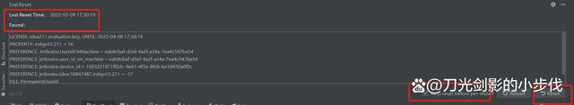

idea 2021 安装及破解方法（史上最简单的安装破解方法）亲测有效

播报文章

[

刀光剑影的小步伐

](https://author.baidu.com/home?from=bjh_article&app_id=1640924977178673)

2022-03-16 11:14

关注

**intellij idea 2021**是一款市面上最好的JAVA IDE编程工具，该工具支持git、svn、github等版本控制工具，整合了智能代码助手、代码自动提示等功能，IntelliJ IDEA 强大的静态代码分析和人体工程学设计，让你的开发设计简单轻松，IntelliJ IDEA将您的源代码编入索引之后，通过在各个环境中提供相关建议，提供快速和智能的体验：即时和智能的代码完成，即时代码分析和可靠的重构工具。内含2021和其他旧版，**目前正式版更新到2021.3版**，需要的朋友可以下载试试！

一、idea 安装教程

1. 在浏览器进入idea官网:

   1).官网路径（ps：不想下载的小编也准备了安装包放在了文章的末尾，里面有相应的idea安装包和破解工具，希望对大家有所帮助）:

   https://www.jetbrains.com/zh-cn/idea/download/#section=windows

2.选择其他版本（ps：最新的IDEA版本，直接取消了试用30天按钮，解决办法：可以先下载旧版本，然后安装完插件之后再升级到最新版本）

3.选择2021.1.3版本的，点击红框内的链接下载。

4.下载完成保存在本地。

5.双击点击安装，点击NEXT。

6.选择安装地址，（ps：不要安装在C盘 不要安装在C盘 不要安装在C盘 重要的事情说三遍），点击NEXT。

7.选择自己电脑的版本 我的是64位的。32位的可以勾选32-bit launcher，点击NEXT。

8.点击install，安装

9.勾选Run IntelliJ IDEA，点击Finish。

10.勾选Evaluate for free ,免费试用三十天

二、激活、破解IDEA

IntelliJ IDEA被认为是当前Java开发效率最快的IDE工具。它整合了开发过程中实用的众多功能，几乎可以不用鼠标可以方便的完成你要做的任何事情，最大程度的加快开发的速度。简单而又功能强大。与其他的一些繁冗而复杂的IDE工具有鲜明的对比。

IntelliJ IDEA 2021.3 为远程开发 (Beta) 提供支持，并引入了一种使用 Repair IDE…操作对 IDE 问题进行故障排除的新方式。同时，它还为 Kotlin 带来了调试器更新和 Constant conditions（常量条件）检查，以及其他实用变更！

之前的百度云链接失效了，请关注微信公众号：**Java学习生**，然后发送“IDEA”就可以获得破解工具。

注：最新的IDEA版本，直接取消了试用30天按钮

解决办法：可以先下载旧版本，然后安装完插件之后再升级到最新版本，如果升级后之前破解失效，可以在公众号："Java学习生" 给小编留言。

1.进入到IDEA中，随便建个JAVA工程，然后将获取到的ide-eval-resetter-x.zip补丁拖拽到IDEA界面中，点击上方导航栏的help下拉菜单，会出现一个Eval Reset，说明补丁安装成功

2.点击Eval Reset按钮，出现如下界面

3.一共有一个勾选项Auto reset before per restart和Reload、Reset两个按钮

1）按钮：Reload用来刷新界面上的显示信息。

2）按钮：Reset点击会询问是否重置试用30天并**重启IDE**。选择Yes则执行重置操作并**重启IDE生效**，选择No则什么也不做。（此为手动重置方式）

3）勾选项Auto reset before per restart：如果勾选了Auto reset before per restart，则自勾选后**每次重启/退出IDE时会自动重置试用信息**，你无需做额外的事情。（此为自动重置方式）

说明：IDEA 无限重置时间补丁，要**重启IDE生效**！！！

4.写到这里idea破解已经完成，希望对大家有所帮助。